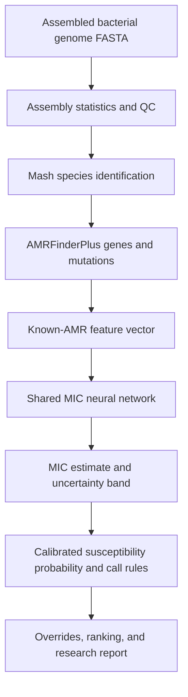

# DNAgen

**Bacterial genome → predicted antibiotic MIC → an interpretable susceptibility report.**

DNAgen is a research prototype that estimates antibiotic susceptibility from an assembled bacterial genome. It identifies known resistance genes and mutations, predicts a minimum inhibitory concentration (MIC) for each supported antibiotic, and reports **likely active**, **uncertain**, or **likely inactive** with uncertainty information.

A separate research module investigates whether an incomplete chromosome can be completed using related reference genomes. Its current release returns **`no_result`** when the evidence does not satisfy the 95% confidence gate. Reliable antibiotic prediction from those inferred sequences has **not** been demonstrated.

> These are predictions of **in-vitro susceptibility, not prescribing advice**. MIC is a laboratory concentration, not a patient dose. Confirm with standard antimicrobial susceptibility testing (AST). Dose, route, infection site, allergies, organ function, and final treatment remain clinical decisions.

Repository: [Hub-Varith/amr-backend](https://github.com/Hub-Varith/amr-backend).

## Contents

- [Scope and implementation status](#scope-and-implementation-status)
- [Why this project exists](#why-this-project-exists)
- [Supported species](#supported-species)
- [How the system works](#how-the-system-works)
- [Data and the data contract](#data-and-the-data-contract)
- [MIC model](#mic-model)
- [Chromosome completion model](#chromosome-completion-model)
- [Results and their limits](#results-and-their-limits)
- [Repository layout](#repository-layout)
- [Run the full-genome application](#run-the-full-genome-application)
- [Run chromosome completion](#run-chromosome-completion)
- [Train a new MIC model](#train-a-new-mic-model)
- [API and output contracts](#api-and-output-contracts)
- [Testing and reproducibility](#testing-and-reproducibility)
- [Limitations and next steps](#limitations-and-next-steps)
- [Troubleshooting](#troubleshooting)
- [Demo and presentation guide](#demo-and-presentation-guide)
- [Sources and document provenance](#sources-and-document-provenance)

## Scope and implementation status

**Documentation snapshot: October 4, 2026.** This README was assembled outside a Git checkout from the inspected project files, saved results, the provided pitch notes, and linked primary sources. It describes multiple branch snapshots; it does not imply that every feature exists together on `main`.

The latest supplied pitch calls the project **DNAgen**. The inspected frontend still uses **Breakpoint**, and the Python package is named **`genome2mic`**. Those names refer to this project's materials; the code has not been renamed by writing this README.

| Component | Verified location / snapshot | Status |
| --- | --- | --- |
| Full-genome MIC pipeline, API, frontend, and data tooling | `genome-data-pipeline`, commit `7ddac33` | Implemented in the inspected source; real-run results are recorded in team docs |
| Alternative per-species–drug XGBoost MIC pipeline | `Axion747/gk5s3`, commit `676aa4f` | Separate implemented training/prediction stack; different artifacts, calibration, and evaluation |
| Packaged v3 completion model with strict output gate | `bhavyak`, commit `e90b259` | Trained weights included; five-species inference and gate replay verified |
| Original completion experiments and training history | `develop-bhavya`, committed baseline `3d3223a` | Research code and saved experiment reports; additional local gate edits were uncommitted when inspected |
| Unitig inputs to the released MIC model | Design and optional code paths | Released `all5_run1` was trained **without unitigs** |
| Automatic completion → MIC integration | Not present in the inspected runtime | Requires implementation and end-to-end validation |
| Clinical deployment, direct blood processing, or a physical sequencer integration | Not established by the inspected artifacts | Future work |

Use the relevant checkout for the commands below. A complete merge of the branches is not assumed. The packaged model on `genome-data-pipeline` at `7ddac33` predates the strict public-output gate; use **`bhavyak` at `e90b259`** for that behavior. [Pipeline implementation][pipeline-code] · [Gated completion implementation][completion-code]

### Branch survey

All **14 remote branch tips** were checked directly against GitHub during this documentation pass. Their locally available histories and file inventories were scanned, with implementation and handoff reads for the distinct model, pipeline, frontend, and completion paths. This was a documentation review, not a new test run of every branch.

| Remote branch | Commit | Role at the inspected snapshot |
| --- | --- | --- |
| `main` | `04b7720` | Initial API scaffold and integration document; does not contain the complete later application |
| `develop` | `a627e0f` | Shared MIC model, data-release work, probability calls, and training documentation integrated here |
| `genome-data-pipeline` | `7ddac33` | Full-genome prediction runtime, connected frontend, job history, and earlier packaged completion export |
| `bhavyak` | `e90b259` | Flye experiment history plus packaged completion v3 with the strict 95% gate |
| `Axion747/gk5s3` | `676aa4f` | Alternative per-pair XGBoost stack and its own training/demo documentation |
| `sid/bvbrc-data` | `84859b8` | Polished frontend with an illustrative report and upload placeholder; not the connected pipeline frontend |
| `Hub-Varith/multi-drug-mic-model-design` | `ef0334b` | Shared multi-drug, multi-species MIC network implementation and design |
| `Hub-Varith/training-data-pipeline-plan` | `56dbfa6` | Data-release feature preparation and model handoff |
| `data_pipeline_hub` | `4f0c002` | Early label pipeline, VM setup, and S3 release infrastructure |
| `all-species-hackathon-data` | `b8a760c` | Five-species known-AMR features, lineages, splits, and release documentation |
| `breakpoints-15-drugs` | `88c16fd` | Checked KPNEU breakpoint subset and susceptibility calling |
| `probability-calls` | `f31cbb3` | Probability calibration, confidence levels, broader breakpoint files, and artifact handoff |
| `training-plan` | `067ebea` | Shared-model training plan and saved-run documentation |
| `fix-pull-data-same-size` | `2920199` | Data-sync correction for changed files with unchanged sizes |

The local `develop-bhavya` branch at `3d3223a` holds the completion experiments and reports; it was not among those 14 remote heads. The local recovery branch is a historical recovery point, not the recommended runtime. Local `main` and `develop` were behind their remote-tracking branches when inspected. Branch tips can change; the source links in this README pin specific commits.

## Why this project exists

Bloodstream infection treatment can begin before the infecting organism's susceptibility results are available. DNAgen explores whether genomic information can provide useful laboratory susceptibility estimates while conventional testing proceeds.

The supplied background sources support the motivation, with important limits:

- Carrara et al.'s systematic review included 191 studies and 73,595 patients and reported a pooled inappropriate empirical antibiotic treatment rate of **32%**, with substantial between-study variation. This is a result from the studied populations, not a universal rate for every clinic. [Study](https://pubmed.ncbi.nlm.nih.gov/29277528/)
- Hung, Lee, and Ko's 2022 meta-analysis associated inappropriate empirical therapy in adults with bacteraemia with higher mortality odds: pooled OR **2.06**, adjusted OR **2.02**. These are associations, not evidence that DNAgen reduces deaths. [Study](https://pubmed.ncbi.nlm.nih.gov/35712120/)
- A 2025 ASM guideline describes an additional **48–72 hours** for conventional identification and AST after organisms are detected in blood culture broth. This clock starts after culture positivity; it is not a measured DNAgen turnaround time. [ASM guideline](https://journals.asm.org/doi/full/10.1128/cmr.00137-24)
- Osena et al. reported bacteriology-testing capacity at **665 of approximately 50,000 identified facilities across 14 African countries**. The result does not establish that 98% of all rural facilities worldwide lack laboratories. [Study](https://journals.plos.org/plosmedicine/article?id=10.1371/journal.pmed.1004638)

The current software starts with a **sequence file**. Collecting blood, identifying or isolating the bacterium, extracting DNA, sequencing, and assembling an appropriate input remain upstream requirements. The prototype does not demonstrate an hour-one, direct-from-blood diagnostic or operation without laboratory capacity.

## Supported species

These are **five bacterial species**, not five genes. Drug coverage is species-specific.

| Key | Species | AMRFinderPlus organism argument | Species–drug pairs in the retained MIC dataset |
| --- | --- | --- | ---: |
| `ECOLI` | *Escherichia coli* | `Escherichia` | 25 |
| `KPNEU` | *Klebsiella pneumoniae* | `Klebsiella_pneumoniae` | 29 |
| `SAUR` | *Staphylococcus aureus* | `Staphylococcus_aureus` | 12 |
| `PAER` | *Pseudomonas aeruginosa* | `Pseudomonas_aeruginosa` | 14 |
| `ABAU` | *Acinetobacter baumannii* | `Acinetobacter_baumannii` | 17 |
| **Total** | | | **97 pairs across 37 distinct antibiotics** |

The application uses the loaded artifact to report available drugs through `GET /v1/species`. Supporting 37 distinct drugs does not mean that every species has a model-supported result for every drug. Species configuration and the model handoff define the scope. [Species configuration][species-config] · [Model handoff][handoff]

## How the system works

### Full-genome susceptibility path



1. **Check the assembly.** Calculate contig count, total length, N50, and GC content; apply configured quality rules.
2. **Identify the species.** Compare against the five species references using Mash. The inspected implementation uses a maximum species-reference distance of 0.05. Unsupported identification yields no drug predictions.
3. **Check novelty when possible.** A nearest-training-genome check exists, but requires training-genome Mash sketches absent from the documented hackathon release. Without them, the reported distance is null.
4. **Find AMR markers.** AMRFinderPlus identifies known resistance-associated genes and supported point mutations. NCBI explicitly distinguishes these detections from a phenotypic susceptibility prediction. [Official AMRFinderPlus documentation](https://github.com/ncbi/amr/wiki)
5. **Build features.** Map marker calls into the same column vocabulary used during training.
6. **Predict MICs.** The shared neural network consumes numerical features and the species identifier, not raw DNA text.
7. **Interpret and rank.** Compare against configured breakpoints, use fitted probability thresholds where available, apply configured overrides, and rank likely-active drugs.

The inspected pipeline reports a QC failure but does not universally stop inference because of it. Unsupported species do stop prediction. A downstream consumer must inspect `qc_pass`, `species`, and `in_range`, rather than treating a completed job as proof that its input was appropriate. [Pipeline behavior][pipeline-doc]

### Tool responsibilities

| Tool or component | Role in this project |
| --- | --- |
| BV-BRC / NCBI laboratory AST records | Training targets and provenance |
| NCBI Pathogen Detection | Precomputed AMRFinderPlus-derived training features and provisional SNP clusters |
| AMRFinderPlus | Known AMR feature extraction from an uploaded assembled genome |
| Mash | Species-reference comparison; optional training-distance checks |
| Shared PyTorch MLP | Predicts per-drug MIC distributions from numerical features |
| Isotonic calibration and call thresholds | Converts raw model probabilities into fitted susceptibility calls |
| ResFinder / PointFinder | Planned external phenotype comparator; not the current learned MIC model |
| Unitigs | Planned broader sequence features; absent from the released known-AMR-only model |
| minimap2 | Alignment inside the separate chromosome-completion module |
| Flye | Earlier assembly experiments from sequencing reads; not the learned completion model |

Flye assembles overlapping single-molecule sequencing reads. Providing fewer reads and deleting an entire continuous chromosome segment are different experiments. The completion module addresses the latter by reference-assisted inference. [Official Flye repository](https://github.com/mikolmogorov/Flye) · [Official minimap2 repository](https://github.com/lh3/minimap2)

## Data and the data contract

The [data contract][contract] defines file meanings, stage ownership, label processing, splitting rules, and output semantics. Where old planning documents differ from current code, this README identifies the difference instead of treating the plan as completed work.

### Laboratory measurements versus computational predictions

BV-BRC includes laboratory phenotypes and computationally predicted phenotypes. A database row containing a MIC-like number is not sufficient evidence that a laboratory measured it. The project's BV-BRC ingestion rule retains **`evidence == "Laboratory Method"`**, then checks methods, units, values, and metadata. Ambiguous or malformed records must be logged and excluded as appropriate. [BV-BRC AMR phenotypes documentation](https://www.bv-brc.org/docs/quick_references/organisms_taxon/amr_phenotypes.html) · [Contract][contract]

Do not use BV-BRC's predicted susceptibility values as if they were independent laboratory labels. A missing drug measurement stays missing.

### Verified local release counts

The following counts were recomputed from the available `2026-10-04-hackathon-all5` Parquet files while preparing this README. Labels were first restricted to `pairs_kept.csv` and then joined to the frozen genome split. Counting the raw labels without those filters produces different totals.

Release metadata:

```text
release=2026-10-04-hackathon-all5
created_utc=2026-10-04T01:41:34Z
git_commit=54ed3e64c5c455848e469c8507faafdd4ce74205
```

| Species | Genomes in the feature table | Retained training labels | Retained test labels |
| --- | ---: | ---: | ---: |
| ECOLI | 16,082 | 158,315 | 28,270 |
| KPNEU | 7,229 | 72,203 | 13,298 |
| SAUR | 1,899 | 9,847 | 1,614 |
| PAER | 1,754 | 8,482 | 1,513 |
| ABAU | 1,206 | 11,382 | 1,969 |
| **Total** | **28,170** | **260,229** | **46,664** |

There are **23,917 training genomes** and **4,253 test genomes**. A label is a **genome–antibiotic measurement**, not an additional genome.

The feature table has 3,030 columns: two identifiers (`genome_id`, `species`) and **3,028 features**:

- 708 `gene_*` columns.
- 2,291 `point_*` columns.
- 29 `n_class_*` count columns.

Among retained training labels, approximately **43.1% are left-censored**, **29.2% right-censored**, and **27.7% interval-censored**. The final model input is smaller because rare features are filtered inside training folds; the team training report records 694–771 retained columns across those fits. [Training report][training]

### Main files

| File | Row / structure | Purpose |
| --- | --- | --- |
| `labels.parquet` | One genome × drug | Laboratory MIC interval and measurement provenance |
| `known_amr.parquet` | One genome | Known gene, mutation, and class-count features |
| `known_amr_columns.csv` | Feature mapping | Column names and biological meanings |
| `lineages.parquet` | One genome | Clusters for splitting and evaluation; never model inputs |
| `splits.parquet` | One genome | Frozen train/test assignment and training fold |
| `pairs_kept.csv` | One species × drug | Supported pairs retained for modeling |
| `label_counts.csv` | One species × drug | Data availability counts |
| `qc.parquet` | One genome, in the full planned pipeline | Genome-quality assessment |
| `unitigs_<SPECIES>.npz` plus row/index files | Sparse matrix, planned | Fixed genome-wide sequence vocabulary |
| `RELEASE`, `SHA256SUMS`, manifests, tool versions | Release metadata | Provenance and integrity verification |

The provisional release does not supply all planned files or raw DNA. **An AMR feature table is not a genome FASTA.** Sequence files must be downloaded separately and matched to the correct isolate/accession. [Hackathon release description][hackathon-data]

### Meaning of 0 and 1

For `gene_*` and `point_*`, `1` means the feature was reported present and `0` means it was not reported present under the extraction rules. A zero is not proof that the organism is susceptible. `n_class_*` contains counts rather than binary values. `genome_id` joins related records; it is not a predictive feature.

The stored known-AMR table is wide; the inspected network input for selected known-AMR columns is **dense float32 after `log1p`**, including binary columns. Optional unitig matrices remain sparse. The pitch's description of a wholly sparse 3,000-column neural-network input is therefore not the exact current implementation. [Feature implementation][feature-code]

### MIC intervals

MIC is the lowest tested concentration that inhibits visible growth under the assay conditions. It is not a minimum bactericidal concentration and not a recommended dose.

The project's label convention stores bounds in mg/L as `(mic_lower, mic_upper]`:

| Reported lab value | Stored interval | Censor type |
| --- | --- | --- |
| `=8` | `(4, 8]` | `interval` |
| `<=0.25` | `(0, 0.25]` | `left` |
| `<0.5` | `(0, 0.5]`, conservative project convention | `left` |
| `>32` | `(32, infinity]` | `right` |
| `>=16` | `(8, infinity]`, project doubling-step convention | `right` |

The network uses log₂ concentrations. A zero lower bound maps to negative infinity; an unbounded upper limit stays positive infinity. No point value is invented for a censored result.

Other contract rules include:

- Keep the measurement sign, units, assay method, testing standard, and year.
- Normalize mg/L and µg/mL consistently.
- Treat disk diffusion as a different measurement: a zone diameter is not a MIC.
- Convert S/I/R-only labels only when an applicable breakpoint is available.
- Resolve near duplicate measurements according to the contract; log and drop incompatible pairs.
- Do not fill untested antibiotics with guessed labels.

These are project data-processing rules, not a substitute for an official testing standard. [Full interval and filtering rules][contract]

### Leakage controls and provisional exceptions

The intended contract requires BioSample de-duplication, grouped train/test splits, fixed training-only unitig vocabularies, and feature selection inside folds. Identifiers, lineage labels, country, year, and isolation source are excluded from predictive inputs.

The released hackathon data makes documented compromises:

- Training markers come from NCBI's precomputed AMRFinderPlus results, with mixed tool versions, rather than a uniform project-run extraction on every genome.
- Splits use NCBI SNP clusters. Near-identical isolates are grouped, but broader lineages can still span train and test.
- The provisional split is distributed in the S3 release rather than committed as the contract originally requested.
- Uniform project assembly QC and unitig construction are incomplete for this release.

Excluding a lineage identifier does not prove that biological lineage information is absent from the remaining genomic features. Do not claim the model has conclusively learned mechanisms rather than lineage associations. [Documented release exceptions][hackathon-data]

## MIC model

### Current architecture

The implementation used by the `genome-data-pipeline` application is a **multi-task multilayer perceptron in PyTorch**, identified as `multitask_aft`. A separate branch, `Axion747/gk5s3`, implements one XGBoost-based model per species–drug pair. Both exist; they must not be described as the same trained model.

The model contains:

- A learned 16-dimensional species embedding.
- A known-AMR encoder with 256 output units, GELU, and dropout.
- An optional 128-dimensional unitig path; unused for `all5_run1`.
- A shared trunk with two 256-unit linear layers, activation, dropout, and layer normalization.
- Per-drug output dimensions for log₂ MIC location, plus species–drug offsets.
- A learned log-scale parameter for each drug.

Training uses AdamW, gradient clipping, early stopping, and the frozen training folds. Each batch contains one species. A drug that was not tested for an isolate is masked out of the loss, so incomplete drug panels can train one shared model. [Architecture][network-code] · [Model design][model-design]

The input dimension changes with selected features; this README does not assert a fixed 376,000-parameter count without the corresponding artifact. No pretrained Mistral-DNA model is used in this inspected implementation.

### Loss and uncertainty

The loss is an interval-censored normal negative log-likelihood on log₂ MIC. It rewards probability mass inside the laboratory interval rather than forcing every measurement into a single exact value.

Conformal bands are fitted using out-of-fold residuals and a nominal 90% level. Predicted MIC and band endpoints are rounded upward to the next doubling step according to the project convention. Nominal coverage is a target to evaluate, not a guarantee for every new isolate or shifted population.

The current training code uses the scored validation fold for early stopping. The project training plan identifies a separate inner stopping split as an improvement; this README does not claim fully nested evaluation. [Cross-validation implementation][cv-code] · [Training limitations][training]

### Susceptibility probability, calls, and ranking

The model computes a raw probability associated with the susceptible breakpoint. Per-pair isotonic calibration is fitted from out-of-fold predictions where adequate class support exists. Calibration evaluation refits curves and thresholds while holding out a fold. The fitting path uses rows that can be assigned a definite susceptible or resistant category; ambiguous and intermediate rows are excluded from that fit. Calibration does not establish a probability of patient recovery. [Calibration implementation][calibration-code]

For a pair with fitted thresholds:

- `p_active >= active_min` → `likely_active`.
- `p_active <= inactive_max` → `likely_inactive`.
- Otherwise → `uncertain`.

Where probability thresholds are unavailable, the band rule is the fallback:

- Entire band at or below the susceptible breakpoint → `likely_active`.
- Entire band above the stored resistant boundary → `likely_inactive`.
- Otherwise → `uncertain`.

With no applicable breakpoint, the call is uncertain. The inspected default is **CLSI, year 2026**, using the repository's versioned breakpoint files. These files are project-maintained conversions; not all entries have been independently checked against a second source. [Breakpoint provenance][breakpoints] · [Call implementation][caller-code]

Configured natural-resistance and strong-marker overrides can force an inactive call. Only rules actually present in the configuration apply. Do not assume every carbapenemase automatically overrides every carbapenem result. Likely-active drugs are ranked by configured spectrum tier, then band margin, probability, and a deterministic drug-name tie-breaker. [Pipeline rules][pipeline-doc]

The seven `confidence_level` display labels summarize `p_active`; they are separate from the chromosome-completion 95% gate. EUCAST's **I** category means susceptible with increased exposure and should not automatically be equated with R. The project's `uncertain` prediction is also not a laboratory I result. [Official EUCAST definitions](https://www.eucast.org/bacteria/clinical-breakpoints-and-interpretation/definition-of-s-i-and-r/)

### Alternative XGBoost implementation

`Axion747/gk5s3` implements a separate MIC approach using sparse known-AMR features and optional unitigs. Its candidate models include interval-aware XGBoost AFT, a classifier of exact MIC steps (B2), and their average in log₂ space. Training selects a candidate per species–drug pair using training-fold evidence. Its bundle layout and command-line interface differ from the shared neural network described above. [Alternative implementation and training guide][xgb-guide]

| Detail | Shared neural-network path | Alternative XGBoost path |
| --- | --- | --- |
| Inspected runtime branch | `genome-data-pipeline` | `Axion747/gk5s3` |
| Model organization | Shared network with species embedding and drug outputs | Separate selected bundle per species–drug pair |
| Documented artifact/run | `all5_run1`, `4d85f96f288e` | `runs/hackathon5`, `72a57bc3e199` in the demo report |
| Calling policy | Calibrated probability thresholds with band fallback | Asymmetric bands and active-call gates; calibrated probability is displayed separately |
| Documented calling standard | CLSI 2026 | CLSI 2024 in its demo |
| Training interface | `python -m genome2mic.models.train_cli` | `python -m genome2mic train --root ... --cv-only` |

The XGBoost branch documents a 15-genome BV-BRC exercise, three genomes per species, selected outside its training/test split table. That is distinct from the neural pipeline's 125-genome exercise. Its report explicitly labels the four-species local data build and many breakpoints as provisional. It also notes that training-novelty sketches are unavailable. These observations do not establish that one implementation is better than the other; a fair comparison requires the same independent evaluation data, labels, breakpoints, and error definitions. [Alternative demo and limitations][xgb-demo]

To use that implementation, follow its pinned guide rather than the neural-network setup commands below. Its fitted weights and local training dataset are gitignored, so cloning the branch alone does not reproduce the reported trained bundle. The branch's `--cv-only` training mode avoids loading test-split labels; its default training path also scores the test split. Neither MIC implementation is a trained genome-completion model.

## Chromosome completion model

### Input and method

The v3 completion model receives **one continuous observed chromosome fragment**, a supported species key, and the fraction of the chromosome supplied. The caller must supply that fraction; the model does not infer the true full length from a partial string.

It then:

1. Retrieves related reference chromosomes using sequence sketches.
2. Aligns the observed fragment and its boundaries with minimap2, including circular and reverse-orientation handling.
3. Constructs candidate missing continuations from references.
4. Selects a candidate with a method chosen on validation genomes for that species.
5. Estimates confidence and applies the release gate.

This is **reference-assisted inference**. It is not a model that can uniquely determine any arbitrary unseen half of a bacterial genome. Two isolates may share the observed region while differing in the missing region.

The frozen selectors are pairwise ranking for ECOLI, histogram gradient-boosting selectors for SAUR and ABAU, and support rules for KPNEU and PAER. They are not all the same learned model. [Selection record][completion-selection]

### Reference data

The experiment reports a pool of 900 complete chromosomes, including 500 additions from NCBI, plus 125 user-provided draft genomes used in duplicate grouping. Draft contigs were not arbitrarily concatenated into complete chromosomes. The inference bank contains **756** chromosomes:

| Species | Reference chromosomes |
| --- | ---: |
| ECOLI | 153 |
| KPNEU | 152 |
| SAUR | 147 |
| PAER | 153 |
| ABAU | 151 |

The module retains one non-plasmid chromosome per included complete assembly. **Plasmids are outside its scope**, including any resistance genes they carry. The pinned manifest records accessions, URLs, chromosome hashes, and sketch hashes. NCBI Datasets provides accession-based genome download packages. [Reference manifest][completion-references] · [Official NCBI download documentation](https://www.ncbi.nlm.nih.gov/datasets/docs/v2/how-tos/genomes/download-genome/)

### Strict 95% release policy

For partial input, the `bhavyak` package releases `completed.fasta` only when:

1. A candidate exists.
2. Its calibrated probability is finite, valid, and **at least 0.95**.
3. At least **10 independent calibration groups** lie within 0.05 of that probability.

The calibrated event is **missing-region recall ≥95% and precision ≥95%**. It is not the probability of an exactly correct genome, and it is not antibiotic susceptibility confidence.

If the conditions are not met, the response includes:

```json
{
  "status": "no_result",
  "decision": "no_result",
  "message": "no result",
  "result": null,
  "sequence_file": null,
  "predicted_bases": 0,
  "next_action": "request_more_sequence"
}
```

This is a schema excerpt, not a new measured sample result. The full JSON also reports confidence, rejection reason, observed percentage, candidate metadata, and the next requested percentage. No public completed FASTA is emitted, and stale public output is removed before inference. [Gate code and output contract][completion-code]

With incremental state enabled, the schedule is **20%, 30%, …, 90%, 100%**. Every input must extend the same exact observed prefix. Optional fine final steps add 95% and 98%. The system requests additional measured DNA; it does not generate the next observation itself.

At **100% observed**, the sequence is returned unchanged with `status=full_sequence_observed` and null confidence. This is a pass-through fallback, not successful missing-sequence prediction. Internal guesses retained for incremental comparisons are not accepted output and must not be passed to the MIC pipeline.

## Results and their limits

The following evaluations answer different questions. MIC agreement, susceptibility-call accuracy, hidden-DNA recovery, and application completion rate must not be collapsed into one “accuracy” number.

### MIC evaluation — team-reported saved run

The team identifies the deployed MIC artifact as `all5_run1`, run **`4d85f96f288e`**, trained on `2026-10-04-hackathon-all5`. The following results are transcribed from its project documentation, not newly reproduced during README preparation. The documented test split has already been used and must not be described as untouched after further tuning. [Training results][training]

| Evaluation | Reported result | Scope |
| --- | --- | --- |
| Cross-fitted probability calls: VME | 0.8–1.4% by species | Recorded updated out-of-fold call evaluation |
| Correct when a call is made | 94.6–97.3% by species | Same evaluation, excluding uncertain results |
| Fraction receiving a committed call | 37–60% by species | Necessary context for the conditional accuracy |
| Earlier KPNEU band-rule test: VME | 0.17% | 15-drug pooled comparison, not the updated all-species probability rule |
| Earlier KPNEU band-rule test: correctness when committed | 98.7%, at 45% commitment | Same limited evaluation |

**VME** is resistant-labelled results incorrectly called active, divided by resistant-labelled results in the stated evaluation. **ME** is susceptible-labelled results incorrectly called inactive, divided by susceptible-labelled results. Neither is a measured patient fatality rate. A tuning target of 1% VME is not a guaranteed cap on future errors.

The saved test evaluation reported essential agreement—MIC within one doubling step on exact laboratory results—as follows:

| Species | Neural model | Same-gene-profile lookup comparator |
| --- | ---: | ---: |
| SAUR | 77% | 88% |
| ECOLI | 71% | 82% |
| PAER | 56% | 52% |
| ABAU | 52% | 66% |
| KPNEU | 52% | 69% |

Better exact-MIC agreement for a lookup did not consistently translate into better susceptibility calls; the project documents substantial errors for some lookup drug pairs. Report both MIC error and call behavior, with denominators and abstention. [Recorded comparison][training]

### Full-genome API exercise — team-reported

The pipeline documentation records 125 uploaded genomes, 25 per species, from the already evaluated test split:

- 125/125 jobs finished; species was accepted for 123/125.
- Mean processing time was approximately 8 seconds per genome on the reported WSL setup with 12 tool threads.
- Resistant called active: **2/636**; susceptible called inactive: **24/610**.
- Approximately 58% of drug results received a committed call; 96.4% of those calls were correct.

These timings begin with an existing sequence file; they do not include blood collection, culture, DNA extraction, or sequencing. This exercise is not a new independent accuracy study. Two observed ECOLI errors involved ceftriaxone/cefotaxime and an `ampC` promoter mutation. [Pipeline evaluation][pipeline-doc]

### Chromosome completion — frozen v3 results

The primary comparison supplied **65% of each chromosome** and evaluated the **hidden 35%** in 50 fresh genome groups, ten per species. Copied observed bases do not inflate these missing-region scores.

| Species | v2 hidden-region F1 | v3 hidden-region F1 |
| --- | ---: | ---: |
| ECOLI | 51.81% | 84.61% |
| KPNEU | 82.21% | 89.61% |
| SAUR | 70.67% | 91.96% |
| PAER | 85.00% | 92.69% |
| ABAU | 76.97% | 88.80% |
| **Mean** | **73.33%** | **89.54%** |

F1 combines alignment-derived recovery and precision for the missing region. **89.54% F1 does not mean 89.54% of full genomes were exactly correct**, and it is not a susceptibility accuracy statistic.

Additional recorded checks:

- A second cut position on the same 50 genomes: 88.72% mean hidden-region F1.
- Order-sensitive alignment diagnostic: 85.11% F1.
- Exactly reconstructed withheld strings: **0/50** in the reported conditions.
- Early stops under the 95% confidence policy: **0/50**, including the 95%/98% final increments.
- History-aware confidence Brier score: 0.1390 versus 0.1417 without that history check; lower is better.
- Maximum reported history-aware test confidence: 57.3%.

The same-reference support rule scored 89.66%, compared with 89.54% for the frozen validation-selected system. The improvement over v2 reflects the expanded references and candidate construction as well as model selection; it cannot be attributed to a superior learned selector alone. [Completion results][completion-results]

On 25 preselected genomes, v3 hidden-region AMR gene-symbol recall was **61.2%** and precision **54.7%**. Curated point-mutation recall was **61.1%** and precision **84.6%**. These are marker-set comparisons, not full-allele correctness or MIC validation. A good chromosome-wide score can still miss a resistance determinant. [AMR marker evaluation][completion-amr]

### Software checks for the gated package

`BHAVYAK_VERIFICATION.json` records nine passing regression tests, actual inference replay for all five species, 20%→30% incremental replay, full-input pass-through, and verification of all 756 local reference chromosomes. Replay preserved the earlier confidence and selection behavior while suppressing low-confidence public FASTA output.

These checks validate transfer and gating. They do **not** establish two perfectly reconstructed database examples. Those requested demo examples remain **unverified**. [Verification record][gate-verification]

## Repository layout

This is a map across the inspected snapshots, not a promise that every branch contains every directory.

```text
amr-backend/
├── DATA_CONTRACT.md             # data schemas, interpretation, handoff rules
├── MODEL_DESIGN.md              # shared MIC network design
├── INTEGRATION.md               # API contract plus explicitly proposed extensions
├── configs/                    # species, drugs, breakpoints, overrides
├── src/genome2mic/
│   ├── ingest/                 # AST ingestion and harmonization
│   ├── genomes/                # genome manifests
│   ├── qc/                     # assembly quality rules
│   ├── features/               # AMR feature construction
│   ├── splits/                 # provisional grouped split tooling
│   ├── data/                   # model data structures
│   ├── models/                 # shared MIC network, fitting, artifacts
│   ├── predict/                # FASTA-to-report pipeline and call logic
│   ├── eval/                   # evaluation metrics
│   └── api/                    # FastAPI routes, schemas, job storage
├── frontend/                   # React + TypeScript + Vite interface
├── workflow/                   # Snakemake genome/tool processing
├── scripts/                    # VM and S3 handoff utilities
├── infra/                      # AWS and database setup files
├── tests/                      # application, feature, data and model tests
├── docs/                       # setup, pipeline and training reports
├── data/processed/             # downloaded release; branch-dependent, mostly ignored
├── models/                     # separately obtained MIC model artifacts
└── genome_completion_v3/        # separately packaged completion runtime
    ├── models/                 # three committed trained joblib artifacts
    ├── references.json         # pinned reference manifest
    ├── setup_references.py     # download and verify references
    ├── predict.py              # completion CLI
    ├── release_policy.py       # strict gate in bhavyak
    ├── reports/                # historical scientific evaluation
    ├── cache/                  # ~3.9 GB reference cache, ignored
    └── run/                    # local outputs, ignored
```

## Run the full-genome application

The steps below describe the inspected **`genome-data-pipeline`** implementation. They have been checked against its entrypoints and configuration; this README preparation did not repeat a fresh installation or download private S3 model artifacts.

### 1. Get the pipeline checkout and Python dependencies

```bash
git clone --branch genome-data-pipeline --single-branch \
  https://github.com/Hub-Varith/amr-backend.git dnagen-backend
cd dnagen-backend

python3.11 -m venv .venv
source .venv/bin/activate
python -m pip install -e ".[model,data,db,test]"
```

The package declares Python ≥3.11. The documented full toolchain was exercised on Linux/WSL. Use the recorded tool versions when reproducing results: **AMRFinderPlus 4.2.7**, database **2026-08-07.1**, and **Mash 2.3**, plus the NCBI Datasets CLI used by genome downloads. Follow the tools' supported installation instructions and record the versions actually installed. [Official AMRFinderPlus installation](https://github.com/ncbi/amr/wiki/Installing-AMRFinder)

Updating a database to the latest release can change marker calls. Set `G2M_AMRFINDER_DB` to the intended installed database directory when reproducing the recorded model pipeline; do not assume `amrfinder -u` restores the historical database.

### 2. Obtain the saved MIC artifact and references

Authorized team AWS access is required for the documented model location. Credentials stay outside Git.

```bash
aws s3 cp --recursive --profile g2m \
  s3://g2m-data-v1/models/hub/all5_run1/ models/all5_run1/

make references
```

`make references` downloads the configured species references and builds `data/references/references.msh`. This species sketch is different from both the optional training-novelty sketches and the completion model's 756-reference library.

The MIC runtime expects the trained artifact, feature specification, conformal information, `probability_calibration.json`, and `call_thresholds.json` in its run directory. Downloading the small completion joblib files does not supply the MIC neural network. [Model handoff][handoff]

### 3. Start the API

Run from the repository root so relative configuration paths resolve:

```bash
export G2M_MODEL_RUN=all5_run1
export G2M_CORS_ORIGINS='["http://localhost:5173","http://127.0.0.1:5173"]'
make api
```

API address: `http://127.0.0.1:8000`.

```bash
curl http://127.0.0.1:8000/health
curl http://127.0.0.1:8000/ready
curl http://127.0.0.1:8000/v1/species
```

`/health` confirms the process is running. `/ready` checks loaded configurations and model/tool prerequisites; 503 means it is not ready for prediction. A live process alone does not establish a functioning inference pipeline.

### 4. Start the frontend

In another terminal:

```bash
cd dnagen-backend/frontend
npm ci
VITE_API_BASE_URL=http://127.0.0.1:8000 npm run dev
```

Use the address printed by Vite. The inspected `vite.config.ts` does **not** install the proxy proposed in older integration notes, so set `VITE_API_BASE_URL` and allow the corresponding frontend origin in the API's CORS settings.

Frontend build and lint commands:

```bash
npm run build
npm run lint
```

### 5. Run a genome from the command line

```bash
make predict FASTA=/absolute/path/to/sample.fasta
```

This target runs `genome2mic.predict.run_predict` and retains work files for inspection. Plain and gzipped FASTA are supported by the documented pipeline. Input must be an assembled bacterial isolate genome, not an arbitrary DNA snippet, raw FASTQ, or a mixture of species.

### Optional database-backed job history

`G2M_DATABASE_URL` enables the Postgres/Neon job store when the database extra is installed and the connection succeeds. Apply the repository's migrations with `make db-migrate` in the intended environment.

Without a reachable database, the application falls back to in-memory job history. Work executes in-process; a database preserves records but does not resume interrupted inference automatically. The API's authentication dependency is currently a placeholder, so this development service should not be described as a completed production deployment. [API implementation][api-main]

### Useful settings

| Environment variable | Default / meaning |
| --- | --- |
| `G2M_MODEL_RUN` | `all5_run1` |
| `G2M_MODELS_DIR` | `models` |
| `G2M_CONFIGS_DIR` | `configs` |
| `G2M_REFERENCES_SKETCH` | `data/references/references.msh` |
| `G2M_AMRFINDER_DB` | Default installed database unless explicitly set |
| `G2M_TOOL_THREADS` | 4 |
| `G2M_KEEP_WORK_FILES` | `false` |
| `G2M_MAX_UPLOAD_BYTES` | 52,428,800 bytes, also enforced after API gzip expansion |
| `G2M_CORS_ORIGINS` | JSON array, empty by default |
| `G2M_DATABASE_URL` | Optional database connection secret |

Settings can be read from `.env`; never commit credentials. [Settings source][api-settings]

## Run chromosome completion

Use a separate checkout of the gated package:

```bash
git clone --branch bhavyak --single-branch \
  https://github.com/Hub-Varith/amr-backend.git dnagen-completion
cd dnagen-completion/genome_completion_v3

python3.12 -m venv .venv
source .venv/bin/activate
python -m pip install -r requirements.txt

python setup_references.py --species ECOLI
python setup_references.py --verify-only --species ECOLI
```

Omit `--species` to prepare all five reference collections. The loader verifies pinned chromosome and sketch hashes. The reference cache is ignored by Git; the three trained weights are committed in `genome_completion_v3/models/`.

Apple Silicon macOS uses the bundled tested minimap2 executable. Other platforms require a compatible minimap2 installation, selectable with `COMPLETION_MINIMAP2`. `COMPLETION_REFERENCE_DIR` can select another cache location. Cross-platform equivalence should be verified before reusing the exact benchmark claims. [Completion setup guide][completion-readme]

Single partial input:

```bash
python predict.py \
  --input /absolute/path/to/observed65.fasta \
  --species ECOLI --percent 65 --output run/example
```

Incremental input:

```bash
python predict.py --input observed20.fasta --species ECOLI --percent 20 \
  --output run/session/p20 --state run/session/state.json

python predict.py --input observed30.fasta --species ECOLI --percent 30 \
  --output run/session/p30 --state run/session/state.json
```

`observed30.fasta` must contain the exact first input followed by newly observed sequence. A new incremental session starts at 20%, or at 100% for a fully observed input. Use a distinct output directory per step.

The CLI requires one FASTA record and at least 10 kb. Supported partial percentages are 20, 30, 40, 50, 60, 65, 70, 80, 90, 95, and 98; the incremental schedule is narrower unless fine final steps are enabled. Passing `--percent 65` is an input assumption, not a measured coverage calculation. Do not concatenate draft contigs to satisfy the single-record requirement.

Consumers should read `prediction.json` and only use `sequence_file` when the status permits it. A null result is expected when the threshold cannot be supported. The gate has not been shown to accept incomplete genomes reliably on the recorded fresh test set.

## Train a new MIC model

These commands are for the MIC pipeline checkout and its Python environment, not the completion directory. They are documented procedures, not training jobs started by this README.

### Download a fixed data release

```bash
make pull-data RELEASE=2026-10-04-hackathon-all5
```

The script uses AWS profile `g2m` unless overridden, downloads the release into `data/processed`, and verifies `SHA256SUMS`. Preserve release provenance, and do not manually edit the processed data or regenerate splits to improve scores.

### Fit the known-AMR-only model

```bash
python -m genome2mic.models.train_cli \
  --processed-dir data/processed \
  --out-dir models/my_run \
  --no-unitigs

python -m genome2mic.predict.run_fit_calls \
  --run-dir models/my_run \
  --processed-dir data/processed
```

Use `--species KPNEU` to restrict the training command to that species. The fitting stage writes model weights, `spec.json`, out-of-fold predictions, training history, conformal information, and label counts. The second command writes probability calibration, thresholds, and call evaluation reports. [Training CLI][train-cli] · [Probability fitting CLI][calibration-code]

The dataset's test split has already been evaluated for the documented run. Further model selection must use development data, and a genuinely fresh holdout is needed for an independent final claim. The historical “six-minute laptop run” is a team-reported observation for a particular setup, not a runtime guarantee for another machine or feature configuration.

### Rebuild data only when intentionally developing the pipeline

The Makefile exposes `download-ast`, `labels`, `genome-manifest`, `genomes`, `qc`, `ncbi-pd`, and `hackathon-data`. Some steps are designed for the team's VM/tool environments. `push-data` publishes a new release; it is not necessary for ordinary inference. Read the data-pipeline and engineer setup documents before rebuilding. [Engineer setup][engineer] · [Data pipeline plan][data-plan]

## API and output contracts

### Implemented routes in the inspected pipeline branch

| Method | Route | Purpose |
| --- | --- | --- |
| GET | `/health` | Liveness |
| GET | `/ready` | Readiness, 200 or 503 |
| GET | `/v1/species` | Species and loaded drug coverage |
| POST | `/v1/predict` | Submit assembled FASTA; returns 202 and a job ID |
| GET | `/v1/jobs?limit=20` | Recent jobs |
| GET | `/v1/jobs/{job_id}` | `queued`, `running`, `done`, or `failed` |
| GET | `/v1/jobs/{job_id}/result` | Completed report; 409 until done |

Older integration notes propose SSE events and a `/v1/drugs` route; they are not implemented in the routers inspected for this README. The proposed per-adapter mock configuration is likewise not a setting in the inspected configuration class. [Integration proposals][integration] · [Actual routers][routers]

Example request:

```bash
curl -X POST http://127.0.0.1:8000/v1/predict \
  -F 'file=@/absolute/path/to/sample.fasta' \
  -F 'sample_id=demo-isolate'
```

Use the returned job ID to poll status and fetch the result. Accepted extensions are `.fasta`, `.fa`, `.fna`, and their gzipped forms. The default upload limit is 50 MiB; invalid type/content, oversize uploads, unavailable models, and unknown jobs have explicit error responses. Responses include an `X-Request-ID` for tracing.

### MIC report

The top-level report includes:

`sample_id`, `species`, `qc_pass`, `nearest_training_distance`, `in_range`, `predictions`, `ranked_active`, `model_version`, `run_id`, and `disclaimer`.

Each drug row includes:

`drug`, `pred_mic`, `band_low`, `band_high`, `s_breakpoint`, `r_breakpoint`, `p_active`, `confidence_level`, `call`, `margin_steps`, `reasons`, and `override`.

MIC and band values are in mg/L. Natural-resistance overrides suppress the displayed MIC and probability. Missing probability calibration or breakpoints can leave probability fields null. The schema checks interval consistency, inactive override calls, and that every ranked drug has an active call. [Report schemas][schemas]

This API report is distinct from completion's `prediction.json`. No inspected API endpoint automatically reconstructs a partial chromosome and then returns clinically validated drug calls from it.

## Testing and reproducibility

### Application tests

From the MIC checkout with test dependencies installed:

```bash
make test
make test-api
make test-data
```

These commands invoke the repository's tests. A passing unit suite does not establish clinical or prospective performance. No new full application test run is claimed solely from writing this README.

### Completion package tests

From the gated completion directory:

```bash
python -m unittest test_core test_export test_release_policy -v
```

Tests cover alignment behavior, artifact integrity, reference restoration, invalid confidence values, the threshold boundary, insufficient support, no-candidate behavior, stale-output removal, and private incremental history. Saved real-inference replay is in `BHAVYAK_VERIFICATION.json`.

### Record these with every new result

- Git commit and branch snapshot.
- Data release ID and file checksums.
- Model run ID, selected feature columns, and artifact hashes.
- Tool and database versions, including AMRFinderPlus and minimap2 builds where relevant.
- Species, drug, split, exclusion rules, and evaluation denominators.
- Thresholds, calibration method, fraction of results withheld, and error rates.
- Hardware and what the timing includes.
- For completion: observed fraction, cut origin, orientation, reference eligibility, hidden-region metric, and whether the chromosome was previously seen.

Preserve failed and abstained cases in reports. Do not count `no_result` or a 100%-observed pass-through as a successful reconstruction.

## Limitations and next steps

| Limitation | Consequence / next work |
| --- | --- |
| Research software, no prospective clinical validation | Do not claim clinical readiness, mortality reduction, or guaranteed treatment success |
| Input begins with an existing assembly | Validate wet-lab and sequencing turnaround separately |
| SNP-cluster rather than strict lineage separation | Evaluate on stricter genomic, temporal, geographic, or external cohorts |
| Missing training-genome novelty sketches | Unknown training distance cannot be interpreted as confirmed familiarity |
| Mixed AMRFinderPlus versions in training | Rebuild a uniform feature release and check train/serve agreement |
| Incomplete breakpoint verification | Independently audit standards, years, organisms, and infection-site applicability |
| Censor-heavy MIC data and extreme predictions | Evaluate model constraints, uncertainty width, and per-drug errors on development folds |
| Unitigs absent from released model | Add only after training-only vocabulary construction and leakage-controlled evaluation |
| Completion fails the intended early-stopping goal on the recorded tests | Improve and independently recalibrate before accepting partial sequences |
| Plasmids excluded from completion | Quantify missing mobile resistance determinants before downstream use |
| No established completion-to-MIC validation | Measure errors in drug calls and MIC after completion, including abstentions |
| Production operations incomplete | Review authentication, durable work execution, monitoring, and deployment behavior |

The separate at-home sepsis concept, TREWS, Presage, FinchNode, ElevenLabs, and other sponsor ideas in the supplied brainstorming notes are not evidence of integrations in this DNA pipeline. They are not listed as implemented dependencies here.

## Troubleshooting

| Symptom | What to check |
| --- | --- |
| `/health` works but `/ready` is 503 | Model run files, config paths, Mash sketch, tool executables, AMRFinderPlus database |
| Frontend cannot reach API | `VITE_API_BASE_URL`, backend address, and exact CORS origin; no Vite proxy is configured in the inspected snapshot |
| Data download fails | Authorized AWS profile and release name; avoid exposing credentials in logs |
| Release checksum mismatch | Preserve the failed files for inspection; re-download a clean release and investigate before training |
| Completion reports missing references | Run `setup_references.py` for that species and verify checksums |
| Completion returns `no_result` | Inspect confidence/reason and supply the next real observed segment; do not bypass the gate |
| Incremental input is rejected | Species, schedule, prefix, or previous state file changed; new DNA must extend the exact previous input |
| No FASTA after partial completion | Expected for abstention; read JSON status rather than assuming a crash |
| Model artifact fails to load | Use the package's compatible Python/dependency environment and verify weights; joblib artifacts must be trusted |
| RAM pressure | Keep reference work and training scoped; known-AMR MLP training and whole-genome assembly have different resource requirements |

## Demo and presentation guide

A defensible short description is:

> DNAgen is a research prototype that turns bacterial genome features into estimated antibiotic MICs and uncertainty-aware susceptibility calls. Its documented MIC release covers five species and 37 distinct antibiotics. A separate reference-assisted chromosome-completion experiment improves recovery of missing DNA, but has not yet demonstrated reliable early stopping or validated antibiotic predictions from reconstructed genomes.

For the full-genome demo, state whether the sequence, feature extraction, model inference, and report are live or prerecorded. Identify the model run, input accession/isolate, and data split. A previously evaluated test isolate is a demonstration case, not a fresh validation set.

For completion, display the supplied percentage, the confidence event, and `accepted`, `no_result`, or `full_sequence_observed`. If an exact reconstruction is later found, compare the complete sequence and withheld region against a versioned database record and disclose whether that genome or a near-duplicate was already in the reference bank. Selecting two successful examples does not establish general accuracy.

### Corrections to the supplied pitch draft

| Draft statement | Supported wording / status |
| --- | --- |
| “MIC is the minimum amount needed to kill” | MIC concerns growth inhibition under test conditions, not killing or patient dosing |
| “98.5% accuracy” or “0.8% fatal error cap” | No matching universal claim is established here; report the specific measured cohort, call rule, denominator, and abstention rate |
| “Always scored on families it has never seen” | Provisional SNP clusters group near-identical isolates; broader lineage overlap remains possible |
| “A calibrated 90% always holds 90% of the time” | Calibration is fitted and evaluated; its reliability on new populations must still be tested |
| “Deployable tomorrow,” “hour one,” or a fixed hardware price | Not established by this code or benchmark; no verified wet-lab deployment or hardware-cost assessment is included |
| “Death odds double within 12 hours” | The cited 12-hour cohort reported an adjusted OR of 1.17 at that landmark; the approximately twofold association comes from a different meta-analysis |
| “Every hour reduces survival by nearly 8%” | Not used as a universal bloodstream-infection statistic in this README |
| “98% of rural facilities lack a lab” | The verified study reports bacteriology capacity for identified facilities across 14 specific countries, not all rural clinics |
| Genome predictor stops at 90% confidence | The user's implemented release threshold is **95%**, with calibration support required |

The 12-hour study is by Van Heuverswyn and colleagues, not the author attribution in the draft. The provided PMID 29277528 points to **Carrara et al. (2018)**, and PMID 35712120 to **Hung, Lee, and Ko (2022), Frontiers in Medicine**. The corrected citations above are used here. [12-hour cohort](https://pmc.ncbi.nlm.nih.gov/articles/PMC9907509/)

## Sources and document provenance

Project specifications, measured model results, and external clinical literature are different kinds of evidence:

| Source | Used for |
| --- | --- |
| [Data contract][contract] and [gated branch contract][gated-contract] | Data meanings, constraints, and completion output policy |
| [Actual model code][network-code], [pipeline code][pipeline-code], [API code][api-main] | Implemented behavior |
| [Model handoff][handoff], [training report][training], [pipeline report][pipeline-doc] | Team-recorded MIC run, evaluation, and operational observations |
| Local `2026-10-04-hackathon-all5` files | Recomputed genome, feature, and retained-label counts |
| [Completion reports][completion-results], [AMR evaluation][completion-amr], [gate verification][gate-verification] | Recorded completion metrics and software checks |
| Latest supplied DNAgen pitch and earlier planning notes | Project name, motivation, and intended direction; claims checked before inclusion |
| Linked clinical studies and official tool documentation | External background and tool semantics, not validation of DNAgen |

External documentation checked for this README includes NCBI AMRFinderPlus, NCBI Datasets, BV-BRC AMR phenotypes, EUCAST S/I/R definitions, and the Flye and minimap2 repositories. The project's original phenotype comparator is described by the [ResFinder project](https://github.com/genomicepidemiology/resfinder); no completed head-to-head ResFinder performance claim is made here.

The repository snapshot did not provide a root project license file. Do not infer a license for the whole project from the bundled minimap2 MIT license; dependency and dataset terms apply separately.

This README does not introduce new performance measurements beyond the explicitly described local data-count verification. It records known results and their limitations so another developer or judge can distinguish what exists, what was tested, and what still needs to be demonstrated.

[contract]: https://github.com/Hub-Varith/amr-backend/blob/7ddac332a248811e0f224e531e65c71cc8505492/DATA_CONTRACT.md
[gated-contract]: https://github.com/Hub-Varith/amr-backend/blob/e90b259601dcbb7526201afa7ab0f722c51b95d4/DATA_CONTRACT.md
[model-design]: https://github.com/Hub-Varith/amr-backend/blob/7ddac332a248811e0f224e531e65c71cc8505492/MODEL_DESIGN.md
[handoff]: https://github.com/Hub-Varith/amr-backend/blob/7ddac332a248811e0f224e531e65c71cc8505492/docs/MODEL_HANDOFF.md
[training]: https://github.com/Hub-Varith/amr-backend/blob/7ddac332a248811e0f224e531e65c71cc8505492/docs/TRAINING_PLAN.md
[hackathon-data]: https://github.com/Hub-Varith/amr-backend/blob/7ddac332a248811e0f224e531e65c71cc8505492/docs/HACKATHON_DATA.md
[pipeline-doc]: https://github.com/Hub-Varith/amr-backend/blob/7ddac332a248811e0f224e531e65c71cc8505492/docs/PREDICTION_PIPELINE.md
[pipeline-code]: https://github.com/Hub-Varith/amr-backend/blob/7ddac332a248811e0f224e531e65c71cc8505492/src/genome2mic/predict/pipeline.py
[feature-code]: https://github.com/Hub-Varith/amr-backend/blob/7ddac332a248811e0f224e531e65c71cc8505492/src/genome2mic/models/feature_bundle.py
[network-code]: https://github.com/Hub-Varith/amr-backend/blob/7ddac332a248811e0f224e531e65c71cc8505492/src/genome2mic/models/multitask_mic_net.py
[cv-code]: https://github.com/Hub-Varith/amr-backend/blob/7ddac332a248811e0f224e531e65c71cc8505492/src/genome2mic/models/cross_validation.py
[train-cli]: https://github.com/Hub-Varith/amr-backend/blob/7ddac332a248811e0f224e531e65c71cc8505492/src/genome2mic/models/train_cli.py
[calibration-code]: https://github.com/Hub-Varith/amr-backend/blob/7ddac332a248811e0f224e531e65c71cc8505492/src/genome2mic/predict/run_fit_calls.py
[caller-code]: https://github.com/Hub-Varith/amr-backend/blob/7ddac332a248811e0f224e531e65c71cc8505492/src/genome2mic/predict/susceptibility_caller.py
[species-config]: https://github.com/Hub-Varith/amr-backend/blob/7ddac332a248811e0f224e531e65c71cc8505492/configs/species.yaml
[breakpoints]: https://github.com/Hub-Varith/amr-backend/blob/7ddac332a248811e0f224e531e65c71cc8505492/configs/breakpoints/README.md
[engineer]: https://github.com/Hub-Varith/amr-backend/blob/7ddac332a248811e0f224e531e65c71cc8505492/docs/ENGINEER_SETUP.md
[data-plan]: https://github.com/Hub-Varith/amr-backend/blob/7ddac332a248811e0f224e531e65c71cc8505492/docs/DATA_PIPELINE_PLAN.md
[integration]: https://github.com/Hub-Varith/amr-backend/blob/7ddac332a248811e0f224e531e65c71cc8505492/INTEGRATION.md
[api-main]: https://github.com/Hub-Varith/amr-backend/blob/7ddac332a248811e0f224e531e65c71cc8505492/src/genome2mic/api/main.py
[api-settings]: https://github.com/Hub-Varith/amr-backend/blob/7ddac332a248811e0f224e531e65c71cc8505492/src/genome2mic/api/config.py
[routers]: https://github.com/Hub-Varith/amr-backend/tree/7ddac332a248811e0f224e531e65c71cc8505492/src/genome2mic/api/routers
[schemas]: https://github.com/Hub-Varith/amr-backend/tree/7ddac332a248811e0f224e531e65c71cc8505492/src/genome2mic/api/schemas
[completion-code]: https://github.com/Hub-Varith/amr-backend/blob/e90b259601dcbb7526201afa7ab0f722c51b95d4/genome_completion_v3/predict.py
[completion-readme]: https://github.com/Hub-Varith/amr-backend/blob/e90b259601dcbb7526201afa7ab0f722c51b95d4/genome_completion_v3/README.md
[completion-selection]: https://github.com/Hub-Varith/amr-backend/blob/e90b259601dcbb7526201afa7ab0f722c51b95d4/genome_completion_v3/MODEL_SELECTION.json
[completion-references]: https://github.com/Hub-Varith/amr-backend/blob/e90b259601dcbb7526201afa7ab0f722c51b95d4/genome_completion_v3/references.json
[completion-results]: https://github.com/Hub-Varith/amr-backend/blob/e90b259601dcbb7526201afa7ab0f722c51b95d4/genome_completion_v3/reports/OVERNIGHT_RESULTS.md
[completion-amr]: https://github.com/Hub-Varith/amr-backend/blob/e90b259601dcbb7526201afa7ab0f722c51b95d4/genome_completion_v3/reports/AMR_RESULTS.md
[gate-verification]: https://github.com/Hub-Varith/amr-backend/blob/e90b259601dcbb7526201afa7ab0f722c51b95d4/genome_completion_v3/BHAVYAK_VERIFICATION.json
[xgb-guide]: https://github.com/Hub-Varith/amr-backend/blob/676aa4f726b4fa60a04b5c0d87e116f1d5e4cf53/MODEL_IMPLEMENTATION.md
[xgb-demo]: https://github.com/Hub-Varith/amr-backend/blob/676aa4f726b4fa60a04b5c0d87e116f1d5e4cf53/reports/hackathon_demo/README.md
