# genome2mic results report

> **SYNTHETIC DATA.** `data/raw/SYNTHETIC_DATA.md` is present: every genome, lab result, model and number in this report was produced from simulated data. These figures demonstrate that the pipeline runs end to end. They say nothing about real-world performance and must not be quoted as such.

> **Scope note.** These are predictions of in-vitro susceptibility, not prescribing advice. Dose, route, and final drug choice depend on PK/PD, infection site, renal function, allergies, and other patient factors, and remain with the clinician. Confirm with standard AST.

Generated 2026-10-04 01:35 UTC from `/Users/bensonzhang/conductor/workspaces/amr-backend/taipei/runs/synthetic`. Predictions of in-vitro MIC (mg/L) per species x drug; the system ranks, a clinician decides.

## How to read this report

- **VME** (very major error: predicted S, lab R) is listed first in every table and figure; it is the error that would harm a patient. Its denominator is the number of lab-R rows.
- **ME** (major error: predicted R, lab S) uses the lab-S rows as denominator; **minor error** has exactly one side I; **CA** is same S/I/R; **EA** is within +/-1 doubling step of an exact lab MIC; **exact agreement** is the same doubling step.
- **EA**, **exact agreement** and **band coverage** are computed only on rows whose lab result is one exact doubling step (e.g. `8` = (4, 8] mg/L); censored results (`<=`, `>`), multi-step S/I/R-only intervals and disk-diffusion results (a zone diameter, never an MIC, even when the I range is one step such as CLSI meropenem (1, 2]) are left out, and the `n` shown next to each of these rates is that number of exact rows. Band coverage is therefore measured on the same kind of rows the conformal band is calibrated on.
- VME, ME, minor error and CA are shown twice: **as reported** compares the predicted category with the lab's own S/I/R, assigned under the lab's standard and year (which may differ from the call breakpoint); **re-derived** compares it with the lab MIC re-classified under the same call breakpoint as the prediction (rows whose lab interval straddles a breakpoint are left out).
- **Call-level** metrics score the call a clinician would see (likely active / uncertain / likely inactive: band upper end <= S breakpoint, band lower end > R breakpoint, plus the natural-resistance and strong-marker overrides) instead of the point prediction's S/I/R: **call VME** is lab R called likely active, **call ME** lab S called likely inactive, **active calls % of lab S** is how many susceptible isolates get an actionable answer, and **uncertain** means wait for the lab. Raw VME (pred_sir) can be high while call VME stays low, because a wide band turns a borderline point prediction into 'uncertain' rather than 'likely active'.
- Rates are shown as percentages with their denominator `n`. Band coverage is the share of exact lab MICs inside the 90 % conformal band; band width is in doubling steps over every row with a band. CV bands are cross-conformal: the band on each fold's rows is calibrated on the out-of-fold residuals of the other folds only, so CV coverage is an out-of-fold estimate, not the calibration set itself.
- Targets quoted on the figures and below -- EA >= 90 %, CA >= 90 %, VME <= 1.5 %, ME <= 3 % -- are figures commonly used in AST device evaluation. They are listed as reference points only; this report does not claim they were met, and they are not regulatory thresholds.
- `test set` = lineage-held-out genomes scored once at the end; `CV` = out-of-fold predictions on the train split; external and leave-one-lineage-out (LOLO) sets are listed separately. A LOLO lineage is a train cluster refitted without that lineage, so its rows never overlap the test set.

_All numbers below come from synthetic data (see the banner above)._

## Headline: main model on the test set (VME first)

| Species | Drug | Model | VME % as reported (of lab R) | ME % as reported (of lab S) | CA % as reported | VME % re-derived (of lab R) | ME % re-derived (of lab S) | CA % re-derived | Call VME % re-derived (of lab R) | Active calls % re-derived (of lab S) | EA % (exact lab MICs) | n |
| --- | --- | --- | --- | --- | --- | --- | --- | --- | --- | --- | --- | --- |
| ECOLI | ceftriaxone | aft_known_unitig | 0.0% (n=19) | 0.0% (n=19) | 100.0% (n=38) | 0.0% (n=19) | 0.0% (n=19) | 100.0% (n=38) | 0.0% (n=19) | 89.5% (n=19) | 52.6% (n=19) | 38 |
| ECOLI | ciprofloxacin | aft_known_unitig | 0.0% (n=4) | 0.0% (n=33) | 97.4% (n=38) | 0.0% (n=4) | 0.0% (n=33) | 97.4% (n=38) | 0.0% (n=4) | 81.8% (n=33) | 93.8% (n=32) | 38 |
| ECOLI | meropenem | aft_known_unitig | 0.0% (n=6) | 0.0% (n=30) | 87.5% (n=40) | 0.0% (n=8) | 0.0% (n=28) | 94.9% (n=39) | 0.0% (n=8) | 96.4% (n=28) | 68.8% (n=16) | 40 |
| ECOLI | piperacillin-tazobactam | aft_known_unitig | 0.0% (n=11) | 0.0% (n=23) | 97.1% (n=35) | 0.0% (n=10) | 0.0% (n=23) | 97.1% (n=34) | 0.0% (n=10) | 87.0% (n=23) | 75.0% (n=24) | 35 |
| KPNEU | ceftriaxone | aft_known_unitig | 2.6% (n=38) | 0.0% (n=43) | 98.8% (n=81) | 2.6% (n=38) | 0.0% (n=43) | 98.8% (n=81) | 0.0% (n=38) | 97.7% (n=43) | 61.3% (n=31) | 81 |
| KPNEU | ciprofloxacin | aft_known_unitig | 0.0% (n=14) | 1.6% (n=61) | 92.5% (n=80) | 0.0% (n=14) | 1.6% (n=61) | 92.5% (n=80) | 0.0% (n=14) | 85.2% (n=61) | 93.8% (n=65) | 80 |
| KPNEU | gentamicin | aft_known_unitig | 0.0% (n=7) | 0.0% (n=45) | 96.2% (n=53) | 0.0% (n=7) | 0.0% (n=45) | 96.2% (n=53) | 0.0% (n=7) | 100.0% (n=45) | 97.5% (n=40) | 53 |
| KPNEU | meropenem | aft_known_unitig | 0.0% (n=17) | 0.0% (n=61) | 91.7% (n=84) | 0.0% (n=23) | 0.0% (n=58) | 98.8% (n=81) | 0.0% (n=23) | 98.3% (n=58) | 75.0% (n=36) | 84 |
| KPNEU | piperacillin-tazobactam | aft_known_unitig | 6.7% (n=15) | 0.0% (n=28) | 95.3% (n=43) | 0.0% (n=14) | 0.0% (n=28) | 95.3% (n=43) | 0.0% (n=14) | 53.6% (n=28) | 96.6% (n=29) | 43 |

## Data

### Label counts (species x drug, all lab-measured labels)

| species | drug | n | n_R | n_S | n_I | n_exact | n_censored | n_distinct_mic |
| --- | --- | --- | --- | --- | --- | --- | --- | --- |
| ECOLI | ceftolozane-tazobactam | 1 | 0 | 1 | 0 | 1 | 0 | 1 |
| ECOLI | ceftriaxone | 225 | 120 | 105 | 0 | 83 | 142 | 10 |
| ECOLI | ciprofloxacin | 227 | 96 | 122 | 9 | 181 | 46 | 11 |
| ECOLI | gentamicin | 52 | 16 | 35 | 1 | 36 | 16 | 7 |
| ECOLI | meropenem | 233 | 54 | 158 | 21 | 92 | 141 | 10 |
| ECOLI | piperacillin-tazobactam | 201 | 80 | 118 | 3 | 136 | 65 | 10 |
| KPNEU | ceftolozane-tazobactam | 4 | 0 | 4 | 0 | 4 | 0 | 1 |
| KPNEU | ceftriaxone | 532 | 297 | 235 | 0 | 179 | 353 | 10 |
| KPNEU | ciprofloxacin | 550 | 216 | 305 | 29 | 402 | 148 | 11 |
| KPNEU | gentamicin | 330 | 59 | 249 | 22 | 228 | 102 | 8 |
| KPNEU | meropenem | 562 | 182 | 353 | 27 | 244 | 318 | 12 |
| KPNEU | piperacillin-tazobactam | 345 | 139 | 198 | 8 | 209 | 136 | 10 |

### Pairs kept (>= 50 non-susceptible, >= 50 susceptible, >= 4 distinct MIC levels)

| species | drug | n | n_nonsusceptible | n_susceptible | n_distinct_mic |
| --- | --- | --- | --- | --- | --- |
| ECOLI | ceftriaxone | 225 | 120 | 105 | 10 |
| ECOLI | ciprofloxacin | 227 | 105 | 122 | 11 |
| ECOLI | meropenem | 233 | 75 | 158 | 10 |
| ECOLI | piperacillin-tazobactam | 201 | 83 | 118 | 10 |
| KPNEU | ceftriaxone | 532 | 297 | 235 | 10 |
| KPNEU | ciprofloxacin | 550 | 245 | 305 | 11 |
| KPNEU | gentamicin | 330 | 81 | 249 | 8 |
| KPNEU | meropenem | 562 | 209 | 353 | 12 |
| KPNEU | piperacillin-tazobactam | 345 | 147 | 198 | 10 |

### Drop logs (every filter, with its count)

#### Stage `evaluate` — 32446 rows dropped

| stage | reason | n_dropped | detail |
| --- | --- | --- | --- |
| evaluate | pred_mic null: categorical metrics only | 3075 | models: b0_resfinder |
| evaluate | lab_lower/lab_upper null: excluded from MIC metrics | 0 | — |
| evaluate | lab interval (0, inf): excluded from MIC metrics | 0 | — |
| evaluate | lab interval censored or wider than one doubling step: excluded from EA, exact agreement and band coverage | 7568 | models: aft_known, aft_known_unitig, b1_lookup, b2_xgb_steps |
| evaluate | lab_exact false (one-step interval but not a measured MIC, e.g. disk diffusion): excluded from EA, exact agreement and band coverage | 32 | models: aft_known, aft_known_unitig, b1_lookup, b2_xgb_steps |
| evaluate | pred_sir or lab_sir null: excluded from categorical metrics | 0 | — |
| evaluate | pred_sir or lab_sir_rederived null: excluded from re-derived categorical metrics | 147 | — |
| evaluate | lab_sir I: excluded from AUROC | 676 | — |
| evaluate | call or lab_sir null: excluded from call-level metrics | 3075 | — |
| evaluate | call or lab_sir_rederived null: excluded from re-derived call-level metrics | 3199 | — |
| evaluate | band_low/band_high null: excluded from band metrics | 3075 | models: b0_resfinder |
| evaluate | nearest_distance null: excluded from distance bins | 3075 | — |
| evaluate | nearest_distance outside bins: excluded from distance bins | 0 | — |
| evaluate | pred_mic null: categorical metrics only | 0 | — |
| evaluate | lab_lower/lab_upper null: excluded from MIC metrics | 0 | — |
| evaluate | lab interval (0, inf): excluded from MIC metrics | 0 | — |
| evaluate | lab interval censored or wider than one doubling step: excluded from EA, exact agreement and band coverage | 7568 | models: aft_known, aft_known_unitig, b1_lookup, b2_xgb_steps |
| evaluate | lab_exact false (one-step interval but not a measured MIC, e.g. disk diffusion): excluded from EA, exact agreement and band coverage | 32 | models: aft_known, aft_known_unitig, b1_lookup, b2_xgb_steps |
| evaluate | pred_sir or lab_sir null: excluded from categorical metrics | 0 | — |
| evaluate | pred_sir or lab_sir_rederived null: excluded from re-derived categorical metrics | 124 | — |
| evaluate | lab_sir I: excluded from AUROC | 676 | — |
| evaluate | call or lab_sir null: excluded from call-level metrics | 0 | — |
| evaluate | call or lab_sir_rederived null: excluded from re-derived call-level metrics | 124 | — |
| evaluate | band_low/band_high null: excluded from band metrics | 0 | — |

#### Stage `ingest` — 2451 rows dropped

| stage | reason | n_dropped | detail |
| --- | --- | --- | --- |
| ingest | missing genome_id | 0 | — |
| ingest | evidence != Laboratory Method | 183 | Computational Prediction (183) |
| ingest | unknown drug | 15 | Nitrofurantoin (7), Cefiderocol (5), Fosfomycin (3) |
| ingest | unknown species | 0 | — |
| ingest | unknown laboratory typing method | 240 | Vitek 2 (142), automated system (98) |
| ingest | unknown measurement sign | 0 | — |
| ingest | unparseable or non-positive MIC value | 0 | — |
| ingest | unknown MIC unit | 0 | — |
| ingest | no MIC value and no S/I/R | 0 | — |
| ingest | unknown S/I/R value on S/I/R-only row | 0 | — |
| ingest | null or unknown standard on S/I/R-only row | 111 | — |
| ingest | S/I/R-only row with null standard_year | 253 | — |
| ingest | no breakpoint table for standard_year | 59 | EUCAST 2017 (14), EUCAST 2020 (13), CLSI 2019 (8), EUCAST 2023 (5), CLSI 2017 (3), ... 9 more |
| ingest | no breakpoint for species x drug x standard on S/I/R-only row | 0 | — |
| ingest | 'I' reported but the standard has no I category (S == R) | 0 | — |
| ingest | combination MIC 'x/y': primary-agent value x used, full text kept in raw_result (count, not a drop) | 151 | 128/4 (35), 2/4 (29), 4/4 (23), 1/4 (17), 64/4 (10), ... 11 more |
| ingest | decimal rendering of a power of two snapped to the doubling grid, e.g. 0.016 -> 2^-6 (count, not a drop) | 1037 | 0.06 (515), 0.03 (426), 0.12 (50), 0.015 (46) |
| ingest | biosample de-dup: rows re-keyed to the BV-BRC genome_id (count, not a drop) | 0 | — |
| ingest | duplicate (genome_id, drug): extra rows merged into one interval | 346 | 341 pairs |
| ingest | duplicate (genome_id, drug): S vs R conflict, pair dropped | 56 | 28 pairs: 573.1000/ciprofloxacin, 573.1001/piperacillin-tazobactam, 573.1028/gentamicin, 573.1035/meropenem, 573.1041/ciprofloxacin, ... 23 more |
| ingest | duplicate (genome_id, drug): intervals more than 1 step apart, pair dropped | 0 | — |

#### Stage `known_amr` — 152 rows dropped

| stage | reason | n_dropped | detail |
| --- | --- | --- | --- |
| known_amr | qc_fail | 40 | qc_pass == False; excluded from known_amr |
| known_amr | amrfinder.tsv missing -> features zero-filled (rows kept) | 0 | — |
| known_amr | amrfinder rows with Type != AMR (STRESS/VIRULENCE) | 112 | — |
| known_amr | amrfinder AMR rows with Subtype not in {AMR, POINT} | 0 | — |
| known_amr | amrfinder AMR rows without a symbol | 0 | — |
| known_amr | amrfinder AMR hits without a Class (kept as gene_/point_, not counted in n_class_) | 0 | — |

#### Stage `lineages` — 40 rows dropped

| stage | reason | n_dropped | detail |
| --- | --- | --- | --- |
| lineages | labelled_genome_without_qc_record | 0 | — |
| lineages | qc_fail | 40 | qc_pass is not True |
| lineages | species_unknown | 0 | — |
| lineages | species_not_in_config | 0 | — |
| lineages | fasta_missing | 0 | ECOLI:  |
| lineages | sketch_too_small | 0 | ECOLI: fewer than s=1000 distinct 21-mers |
| lineages | non_acgt_window | 0 | ECOLI: k-mer windows skipped for non-ACGT bases while sketching (window count, not genomes) |
| lineages | fasta_missing | 0 | KPNEU:  |
| lineages | sketch_too_small | 0 | KPNEU: fewer than s=1000 distinct 21-mers |
| lineages | non_acgt_window | 0 | KPNEU: k-mer windows skipped for non-ACGT bases while sketching (window count, not genomes) |

#### Stage `qc` — 80 rows dropped

| stage | reason | n_dropped | detail |
| --- | --- | --- | --- |
| qc | missing_fasta | 0 | in labels.parquet but no FASTA under data/raw/genomes |
| qc | too_fragmented | 10 | n_contigs > 500 |
| qc | wrong_size | 10 | total_length outside expected_genome_size +/- size_tolerance |
| qc | species_mismatch | 10 | mash_species != label species, or no Mash result for a labelled genome |
| qc | too_distant | 10 | mash_distance > 0.05 from every reference, or no Mash result |
| qc | qc_fail_any | 40 | distinct genomes failing >= 1 rule (per-rule counts above overlap); excluded from training and the unitig build |

#### Stage `splits` — 133 rows dropped

| stage | reason | n_dropped | detail |
| --- | --- | --- | --- |
| splits | lineage_rows_species_not_in_config | 0 | — |
| splits | label_rows_for_genomes_without_lineage | 133 | genome failed QC or has no lineage row; excluded from the test-set R/S check |
| splits | kept_pairs_for_species_without_lineages | 0 | — |

#### Stage `synth` — 1162 rows dropped

| stage | reason | n_dropped | detail |
| --- | --- | --- | --- |
| synth | planted expected_drop: evidence == Computational Prediction | 183 | — |
| synth | planted expected_drop: S/I/R-only row with blank standard | 111 | — |
| synth | planted expected_drop: S/I/R-only row with null standard_year | 253 | — |
| synth | planted expected_drop: S/I/R-only row with no breakpoint table for standard_year | 59 | — |
| synth | planted expected_drop: unknown antibiotic name | 20 | — |
| synth | planted expected_drop: unknown typing method | 240 | — |
| synth | planted expected_drop: conflicting cross-source duplicate (genome x drug pairs) | 37 | — |
| synth | planted: within-source duplicate rows (consistent) (not a drop; ingest should merge) | 68 | — |
| synth | planted: biosamples present in both sources (not a drop; ingest should merge) | 150 | — |
| synth | planted expected_drop: QC-fail genome (too_many_contigs) | 10 | — |
| synth | planted expected_drop: QC-fail genome (wrong_size) | 10 | — |
| synth | planted expected_drop: QC-fail genome (wrong_species) | 10 | — |
| synth | planted expected_drop: QC-fail genome (too_distant) | 10 | — |
| synth | planted expected_drop: species x drug pairs failing the 50/50 inclusion rule | 1 | ECOLI x gentamicin |

#### Stage `train` — 1700758 rows dropped

| stage | reason | n_dropped | detail |
| --- | --- | --- | --- |
| train | label_without_split_row | 10 | ECOLI x ceftriaxone |
| train | label_without_qc_row | 0 | ECOLI x ceftriaxone |
| train | qc_fail | 0 | ECOLI x ceftriaxone |
| train | label_without_lineage_row | 0 | ECOLI x ceftriaxone |
| train | label_without_known_amr_row | 0 | ECOLI x ceftriaxone |
| train | label_without_unitig_row | 0 | ECOLI x ceftriaxone |
| train | known_rare_feature | 3 | ECOLI x ceftriaxone: present in < 5 of 148 training genomes |
| train | known_rare_feature | 3 | ECOLI x ceftriaxone: present in < 5 of 148 training genomes |
| train | unitig_below_min_freq | 119 | ECOLI x ceftriaxone: present in < 1% of 148 training rows |
| train | unitig_above_max_freq | 668 | ECOLI x ceftriaxone: present in > 99% of 148 training rows |
| train | unitig_beyond_top_k | 14162 | ECOLI x ceftriaxone: ranked below top_k=2000 by \|corr\| with y_point |
| train | censored row (B2 trains on exact MICs only) | 96 | ECOLI x ceftriaxone: 52 exact rows kept of 148 |
| train | one-step lab interval but not a measured MIC (e.g. disk diffusion): B2 trains on exact MICs only | 0 | ECOLI x ceftriaxone |
| train | known_rare_feature | 3 | ECOLI x ceftriaxone: present in < 5 of 157 training genomes |
| train | known_rare_feature | 3 | ECOLI x ceftriaxone: present in < 5 of 157 training genomes |
| train | unitig_below_min_freq | 83 | ECOLI x ceftriaxone: present in < 1% of 157 training rows |
| train | unitig_above_max_freq | 512 | ECOLI x ceftriaxone: present in > 99% of 157 training rows |
| train | unitig_beyond_top_k | 14354 | ECOLI x ceftriaxone: ranked below top_k=2000 by \|corr\| with y_point |
| train | censored row (B2 trains on exact MICs only) | 106 | ECOLI x ceftriaxone: 51 exact rows kept of 157 |
| train | one-step lab interval but not a measured MIC (e.g. disk diffusion): B2 trains on exact MICs only | 0 | ECOLI x ceftriaxone |
| train | known_rare_feature | 4 | ECOLI x ceftriaxone: present in < 5 of 102 training genomes |
| train | known_rare_feature | 4 | ECOLI x ceftriaxone: present in < 5 of 102 training genomes |
| train | unitig_below_min_freq | 539 | ECOLI x ceftriaxone: present in < 1% of 102 training rows |
| train | unitig_above_max_freq | 1245 | ECOLI x ceftriaxone: present in > 99% of 102 training rows |
| train | unitig_beyond_top_k | 13165 | ECOLI x ceftriaxone: ranked below top_k=2000 by \|corr\| with y_point |
| train | censored row (B2 trains on exact MICs only) | 66 | ECOLI x ceftriaxone: 36 exact rows kept of 102 |
| train | one-step lab interval but not a measured MIC (e.g. disk diffusion): B2 trains on exact MICs only | 0 | ECOLI x ceftriaxone |
| train | known_rare_feature | 3 | ECOLI x ceftriaxone: present in < 5 of 158 training genomes |
| train | known_rare_feature | 3 | ECOLI x ceftriaxone: present in < 5 of 158 training genomes |
| train | unitig_below_min_freq | 86 | ECOLI x ceftriaxone: present in < 1% of 158 training rows |
| train | unitig_above_max_freq | 484 | ECOLI x ceftriaxone: present in > 99% of 158 training rows |
| train | unitig_beyond_top_k | 14379 | ECOLI x ceftriaxone: ranked below top_k=2000 by \|corr\| with y_point |
| train | censored row (B2 trains on exact MICs only) | 101 | ECOLI x ceftriaxone: 57 exact rows kept of 158 |
| train | one-step lab interval but not a measured MIC (e.g. disk diffusion): B2 trains on exact MICs only | 0 | ECOLI x ceftriaxone |
| train | known_rare_feature | 3 | ECOLI x ceftriaxone: present in < 5 of 143 training genomes |
| train | known_rare_feature | 3 | ECOLI x ceftriaxone: present in < 5 of 143 training genomes |
| train | unitig_below_min_freq | 177 | ECOLI x ceftriaxone: present in < 1% of 143 training rows |
| train | unitig_above_max_freq | 529 | ECOLI x ceftriaxone: present in > 99% of 143 training rows |
| train | unitig_beyond_top_k | 14243 | ECOLI x ceftriaxone: ranked below top_k=2000 by \|corr\| with y_point |
| train | censored row (B2 trains on exact MICs only) | 99 | ECOLI x ceftriaxone: 44 exact rows kept of 143 |
| train | one-step lab interval but not a measured MIC (e.g. disk diffusion): B2 trains on exact MICs only | 0 | ECOLI x ceftriaxone |
| train | censored row (conformal residuals use exact MICs only) | 117 | ECOLI x ceftriaxone |
| train | missing prediction (conformal residuals) | 0 | ECOLI x ceftriaxone |
| train | one-step lab interval but not a measured MIC (e.g. disk diffusion): conformal residuals use exact MICs only | 0 | ECOLI x ceftriaxone |
| train | censored row (conformal residuals use exact MICs only) | 117 | ECOLI x ceftriaxone |
| train | missing prediction (conformal residuals) | 0 | ECOLI x ceftriaxone |
| train | one-step lab interval but not a measured MIC (e.g. disk diffusion): conformal residuals use exact MICs only | 0 | ECOLI x ceftriaxone |
| train | censored row (conformal residuals use exact MICs only) | 117 | ECOLI x ceftriaxone |
| train | missing prediction (conformal residuals) | 0 | ECOLI x ceftriaxone |
| train | one-step lab interval but not a measured MIC (e.g. disk diffusion): conformal residuals use exact MICs only | 0 | ECOLI x ceftriaxone |
| train | censored row (conformal residuals use exact MICs only) | 117 | ECOLI x ceftriaxone |
| train | missing prediction (conformal residuals) | 0 | ECOLI x ceftriaxone |
| train | one-step lab interval but not a measured MIC (e.g. disk diffusion): conformal residuals use exact MICs only | 0 | ECOLI x ceftriaxone |
| train | known_rare_feature | 3 | ECOLI x ceftriaxone: present in < 5 of 177 training genomes |
| train | known_rare_feature | 3 | ECOLI x ceftriaxone: present in < 5 of 177 training genomes |
| train | unitig_below_min_freq | 25 | ECOLI x ceftriaxone: present in < 1% of 177 training rows |
| train | unitig_above_max_freq | 127 | ECOLI x ceftriaxone: present in > 99% of 177 training rows |
| train | unitig_beyond_top_k | 14797 | ECOLI x ceftriaxone: ranked below top_k=2000 by \|corr\| with y_point |
| train | censored row (B2 trains on exact MICs only) | 117 | ECOLI x ceftriaxone: 60 exact rows kept of 177 |
| train | one-step lab interval but not a measured MIC (e.g. disk diffusion): B2 trains on exact MICs only | 0 | ECOLI x ceftriaxone |

_633 more rows not shown._

#### Stage `unitigs` — 376784 rows dropped

| stage | reason | n_dropped | detail |
| --- | --- | --- | --- |
| unitigs | no_qc_row | 0 | species=ECOLI |
| unitigs | qc_fail | 0 | species=ECOLI |
| unitigs | fasta_missing | 0 | species=ECOLI |
| unitigs | kmer_below_min_freq | 108308 | present in < 1% of 238 training genomes |
| unitigs | kmer_above_max_freq | 2977 | present in > 99% of 238 training genomes |
| unitigs | no_qc_row | 0 | species=KPNEU |
| unitigs | qc_fail | 0 | species=KPNEU |
| unitigs | fasta_missing | 0 | species=KPNEU |
| unitigs | kmer_below_min_freq | 263464 | present in < 1% of 567 training genomes |
| unitigs | kmer_above_max_freq | 2035 | present in > 99% of 567 training genomes |

## Results by species and drug

### ECOLI x ceftriaxone

Call breakpoint (CLSI 2024, bloodstream): S if MIC <= 1 mg/L, R if MIC > 2 mg/L.

#### Test set (lineage-held-out genomes, scored once)

| Model | n | VME % (predicted S, lab R; of lab R) | Call VME % (lab R called likely active; of lab R) | Active calls % (lab S called likely active; of lab S) | Uncertain % | ME % (predicted R, lab S; of lab S) | Minor error % (of categorised) | CA % (same S/I/R) | EA % (within +/-1 step; exact lab MICs) | Exact agreement % (exact lab MICs) | AUROC (R vs S) | Band coverage % (90% band; exact lab MICs) | Band width (doubling steps) |
| --- | --- | --- | --- | --- | --- | --- | --- | --- | --- | --- | --- | --- | --- |
| b0_resfinder | 38 | 0.0% (n=19) | — | — | — | 0.0% (n=19) | 0.0% (n=38) | 100.0% (n=38) | — | — | — | — | — |
| b1_lookup | 38 | 0.0% (n=19) | 0.0% (n=19) | 0.0% (n=19) | 44.7% (n=38) | 5.3% (n=19) | 0.0% (n=38) | 97.4% (n=38) | 94.7% (n=19) | 10.5% (n=19) | 0.989 | 100.0% (n=19) | 16.00 |
| b2_xgb_steps | 38 | 0.0% (n=19) | 0.0% (n=19) | 0.0% (n=19) | 44.7% (n=38) | 0.0% (n=19) | 0.0% (n=38) | 100.0% (n=38) | 100.0% (n=19) | 42.1% (n=19) | 1.000 | 100.0% (n=19) | 12.00 |
| aft_known | 38 | 0.0% (n=19) | 0.0% (n=19) | 89.5% (n=19) | 0.0% (n=38) | 0.0% (n=19) | 0.0% (n=38) | 100.0% (n=38) | 100.0% (n=19) | 21.1% (n=19) | 1.000 | 100.0% (n=19) | 4.00 |
| aft_known_unitig | 38 | 0.0% (n=19) | 0.0% (n=19) | 89.5% (n=19) | 0.0% (n=38) | 0.0% (n=19) | 0.0% (n=38) | 100.0% (n=38) | 52.6% (n=19) | 21.1% (n=19) | 1.000 | 100.0% (n=19) | 10.00 |

Categorical metrics with the lab S/I/R re-derived from the lab MIC under the call breakpoint:

| Model | VME % re-derived (of lab R) | Call VME % re-derived (of lab R) | Call ME % re-derived (of lab S) | Active calls % re-derived (of lab S) | Uncertain % re-derived | ME % re-derived (of lab S) | Minor error % re-derived | CA % re-derived |
| --- | --- | --- | --- | --- | --- | --- | --- | --- |
| b0_resfinder | 0.0% (n=19) | — | — | — | — | 0.0% (n=19) | 0.0% (n=38) | 100.0% (n=38) |
| b1_lookup | 0.0% (n=19) | 0.0% (n=19) | 10.5% (n=19) | 0.0% (n=19) | 44.7% (n=38) | 5.3% (n=19) | 0.0% (n=38) | 97.4% (n=38) |
| b2_xgb_steps | 0.0% (n=19) | 0.0% (n=19) | 10.5% (n=19) | 0.0% (n=19) | 44.7% (n=38) | 0.0% (n=19) | 0.0% (n=38) | 100.0% (n=38) |
| aft_known | 0.0% (n=19) | 0.0% (n=19) | 10.5% (n=19) | 89.5% (n=19) | 0.0% (n=38) | 0.0% (n=19) | 0.0% (n=38) | 100.0% (n=38) |
| aft_known_unitig | 0.0% (n=19) | 0.0% (n=19) | 10.5% (n=19) | 89.5% (n=19) | 0.0% (n=38) | 0.0% (n=19) | 0.0% (n=38) | 100.0% (n=38) |

#### Cross-validation (out-of-fold, train split)

| Model | n | VME % (predicted S, lab R; of lab R) | Call VME % (lab R called likely active; of lab R) | Active calls % (lab S called likely active; of lab S) | Uncertain % | ME % (predicted R, lab S; of lab S) | Minor error % (of categorised) | CA % (same S/I/R) | EA % (within +/-1 step; exact lab MICs) | Exact agreement % (exact lab MICs) | AUROC (R vs S) | Band coverage % (90% band; exact lab MICs; cross-conformal, see note) | Band width (doubling steps) |
| --- | --- | --- | --- | --- | --- | --- | --- | --- | --- | --- | --- | --- | --- |
| b0_resfinder | 177 | 0.0% (n=97) | — | — | — | 0.0% (n=80) | 0.0% (n=177) | 100.0% (n=177) | — | — | — | — | — |
| b1_lookup | 177 | 52.6% (n=97) | 0.0% (n=97) | 0.0% (n=80) | 40.7% (n=177) | 8.8% (n=80) | 0.0% (n=177) | 67.2% (n=177) | 56.7% (n=60) | 21.7% (n=60) | 0.850 | 76.7% (n=60) | 13.46 |
| b2_xgb_steps | 177 | 7.2% (n=97) | 0.0% (n=97) | 0.0% (n=80) | 40.7% (n=177) | 13.8% (n=80) | 0.0% (n=177) | 89.8% (n=177) | 80.0% (n=60) | 53.3% (n=60) | 0.931 | 93.3% (n=60) | 12.38 |
| aft_known | 177 | 5.2% (n=97) | 0.0% (n=97) | 82.5% (n=80) | 3.4% (n=177) | 0.0% (n=80) | 1.1% (n=177) | 96.0% (n=177) | 68.3% (n=60) | 36.7% (n=60) | 0.998 | 91.7% (n=60) | 5.69 |
| aft_known_unitig | 177 | 10.3% (n=97) | 0.0% (n=97) | 27.5% (n=80) | 28.2% (n=177) | 0.0% (n=80) | 1.7% (n=177) | 92.7% (n=177) | 53.3% (n=60) | 16.7% (n=60) | 0.993 | 88.3% (n=60) | 9.92 |

_Note: CV bands are cross-conformal: the band on each fold's rows is calibrated on the out-of-fold residuals of the other folds only, so CV coverage is an out-of-fold estimate, not the calibration set itself._

Categorical metrics with the lab S/I/R re-derived from the lab MIC under the call breakpoint:

| Model | VME % re-derived (of lab R) | Call VME % re-derived (of lab R) | Call ME % re-derived (of lab S) | Active calls % re-derived (of lab S) | Uncertain % re-derived | ME % re-derived (of lab S) | Minor error % re-derived | CA % re-derived |
| --- | --- | --- | --- | --- | --- | --- | --- | --- |
| b0_resfinder | 0.0% (n=97) | — | — | — | — | 0.0% (n=80) | 0.0% (n=177) | 100.0% (n=177) |
| b1_lookup | 52.6% (n=97) | 0.0% (n=97) | 10.0% (n=80) | 0.0% (n=80) | 40.7% (n=177) | 8.8% (n=80) | 0.0% (n=177) | 67.2% (n=177) |
| b2_xgb_steps | 7.2% (n=97) | 0.0% (n=97) | 10.0% (n=80) | 0.0% (n=80) | 40.7% (n=177) | 13.8% (n=80) | 0.0% (n=177) | 89.8% (n=177) |
| aft_known | 5.2% (n=97) | 0.0% (n=97) | 10.0% (n=80) | 82.5% (n=80) | 3.4% (n=177) | 0.0% (n=80) | 1.1% (n=177) | 96.0% (n=177) |
| aft_known_unitig | 10.3% (n=97) | 0.0% (n=97) | 10.0% (n=80) | 27.5% (n=80) | 28.2% (n=177) | 0.0% (n=80) | 1.7% (n=177) | 92.7% (n=177) |

#### External and leave-one-lineage-out sets

**leave-one-lineage-out (ECOLI_ML_001)** (`lolo_ECOLI_ML_001`)

| Model | n | VME % (predicted S, lab R; of lab R) | Call VME % (lab R called likely active; of lab R) | Active calls % (lab S called likely active; of lab S) | Uncertain % | ME % (predicted R, lab S; of lab S) | Minor error % (of categorised) | CA % (same S/I/R) | EA % (within +/-1 step; exact lab MICs) | Exact agreement % (exact lab MICs) | AUROC (R vs S) | Band coverage % (90% band; exact lab MICs) | Band width (doubling steps) |
| --- | --- | --- | --- | --- | --- | --- | --- | --- | --- | --- | --- | --- | --- |
| b1_lookup | 37 | 80.0% (n=35) | 0.0% (n=35) | 0.0% (n=2) | 2.7% (n=37) | 0.0% (n=2) | 0.0% (n=37) | 24.3% (n=37) | 35.7% (n=14) | 7.1% (n=14) | 0.600 | 100.0% (n=14) | 16.00 |
| b2_xgb_steps | 37 | 8.6% (n=35) | 0.0% (n=35) | 0.0% (n=2) | 2.7% (n=37) | 0.0% (n=2) | 0.0% (n=37) | 91.9% (n=37) | 71.4% (n=14) | 28.6% (n=14) | 0.964 | 92.9% (n=14) | 12.00 |
| aft_known | 37 | 0.0% (n=35) | 0.0% (n=35) | 50.0% (n=2) | 0.0% (n=37) | 0.0% (n=2) | 0.0% (n=37) | 100.0% (n=37) | 85.7% (n=14) | 35.7% (n=14) | 1.000 | 100.0% (n=14) | 4.00 |
| aft_known_unitig | 37 | 11.4% (n=35) | 0.0% (n=35) | 50.0% (n=2) | 0.0% (n=37) | 0.0% (n=2) | 0.0% (n=37) | 89.2% (n=37) | 57.1% (n=14) | 0.0% (n=14) | 0.986 | 100.0% (n=14) | 10.00 |

Categorical metrics with the lab S/I/R re-derived from the lab MIC under the call breakpoint:

| Model | VME % re-derived (of lab R) | Call VME % re-derived (of lab R) | Call ME % re-derived (of lab S) | Active calls % re-derived (of lab S) | Uncertain % re-derived | ME % re-derived (of lab S) | Minor error % re-derived | CA % re-derived |
| --- | --- | --- | --- | --- | --- | --- | --- | --- |
| b1_lookup | 80.0% (n=35) | 0.0% (n=35) | 50.0% (n=2) | 0.0% (n=2) | 2.7% (n=37) | 0.0% (n=2) | 0.0% (n=37) | 24.3% (n=37) |
| b2_xgb_steps | 8.6% (n=35) | 0.0% (n=35) | 50.0% (n=2) | 0.0% (n=2) | 2.7% (n=37) | 0.0% (n=2) | 0.0% (n=37) | 91.9% (n=37) |
| aft_known | 0.0% (n=35) | 0.0% (n=35) | 50.0% (n=2) | 50.0% (n=2) | 0.0% (n=37) | 0.0% (n=2) | 0.0% (n=37) | 100.0% (n=37) |
| aft_known_unitig | 11.4% (n=35) | 0.0% (n=35) | 50.0% (n=2) | 50.0% (n=2) | 0.0% (n=37) | 0.0% (n=2) | 0.0% (n=37) | 89.2% (n=37) |

**leave-one-lineage-out (ECOLI_ML_002)** (`lolo_ECOLI_ML_002`)

| Model | n | VME % (predicted S, lab R; of lab R) | Call VME % (lab R called likely active; of lab R) | Active calls % (lab S called likely active; of lab S) | Uncertain % | ME % (predicted R, lab S; of lab S) | Minor error % (of categorised) | CA % (same S/I/R) | EA % (within +/-1 step; exact lab MICs) | Exact agreement % (exact lab MICs) | AUROC (R vs S) | Band coverage % (90% band; exact lab MICs) | Band width (doubling steps) |
| --- | --- | --- | --- | --- | --- | --- | --- | --- | --- | --- | --- | --- | --- |
| b1_lookup | 29 | 0.0% (n=23) | 0.0% (n=23) | 0.0% (n=6) | 10.3% (n=29) | 0.0% (n=6) | 79.3% (n=29) | 20.7% (n=29) | 12.5% (n=8) | 0.0% (n=8) | 0.674 | 100.0% (n=8) | 16.00 |
| b2_xgb_steps | 29 | 0.0% (n=23) | 0.0% (n=23) | 0.0% (n=6) | 10.3% (n=29) | 16.7% (n=6) | 0.0% (n=29) | 96.6% (n=29) | 75.0% (n=8) | 75.0% (n=8) | 0.967 | 100.0% (n=8) | 12.00 |
| aft_known | 29 | 0.0% (n=23) | 0.0% (n=23) | 50.0% (n=6) | 0.0% (n=29) | 0.0% (n=6) | 0.0% (n=29) | 100.0% (n=29) | 75.0% (n=8) | 25.0% (n=8) | 1.000 | 100.0% (n=8) | 4.00 |
| aft_known_unitig | 29 | 13.0% (n=23) | 0.0% (n=23) | 50.0% (n=6) | 0.0% (n=29) | 0.0% (n=6) | 0.0% (n=29) | 89.7% (n=29) | 50.0% (n=8) | 12.5% (n=8) | 1.000 | 100.0% (n=8) | 10.00 |

Categorical metrics with the lab S/I/R re-derived from the lab MIC under the call breakpoint:

| Model | VME % re-derived (of lab R) | Call VME % re-derived (of lab R) | Call ME % re-derived (of lab S) | Active calls % re-derived (of lab S) | Uncertain % re-derived | ME % re-derived (of lab S) | Minor error % re-derived | CA % re-derived |
| --- | --- | --- | --- | --- | --- | --- | --- | --- |
| b1_lookup | 0.0% (n=23) | 0.0% (n=23) | 50.0% (n=6) | 0.0% (n=6) | 10.3% (n=29) | 0.0% (n=6) | 79.3% (n=29) | 20.7% (n=29) |
| b2_xgb_steps | 0.0% (n=23) | 0.0% (n=23) | 50.0% (n=6) | 0.0% (n=6) | 10.3% (n=29) | 16.7% (n=6) | 0.0% (n=29) | 96.6% (n=29) |
| aft_known | 0.0% (n=23) | 0.0% (n=23) | 50.0% (n=6) | 50.0% (n=6) | 0.0% (n=29) | 0.0% (n=6) | 0.0% (n=29) | 100.0% (n=29) |
| aft_known_unitig | 13.0% (n=23) | 0.0% (n=23) | 50.0% (n=6) | 50.0% (n=6) | 0.0% (n=29) | 0.0% (n=6) | 0.0% (n=29) | 89.7% (n=29) |

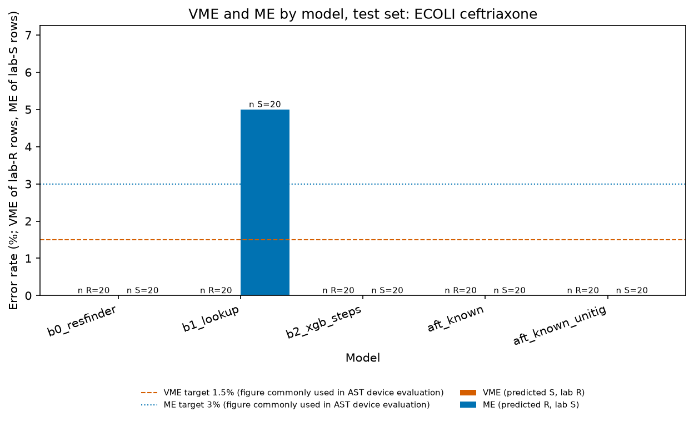

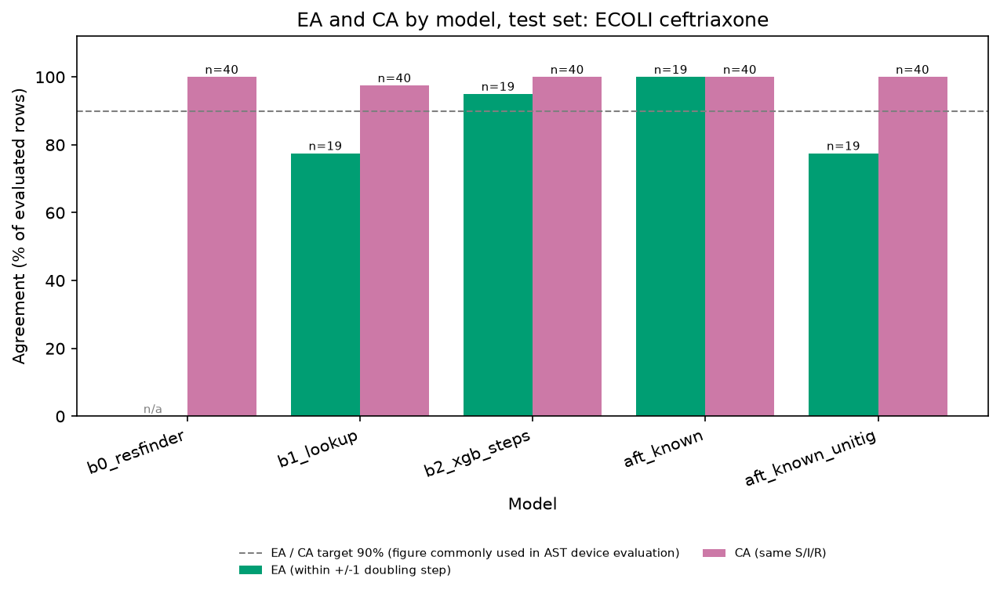

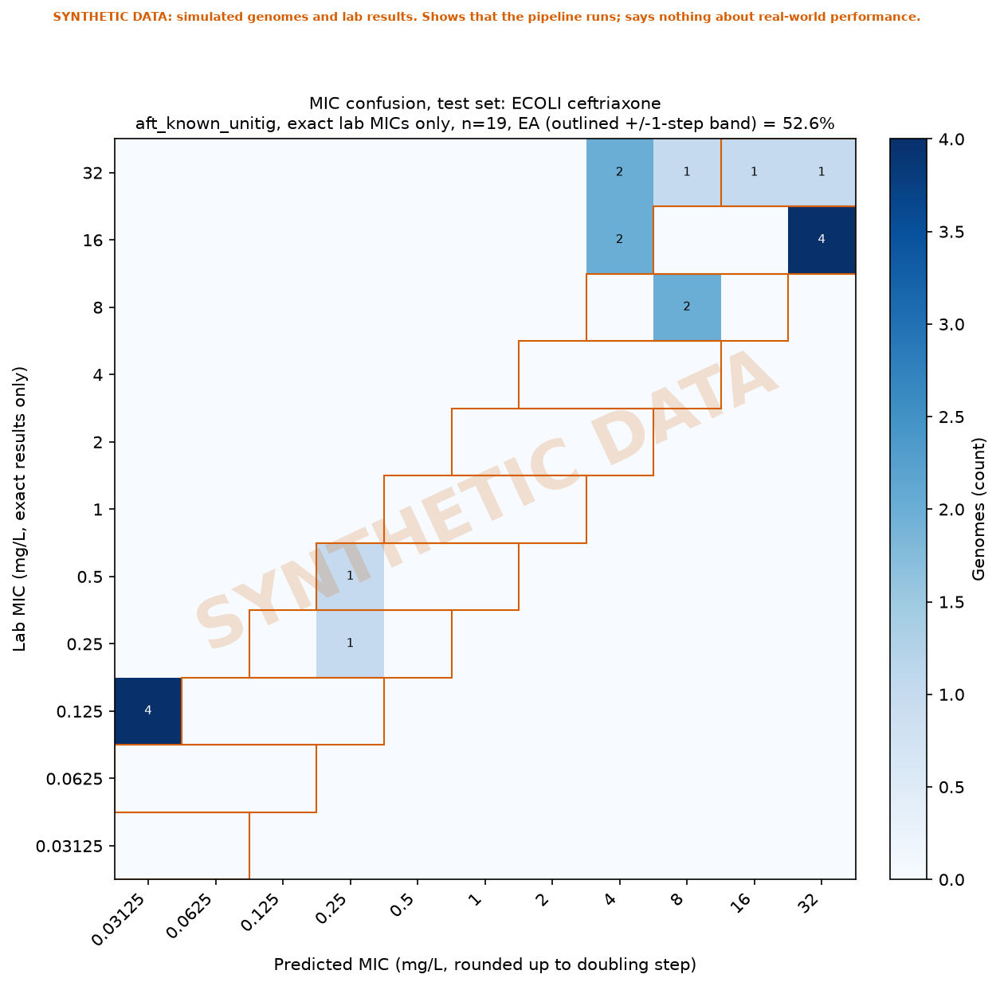

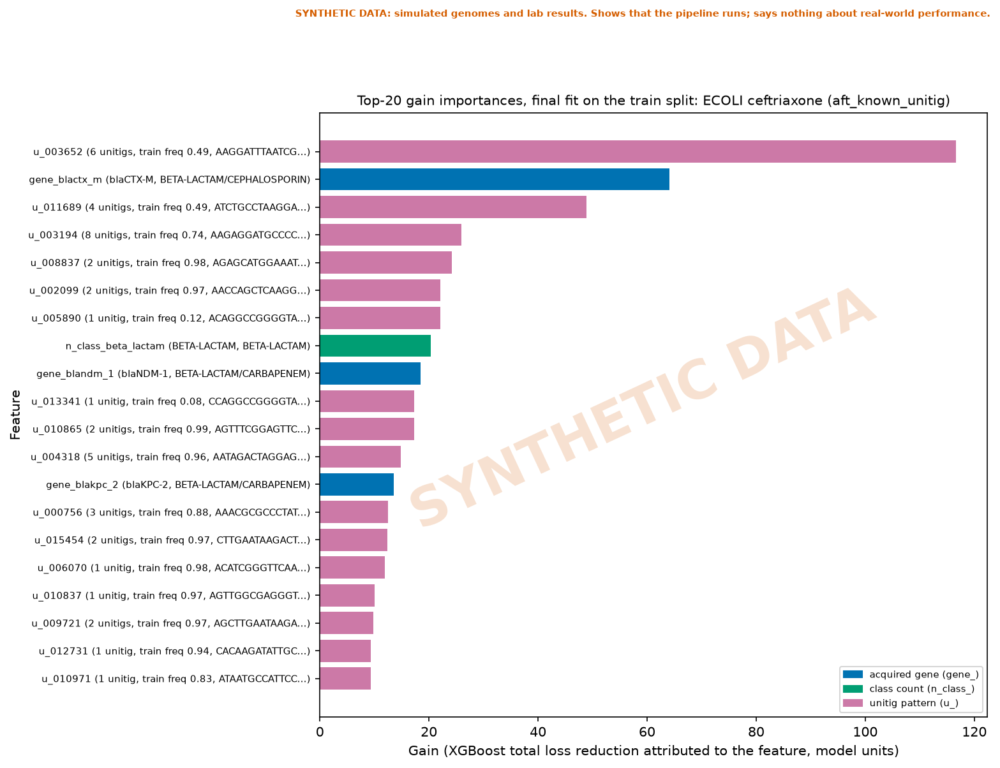

### ECOLI x ciprofloxacin

Call breakpoint (CLSI 2024, bloodstream): S if MIC <= 0.25 mg/L, R if MIC > 0.5 mg/L.

#### Test set (lineage-held-out genomes, scored once)

| Model | n | VME % (predicted S, lab R; of lab R) | Call VME % (lab R called likely active; of lab R) | Active calls % (lab S called likely active; of lab S) | Uncertain % | ME % (predicted R, lab S; of lab S) | Minor error % (of categorised) | CA % (same S/I/R) | EA % (within +/-1 step; exact lab MICs) | Exact agreement % (exact lab MICs) | AUROC (R vs S) | Band coverage % (90% band; exact lab MICs) | Band width (doubling steps) |
| --- | --- | --- | --- | --- | --- | --- | --- | --- | --- | --- | --- | --- | --- |
| b0_resfinder | 38 | 100.0% (n=4) | — | — | — | 12.1% (n=33) | 2.6% (n=38) | 76.3% (n=38) | — | — | — | — | — |
| b1_lookup | 38 | 0.0% (n=4) | 0.0% (n=4) | 0.0% (n=33) | 100.0% (n=38) | 0.0% (n=33) | 21.1% (n=38) | 78.9% (n=38) | 65.6% (n=32) | 37.5% (n=32) | 1.000 | 100.0% (n=32) | 12.00 |
| b2_xgb_steps | 38 | 0.0% (n=4) | 0.0% (n=4) | 93.9% (n=33) | 13.2% (n=38) | 0.0% (n=33) | 2.6% (n=38) | 97.4% (n=38) | 81.2% (n=32) | 53.1% (n=32) | 1.000 | 87.5% (n=32) | 4.00 |
| aft_known | 38 | 0.0% (n=4) | 0.0% (n=4) | 93.9% (n=33) | 15.8% (n=38) | 0.0% (n=33) | 5.3% (n=38) | 94.7% (n=38) | 84.4% (n=32) | 37.5% (n=32) | 1.000 | 87.5% (n=32) | 4.00 |
| aft_known_unitig | 38 | 0.0% (n=4) | 0.0% (n=4) | 81.8% (n=33) | 26.3% (n=38) | 0.0% (n=33) | 2.6% (n=38) | 97.4% (n=38) | 93.8% (n=32) | 37.5% (n=32) | 1.000 | 100.0% (n=32) | 4.00 |

Categorical metrics with the lab S/I/R re-derived from the lab MIC under the call breakpoint:

| Model | VME % re-derived (of lab R) | Call VME % re-derived (of lab R) | Call ME % re-derived (of lab S) | Active calls % re-derived (of lab S) | Uncertain % re-derived | ME % re-derived (of lab S) | Minor error % re-derived | CA % re-derived |
| --- | --- | --- | --- | --- | --- | --- | --- | --- |
| b0_resfinder | 100.0% (n=4) | — | — | — | — | 12.1% (n=33) | 2.6% (n=38) | 76.3% (n=38) |
| b1_lookup | 0.0% (n=4) | 0.0% (n=4) | 0.0% (n=33) | 0.0% (n=33) | 100.0% (n=38) | 0.0% (n=33) | 21.1% (n=38) | 78.9% (n=38) |
| b2_xgb_steps | 0.0% (n=4) | 0.0% (n=4) | 0.0% (n=33) | 93.9% (n=33) | 13.2% (n=38) | 0.0% (n=33) | 2.6% (n=38) | 97.4% (n=38) |
| aft_known | 0.0% (n=4) | 0.0% (n=4) | 0.0% (n=33) | 93.9% (n=33) | 15.8% (n=38) | 0.0% (n=33) | 5.3% (n=38) | 94.7% (n=38) |
| aft_known_unitig | 0.0% (n=4) | 0.0% (n=4) | 0.0% (n=33) | 81.8% (n=33) | 26.3% (n=38) | 0.0% (n=33) | 2.6% (n=38) | 97.4% (n=38) |

#### Cross-validation (out-of-fold, train split)

| Model | n | VME % (predicted S, lab R; of lab R) | Call VME % (lab R called likely active; of lab R) | Active calls % (lab S called likely active; of lab S) | Uncertain % | ME % (predicted R, lab S; of lab S) | Minor error % (of categorised) | CA % (same S/I/R) | EA % (within +/-1 step; exact lab MICs) | Exact agreement % (exact lab MICs) | AUROC (R vs S) | Band coverage % (90% band; exact lab MICs; cross-conformal, see note) | Band width (doubling steps) |
| --- | --- | --- | --- | --- | --- | --- | --- | --- | --- | --- | --- | --- | --- |
| b0_resfinder | 179 | 54.5% (n=88) | — | — | — | 13.3% (n=83) | 4.5% (n=179) | 62.6% (n=179) | — | — | — | — | — |
| b1_lookup | 179 | 65.9% (n=88) | 0.0% (n=88) | 7.2% (n=83) | 96.6% (n=179) | 16.9% (n=83) | 6.7% (n=179) | 53.1% (n=179) | 46.5% (n=142) | 25.4% (n=142) | 0.663 | 73.9% (n=142) | 9.35 |
| b2_xgb_steps | 179 | 3.4% (n=88) | 2.3% (n=88) | 77.1% (n=83) | 58.1% (n=179) | 4.8% (n=83) | 5.0% (n=179) | 91.1% (n=179) | 83.1% (n=142) | 35.9% (n=142) | 0.984 | 92.3% (n=142) | 5.22 |
| aft_known | 179 | 2.3% (n=88) | 1.1% (n=88) | 81.9% (n=83) | 34.1% (n=179) | 0.0% (n=83) | 6.1% (n=179) | 92.7% (n=179) | 88.0% (n=142) | 42.3% (n=142) | 0.993 | 95.8% (n=142) | 4.00 |
| aft_known_unitig | 179 | 3.4% (n=88) | 0.0% (n=88) | 85.5% (n=83) | 38.0% (n=179) | 0.0% (n=83) | 5.0% (n=179) | 93.3% (n=179) | 87.3% (n=142) | 39.4% (n=142) | 0.999 | 99.3% (n=142) | 4.00 |

_Note: CV bands are cross-conformal: the band on each fold's rows is calibrated on the out-of-fold residuals of the other folds only, so CV coverage is an out-of-fold estimate, not the calibration set itself._

Categorical metrics with the lab S/I/R re-derived from the lab MIC under the call breakpoint:

| Model | VME % re-derived (of lab R) | Call VME % re-derived (of lab R) | Call ME % re-derived (of lab S) | Active calls % re-derived (of lab S) | Uncertain % re-derived | ME % re-derived (of lab S) | Minor error % re-derived | CA % re-derived |
| --- | --- | --- | --- | --- | --- | --- | --- | --- |
| b0_resfinder | 54.5% (n=88) | — | — | — | — | 13.3% (n=83) | 4.5% (n=179) | 62.6% (n=179) |
| b1_lookup | 65.9% (n=88) | 0.0% (n=88) | 0.0% (n=83) | 7.2% (n=83) | 96.6% (n=179) | 16.9% (n=83) | 6.7% (n=179) | 53.1% (n=179) |
| b2_xgb_steps | 3.4% (n=88) | 2.3% (n=88) | 0.0% (n=83) | 77.1% (n=83) | 58.1% (n=179) | 4.8% (n=83) | 5.0% (n=179) | 91.1% (n=179) |
| aft_known | 2.3% (n=88) | 1.1% (n=88) | 0.0% (n=83) | 81.9% (n=83) | 34.1% (n=179) | 0.0% (n=83) | 6.1% (n=179) | 92.7% (n=179) |
| aft_known_unitig | 3.4% (n=88) | 0.0% (n=88) | 0.0% (n=83) | 85.5% (n=83) | 38.0% (n=179) | 0.0% (n=83) | 5.0% (n=179) | 93.3% (n=179) |

#### External and leave-one-lineage-out sets

**leave-one-lineage-out (ECOLI_ML_001)** (`lolo_ECOLI_ML_001`)

| Model | n | VME % (predicted S, lab R; of lab R) | Call VME % (lab R called likely active; of lab R) | Active calls % (lab S called likely active; of lab S) | Uncertain % | ME % (predicted R, lab S; of lab S) | Minor error % (of categorised) | CA % (same S/I/R) | EA % (within +/-1 step; exact lab MICs) | Exact agreement % (exact lab MICs) | AUROC (R vs S) | Band coverage % (90% band; exact lab MICs) | Band width (doubling steps) |
| --- | --- | --- | --- | --- | --- | --- | --- | --- | --- | --- | --- | --- | --- |
| b1_lookup | 39 | 78.8% (n=33) | 0.0% (n=33) | 0.0% (n=2) | 100.0% (n=39) | 0.0% (n=2) | 10.3% (n=39) | 23.1% (n=39) | 26.7% (n=30) | 13.3% (n=30) | 0.803 | 100.0% (n=30) | 12.00 |
| b2_xgb_steps | 39 | 3.0% (n=33) | 0.0% (n=33) | 100.0% (n=2) | 43.6% (n=39) | 0.0% (n=2) | 10.3% (n=39) | 87.2% (n=39) | 80.0% (n=30) | 26.7% (n=30) | 1.000 | 96.7% (n=30) | 4.00 |
| aft_known | 39 | 0.0% (n=33) | 0.0% (n=33) | 100.0% (n=2) | 28.2% (n=39) | 0.0% (n=2) | 10.3% (n=39) | 89.7% (n=39) | 80.0% (n=30) | 33.3% (n=30) | 1.000 | 96.7% (n=30) | 4.00 |
| aft_known_unitig | 39 | 0.0% (n=33) | 0.0% (n=33) | 50.0% (n=2) | 38.5% (n=39) | 0.0% (n=2) | 10.3% (n=39) | 89.7% (n=39) | 96.7% (n=30) | 43.3% (n=30) | 1.000 | 100.0% (n=30) | 4.00 |

Categorical metrics with the lab S/I/R re-derived from the lab MIC under the call breakpoint:

| Model | VME % re-derived (of lab R) | Call VME % re-derived (of lab R) | Call ME % re-derived (of lab S) | Active calls % re-derived (of lab S) | Uncertain % re-derived | ME % re-derived (of lab S) | Minor error % re-derived | CA % re-derived |
| --- | --- | --- | --- | --- | --- | --- | --- | --- |
| b1_lookup | 78.8% (n=33) | 0.0% (n=33) | 0.0% (n=2) | 0.0% (n=2) | 100.0% (n=39) | 0.0% (n=2) | 10.3% (n=39) | 23.1% (n=39) |
| b2_xgb_steps | 3.0% (n=33) | 0.0% (n=33) | 0.0% (n=2) | 100.0% (n=2) | 43.6% (n=39) | 0.0% (n=2) | 10.3% (n=39) | 87.2% (n=39) |
| aft_known | 0.0% (n=33) | 0.0% (n=33) | 0.0% (n=2) | 100.0% (n=2) | 28.2% (n=39) | 0.0% (n=2) | 10.3% (n=39) | 89.7% (n=39) |
| aft_known_unitig | 0.0% (n=33) | 0.0% (n=33) | 0.0% (n=2) | 50.0% (n=2) | 38.5% (n=39) | 0.0% (n=2) | 10.3% (n=39) | 89.7% (n=39) |

**leave-one-lineage-out (ECOLI_ML_002)** (`lolo_ECOLI_ML_002`)

| Model | n | VME % (predicted S, lab R; of lab R) | Call VME % (lab R called likely active; of lab R) | Active calls % (lab S called likely active; of lab S) | Uncertain % | ME % (predicted R, lab S; of lab S) | Minor error % (of categorised) | CA % (same S/I/R) | EA % (within +/-1 step; exact lab MICs) | Exact agreement % (exact lab MICs) | AUROC (R vs S) | Band coverage % (90% band; exact lab MICs) | Band width (doubling steps) |
| --- | --- | --- | --- | --- | --- | --- | --- | --- | --- | --- | --- | --- | --- |
| b1_lookup | 31 | 81.5% (n=27) | 0.0% (n=27) | 0.0% (n=3) | 100.0% (n=31) | 0.0% (n=3) | 3.2% (n=31) | 25.8% (n=31) | 35.0% (n=20) | 5.0% (n=20) | 1.000 | 100.0% (n=20) | 12.00 |
| b2_xgb_steps | 31 | 0.0% (n=27) | 0.0% (n=27) | 100.0% (n=3) | 51.6% (n=31) | 0.0% (n=3) | 6.5% (n=31) | 93.5% (n=31) | 75.0% (n=20) | 25.0% (n=20) | 1.000 | 95.0% (n=20) | 4.00 |
| aft_known | 31 | 0.0% (n=27) | 0.0% (n=27) | 100.0% (n=3) | 38.7% (n=31) | 0.0% (n=3) | 3.2% (n=31) | 96.8% (n=31) | 90.0% (n=20) | 25.0% (n=20) | 1.000 | 100.0% (n=20) | 4.00 |
| aft_known_unitig | 31 | 0.0% (n=27) | 0.0% (n=27) | 0.0% (n=3) | 71.0% (n=31) | 0.0% (n=3) | 0.0% (n=31) | 100.0% (n=31) | 85.0% (n=20) | 40.0% (n=20) | 1.000 | 100.0% (n=20) | 4.00 |

Categorical metrics with the lab S/I/R re-derived from the lab MIC under the call breakpoint:

| Model | VME % re-derived (of lab R) | Call VME % re-derived (of lab R) | Call ME % re-derived (of lab S) | Active calls % re-derived (of lab S) | Uncertain % re-derived | ME % re-derived (of lab S) | Minor error % re-derived | CA % re-derived |
| --- | --- | --- | --- | --- | --- | --- | --- | --- |
| b1_lookup | 81.5% (n=27) | 0.0% (n=27) | 0.0% (n=3) | 0.0% (n=3) | 100.0% (n=31) | 0.0% (n=3) | 3.2% (n=31) | 25.8% (n=31) |
| b2_xgb_steps | 0.0% (n=27) | 0.0% (n=27) | 0.0% (n=3) | 100.0% (n=3) | 51.6% (n=31) | 0.0% (n=3) | 6.5% (n=31) | 93.5% (n=31) |
| aft_known | 0.0% (n=27) | 0.0% (n=27) | 0.0% (n=3) | 100.0% (n=3) | 38.7% (n=31) | 0.0% (n=3) | 3.2% (n=31) | 96.8% (n=31) |
| aft_known_unitig | 0.0% (n=27) | 0.0% (n=27) | 0.0% (n=3) | 0.0% (n=3) | 71.0% (n=31) | 0.0% (n=3) | 0.0% (n=31) | 100.0% (n=31) |

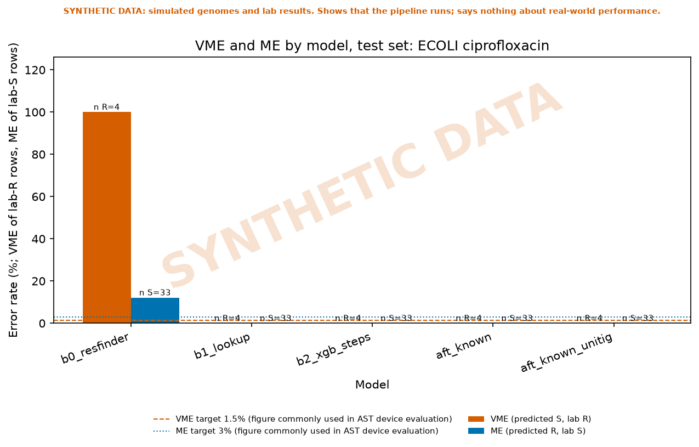

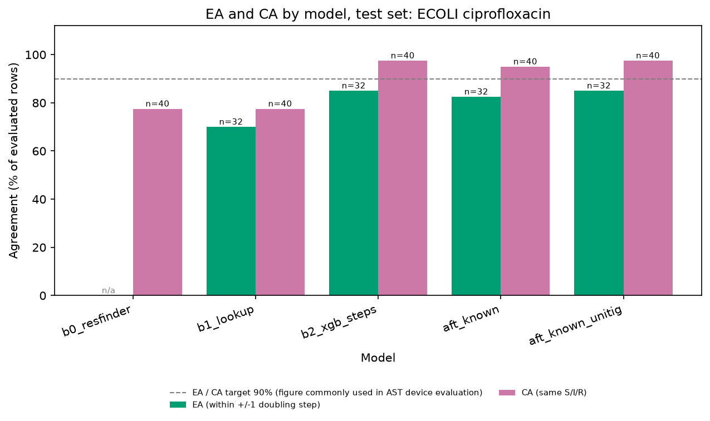

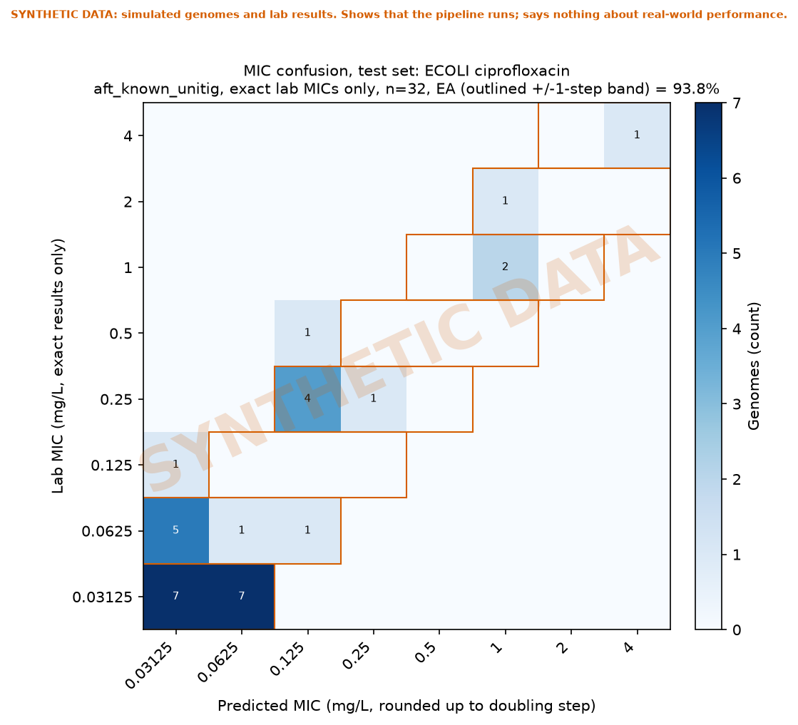

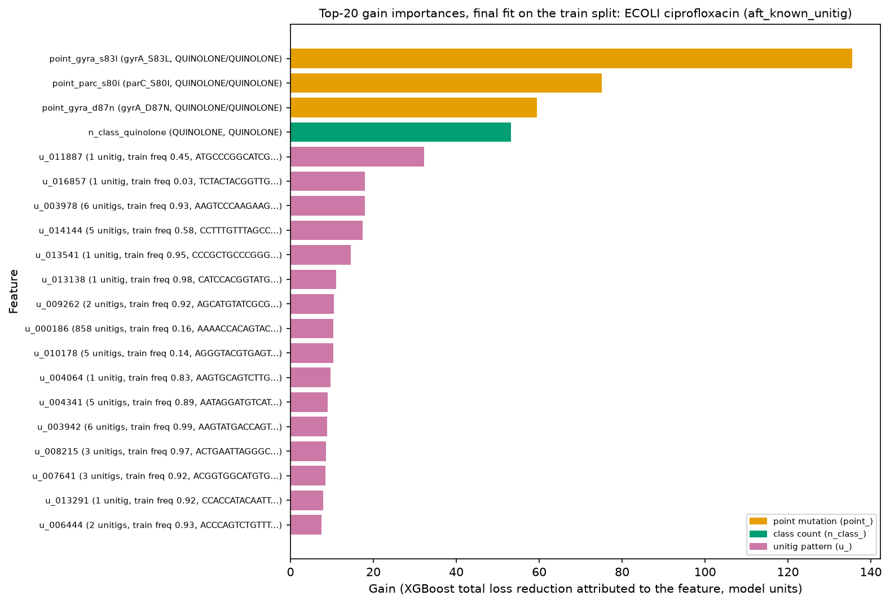

### ECOLI x meropenem

Call breakpoint (CLSI 2024, bloodstream): S if MIC <= 1 mg/L, R if MIC > 2 mg/L.

#### Test set (lineage-held-out genomes, scored once)

| Model | n | VME % (predicted S, lab R; of lab R) | Call VME % (lab R called likely active; of lab R) | Active calls % (lab S called likely active; of lab S) | Uncertain % | ME % (predicted R, lab S; of lab S) | Minor error % (of categorised) | CA % (same S/I/R) | EA % (within +/-1 step; exact lab MICs) | Exact agreement % (exact lab MICs) | AUROC (R vs S) | Band coverage % (90% band; exact lab MICs) | Band width (doubling steps) |
| --- | --- | --- | --- | --- | --- | --- | --- | --- | --- | --- | --- | --- | --- |
| b0_resfinder | 40 | 0.0% (n=6) | — | — | — | 6.7% (n=30) | 10.0% (n=40) | 85.0% (n=40) | — | — | — | — | — |
| b1_lookup | 40 | 50.0% (n=6) | 0.0% (n=6) | 0.0% (n=30) | 70.0% (n=40) | 3.3% (n=30) | 7.5% (n=40) | 82.5% (n=40) | 75.0% (n=16) | 37.5% (n=16) | 0.933 | 100.0% (n=16) | 18.00 |
| b2_xgb_steps | 40 | 0.0% (n=6) | 0.0% (n=6) | 0.0% (n=30) | 70.0% (n=40) | 3.3% (n=30) | 12.5% (n=40) | 85.0% (n=40) | 100.0% (n=16) | 43.8% (n=16) | 1.000 | 100.0% (n=16) | 14.00 |
| aft_known | 40 | 0.0% (n=6) | 0.0% (n=6) | 93.3% (n=30) | 0.0% (n=40) | 3.3% (n=30) | 7.5% (n=40) | 90.0% (n=40) | 93.8% (n=16) | 25.0% (n=16) | 1.000 | 100.0% (n=16) | 6.00 |
| aft_known_unitig | 40 | 0.0% (n=6) | 0.0% (n=6) | 93.3% (n=30) | 0.0% (n=40) | 0.0% (n=30) | 12.5% (n=40) | 87.5% (n=40) | 68.8% (n=16) | 25.0% (n=16) | 1.000 | 100.0% (n=16) | 8.00 |

Categorical metrics with the lab S/I/R re-derived from the lab MIC under the call breakpoint:

| Model | VME % re-derived (of lab R) | Call VME % re-derived (of lab R) | Call ME % re-derived (of lab S) | Active calls % re-derived (of lab S) | Uncertain % re-derived | ME % re-derived (of lab S) | Minor error % re-derived | CA % re-derived |
| --- | --- | --- | --- | --- | --- | --- | --- | --- |
| b0_resfinder | 0.0% (n=8) | — | — | — | — | 3.6% (n=28) | 7.7% (n=39) | 89.7% (n=39) |
| b1_lookup | 37.5% (n=8) | 0.0% (n=8) | 3.6% (n=28) | 0.0% (n=28) | 69.2% (n=39) | 0.0% (n=28) | 5.1% (n=39) | 87.2% (n=39) |
| b2_xgb_steps | 0.0% (n=8) | 0.0% (n=8) | 3.6% (n=28) | 0.0% (n=28) | 69.2% (n=39) | 0.0% (n=28) | 10.3% (n=39) | 89.7% (n=39) |
| aft_known | 0.0% (n=8) | 0.0% (n=8) | 3.6% (n=28) | 96.4% (n=28) | 0.0% (n=39) | 0.0% (n=28) | 5.1% (n=39) | 94.9% (n=39) |
| aft_known_unitig | 0.0% (n=8) | 0.0% (n=8) | 3.6% (n=28) | 96.4% (n=28) | 0.0% (n=39) | 0.0% (n=28) | 5.1% (n=39) | 94.9% (n=39) |

#### Cross-validation (out-of-fold, train split)

| Model | n | VME % (predicted S, lab R; of lab R) | Call VME % (lab R called likely active; of lab R) | Active calls % (lab S called likely active; of lab S) | Uncertain % | ME % (predicted R, lab S; of lab S) | Minor error % (of categorised) | CA % (same S/I/R) | EA % (within +/-1 step; exact lab MICs) | Exact agreement % (exact lab MICs) | AUROC (R vs S) | Band coverage % (90% band; exact lab MICs; cross-conformal, see note) | Band width (doubling steps) |
| --- | --- | --- | --- | --- | --- | --- | --- | --- | --- | --- | --- | --- | --- |
| b0_resfinder | 182 | 2.2% (n=45) | — | — | — | 5.0% (n=120) | 9.3% (n=182) | 86.8% (n=182) | — | — | — | — | — |
| b1_lookup | 182 | 100.0% (n=45) | 0.0% (n=45) | 0.0% (n=120) | 63.2% (n=182) | 1.7% (n=120) | 8.8% (n=182) | 65.4% (n=182) | 38.4% (n=73) | 4.1% (n=73) | 0.509 | 84.9% (n=73) | 17.56 |
| b2_xgb_steps | 182 | 15.6% (n=45) | 2.2% (n=45) | 18.3% (n=120) | 50.5% (n=182) | 8.3% (n=120) | 7.1% (n=182) | 83.5% (n=182) | 72.6% (n=73) | 43.8% (n=73) | 0.927 | 91.8% (n=73) | 12.78 |
| aft_known | 182 | 20.0% (n=45) | 2.2% (n=45) | 93.3% (n=120) | 1.1% (n=182) | 1.7% (n=120) | 9.9% (n=182) | 84.1% (n=182) | 57.5% (n=73) | 19.2% (n=73) | 0.971 | 91.8% (n=73) | 5.59 |
| aft_known_unitig | 182 | 17.8% (n=45) | 2.2% (n=45) | 83.3% (n=120) | 7.7% (n=182) | 0.0% (n=120) | 9.9% (n=182) | 85.7% (n=182) | 45.2% (n=73) | 15.1% (n=73) | 0.979 | 84.9% (n=73) | 7.19 |

_Note: CV bands are cross-conformal: the band on each fold's rows is calibrated on the out-of-fold residuals of the other folds only, so CV coverage is an out-of-fold estimate, not the calibration set itself._

Categorical metrics with the lab S/I/R re-derived from the lab MIC under the call breakpoint:

| Model | VME % re-derived (of lab R) | Call VME % re-derived (of lab R) | Call ME % re-derived (of lab S) | Active calls % re-derived (of lab S) | Uncertain % re-derived | ME % re-derived (of lab S) | Minor error % re-derived | CA % re-derived |
| --- | --- | --- | --- | --- | --- | --- | --- | --- |
| b0_resfinder | 1.9% (n=54) | — | — | — | — | 1.7% (n=115) | 6.6% (n=181) | 91.7% (n=181) |
| b1_lookup | 96.3% (n=54) | 0.0% (n=54) | 1.7% (n=115) | 0.0% (n=115) | 63.0% (n=181) | 0.9% (n=115) | 7.2% (n=181) | 63.5% (n=181) |
| b2_xgb_steps | 16.7% (n=54) | 1.9% (n=54) | 1.7% (n=115) | 19.1% (n=115) | 50.3% (n=181) | 5.2% (n=115) | 7.7% (n=181) | 84.0% (n=181) |
| aft_known | 27.8% (n=54) | 1.9% (n=54) | 1.7% (n=115) | 96.5% (n=115) | 1.1% (n=181) | 0.9% (n=115) | 6.1% (n=181) | 85.1% (n=181) |
| aft_known_unitig | 29.6% (n=54) | 1.9% (n=54) | 1.7% (n=115) | 87.0% (n=115) | 7.2% (n=181) | 0.0% (n=115) | 7.2% (n=181) | 84.0% (n=181) |

#### External and leave-one-lineage-out sets

**leave-one-lineage-out (ECOLI_ML_001)** (`lolo_ECOLI_ML_001`)

| Model | n | VME % (predicted S, lab R; of lab R) | Call VME % (lab R called likely active; of lab R) | Active calls % (lab S called likely active; of lab S) | Uncertain % | ME % (predicted R, lab S; of lab S) | Minor error % (of categorised) | CA % (same S/I/R) | EA % (within +/-1 step; exact lab MICs) | Exact agreement % (exact lab MICs) | AUROC (R vs S) | Band coverage % (90% band; exact lab MICs) | Band width (doubling steps) |
| --- | --- | --- | --- | --- | --- | --- | --- | --- | --- | --- | --- | --- | --- |
| b1_lookup | 40 | 95.0% (n=20) | 0.0% (n=20) | 0.0% (n=15) | 35.0% (n=40) | 6.7% (n=15) | 12.5% (n=40) | 37.5% (n=40) | 53.3% (n=15) | 13.3% (n=15) | 0.430 | 86.7% (n=15) | 18.00 |
| b2_xgb_steps | 40 | 5.0% (n=20) | 0.0% (n=20) | 0.0% (n=15) | 35.0% (n=40) | 6.7% (n=15) | 17.5% (n=40) | 77.5% (n=40) | 93.3% (n=15) | 53.3% (n=15) | 0.957 | 100.0% (n=15) | 14.00 |
| aft_known | 40 | 0.0% (n=20) | 0.0% (n=20) | 93.3% (n=15) | 0.0% (n=40) | 6.7% (n=15) | 5.0% (n=40) | 92.5% (n=40) | 86.7% (n=15) | 33.3% (n=15) | 1.000 | 100.0% (n=15) | 6.00 |
| aft_known_unitig | 40 | 0.0% (n=20) | 0.0% (n=20) | 93.3% (n=15) | 0.0% (n=40) | 0.0% (n=15) | 12.5% (n=40) | 87.5% (n=40) | 40.0% (n=15) | 6.7% (n=15) | 1.000 | 100.0% (n=15) | 8.00 |

Categorical metrics with the lab S/I/R re-derived from the lab MIC under the call breakpoint:

| Model | VME % re-derived (of lab R) | Call VME % re-derived (of lab R) | Call ME % re-derived (of lab S) | Active calls % re-derived (of lab S) | Uncertain % re-derived | ME % re-derived (of lab S) | Minor error % re-derived | CA % re-derived |
| --- | --- | --- | --- | --- | --- | --- | --- | --- |
| b1_lookup | 95.7% (n=23) | 0.0% (n=23) | 0.0% (n=14) | 0.0% (n=14) | 35.0% (n=40) | 0.0% (n=14) | 7.5% (n=40) | 37.5% (n=40) |
| b2_xgb_steps | 4.3% (n=23) | 0.0% (n=23) | 0.0% (n=14) | 0.0% (n=14) | 35.0% (n=40) | 0.0% (n=14) | 17.5% (n=40) | 80.0% (n=40) |
| aft_known | 0.0% (n=23) | 0.0% (n=23) | 0.0% (n=14) | 100.0% (n=14) | 0.0% (n=40) | 0.0% (n=14) | 5.0% (n=40) | 95.0% (n=40) |
| aft_known_unitig | 8.7% (n=23) | 0.0% (n=23) | 0.0% (n=14) | 100.0% (n=14) | 0.0% (n=40) | 0.0% (n=14) | 12.5% (n=40) | 82.5% (n=40) |

**leave-one-lineage-out (ECOLI_ML_002)** (`lolo_ECOLI_ML_002`)

| Model | n | VME % (predicted S, lab R; of lab R) | Call VME % (lab R called likely active; of lab R) | Active calls % (lab S called likely active; of lab S) | Uncertain % | ME % (predicted R, lab S; of lab S) | Minor error % (of categorised) | CA % (same S/I/R) | EA % (within +/-1 step; exact lab MICs) | Exact agreement % (exact lab MICs) | AUROC (R vs S) | Band coverage % (90% band; exact lab MICs) | Band width (doubling steps) |
| --- | --- | --- | --- | --- | --- | --- | --- | --- | --- | --- | --- | --- | --- |
| b1_lookup | 29 | 90.9% (n=11) | 0.0% (n=11) | 0.0% (n=12) | 31.0% (n=29) | 0.0% (n=12) | 17.2% (n=29) | 48.3% (n=29) | 33.3% (n=18) | 22.2% (n=18) | 0.432 | 94.4% (n=18) | 18.00 |
| b2_xgb_steps | 29 | 27.3% (n=11) | 0.0% (n=11) | 0.0% (n=12) | 31.0% (n=29) | 0.0% (n=12) | 24.1% (n=29) | 65.5% (n=29) | 50.0% (n=18) | 38.9% (n=18) | 0.848 | 94.4% (n=18) | 14.00 |
| aft_known | 29 | 0.0% (n=11) | 0.0% (n=11) | 75.0% (n=12) | 0.0% (n=29) | 8.3% (n=12) | 27.6% (n=29) | 69.0% (n=29) | 94.4% (n=18) | 55.6% (n=18) | 0.992 | 100.0% (n=18) | 6.00 |
| aft_known_unitig | 29 | 9.1% (n=11) | 0.0% (n=11) | 75.0% (n=12) | 0.0% (n=29) | 0.0% (n=12) | 10.3% (n=29) | 86.2% (n=29) | 83.3% (n=18) | 33.3% (n=18) | 0.981 | 100.0% (n=18) | 8.00 |

Categorical metrics with the lab S/I/R re-derived from the lab MIC under the call breakpoint:

| Model | VME % re-derived (of lab R) | Call VME % re-derived (of lab R) | Call ME % re-derived (of lab S) | Active calls % re-derived (of lab S) | Uncertain % re-derived | ME % re-derived (of lab S) | Minor error % re-derived | CA % re-derived |
| --- | --- | --- | --- | --- | --- | --- | --- | --- |
| b1_lookup | 83.3% (n=12) | 0.0% (n=12) | 0.0% (n=9) | 0.0% (n=9) | 31.0% (n=29) | 0.0% (n=9) | 24.1% (n=29) | 41.4% (n=29) |
| b2_xgb_steps | 33.3% (n=12) | 0.0% (n=12) | 0.0% (n=9) | 0.0% (n=9) | 31.0% (n=29) | 0.0% (n=9) | 24.1% (n=29) | 62.1% (n=29) |
| aft_known | 0.0% (n=12) | 0.0% (n=12) | 0.0% (n=9) | 100.0% (n=9) | 0.0% (n=29) | 0.0% (n=9) | 20.7% (n=29) | 79.3% (n=29) |
| aft_known_unitig | 8.3% (n=12) | 0.0% (n=12) | 0.0% (n=9) | 100.0% (n=9) | 0.0% (n=29) | 0.0% (n=9) | 17.2% (n=29) | 79.3% (n=29) |

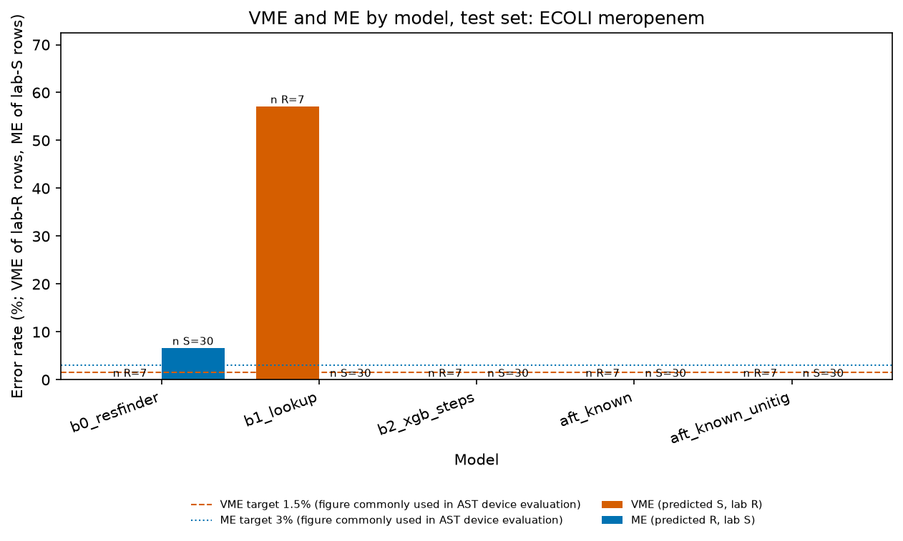

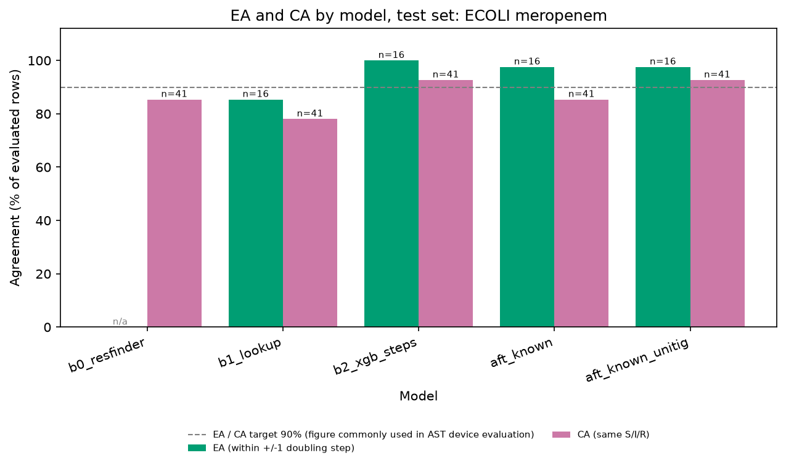

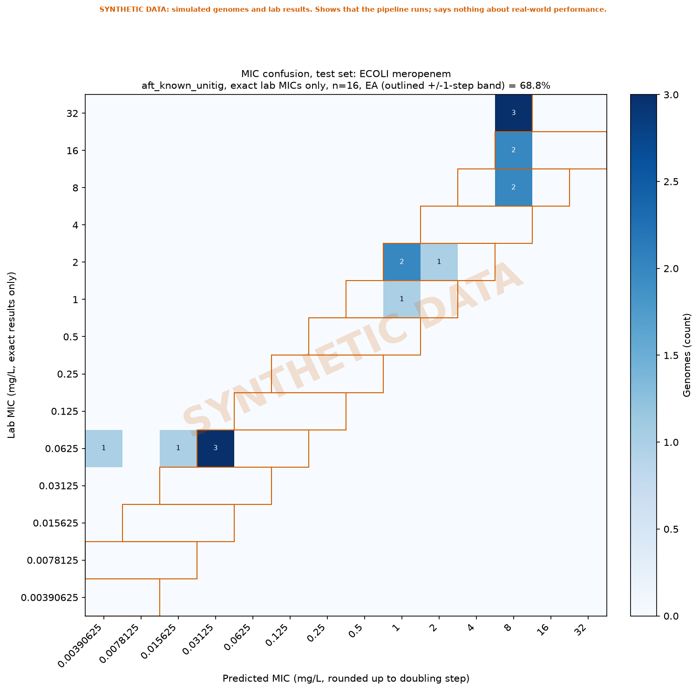

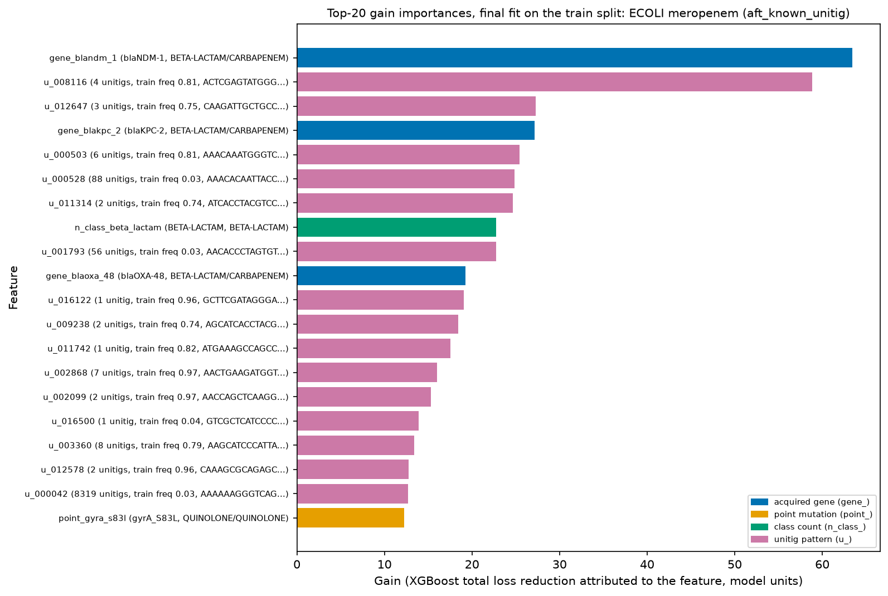

### ECOLI x piperacillin-tazobactam

Call breakpoint (CLSI 2024, bloodstream): S if MIC <= 8 mg/L, R if MIC > 16 mg/L.

#### Test set (lineage-held-out genomes, scored once)

| Model | n | VME % (predicted S, lab R; of lab R) | Call VME % (lab R called likely active; of lab R) | Active calls % (lab S called likely active; of lab S) | Uncertain % | ME % (predicted R, lab S; of lab S) | Minor error % (of categorised) | CA % (same S/I/R) | EA % (within +/-1 step; exact lab MICs) | Exact agreement % (exact lab MICs) | AUROC (R vs S) | Band coverage % (90% band; exact lab MICs) | Band width (doubling steps) |
| --- | --- | --- | --- | --- | --- | --- | --- | --- | --- | --- | --- | --- | --- |
| b0_resfinder | 35 | 0.0% (n=11) | — | — | — | 0.0% (n=23) | 2.9% (n=35) | 97.1% (n=35) | — | — | — | — | — |
| b1_lookup | 35 | 81.8% (n=11) | 0.0% (n=11) | 0.0% (n=23) | 100.0% (n=35) | 0.0% (n=23) | 0.0% (n=35) | 74.3% (n=35) | 70.8% (n=24) | 33.3% (n=24) | 0.947 | 100.0% (n=24) | 8.00 |
| b2_xgb_steps | 35 | 63.6% (n=11) | 9.1% (n=11) | 87.0% (n=23) | 31.4% (n=35) | 0.0% (n=23) | 0.0% (n=35) | 80.0% (n=35) | 79.2% (n=24) | 29.2% (n=24) | 0.943 | 91.7% (n=24) | 4.00 |
| aft_known | 35 | 0.0% (n=11) | 0.0% (n=11) | 87.0% (n=23) | 14.3% (n=35) | 0.0% (n=23) | 2.9% (n=35) | 97.1% (n=35) | 83.3% (n=24) | 33.3% (n=24) | 1.000 | 100.0% (n=24) | 4.00 |
| aft_known_unitig | 35 | 0.0% (n=11) | 0.0% (n=11) | 87.0% (n=23) | 28.6% (n=35) | 0.0% (n=23) | 2.9% (n=35) | 97.1% (n=35) | 75.0% (n=24) | 25.0% (n=24) | 1.000 | 100.0% (n=24) | 4.00 |

Categorical metrics with the lab S/I/R re-derived from the lab MIC under the call breakpoint:

| Model | VME % re-derived (of lab R) | Call VME % re-derived (of lab R) | Call ME % re-derived (of lab S) | Active calls % re-derived (of lab S) | Uncertain % re-derived | ME % re-derived (of lab S) | Minor error % re-derived | CA % re-derived |
| --- | --- | --- | --- | --- | --- | --- | --- | --- |
| b0_resfinder | 0.0% (n=10) | — | — | — | — | 0.0% (n=23) | 2.9% (n=34) | 97.1% (n=34) |
| b1_lookup | 80.0% (n=10) | 0.0% (n=10) | 0.0% (n=23) | 0.0% (n=23) | 100.0% (n=34) | 0.0% (n=23) | 0.0% (n=34) | 76.5% (n=34) |
| b2_xgb_steps | 60.0% (n=10) | 10.0% (n=10) | 0.0% (n=23) | 87.0% (n=23) | 29.4% (n=34) | 0.0% (n=23) | 0.0% (n=34) | 82.4% (n=34) |
| aft_known | 0.0% (n=10) | 0.0% (n=10) | 0.0% (n=23) | 87.0% (n=23) | 14.7% (n=34) | 0.0% (n=23) | 2.9% (n=34) | 97.1% (n=34) |
| aft_known_unitig | 0.0% (n=10) | 0.0% (n=10) | 0.0% (n=23) | 87.0% (n=23) | 29.4% (n=34) | 0.0% (n=23) | 2.9% (n=34) | 97.1% (n=34) |

#### Cross-validation (out-of-fold, train split)

| Model | n | VME % (predicted S, lab R; of lab R) | Call VME % (lab R called likely active; of lab R) | Active calls % (lab S called likely active; of lab S) | Uncertain % | ME % (predicted R, lab S; of lab S) | Minor error % (of categorised) | CA % (same S/I/R) | EA % (within +/-1 step; exact lab MICs) | Exact agreement % (exact lab MICs) | AUROC (R vs S) | Band coverage % (90% band; exact lab MICs; cross-conformal, see note) | Band width (doubling steps) |
| --- | --- | --- | --- | --- | --- | --- | --- | --- | --- | --- | --- | --- | --- |
| b0_resfinder | 157 | 13.6% (n=66) | — | — | — | 0.0% (n=89) | 1.3% (n=157) | 93.0% (n=157) | — | — | — | — | — |
| b1_lookup | 157 | 92.4% (n=66) | 0.0% (n=66) | 4.5% (n=89) | 97.5% (n=157) | 0.0% (n=89) | 4.5% (n=157) | 56.7% (n=157) | 72.6% (n=106) | 29.2% (n=106) | 0.603 | 92.5% (n=106) | 7.11 |
| b2_xgb_steps | 157 | 30.3% (n=66) | 10.6% (n=66) | 76.4% (n=89) | 49.7% (n=157) | 0.0% (n=89) | 17.8% (n=157) | 69.4% (n=157) | 80.2% (n=106) | 35.8% (n=106) | 0.914 | 93.4% (n=106) | 4.00 |
| aft_known | 157 | 15.2% (n=66) | 3.0% (n=66) | 77.5% (n=89) | 45.9% (n=157) | 0.0% (n=89) | 5.1% (n=157) | 88.5% (n=157) | 87.7% (n=106) | 43.4% (n=106) | 0.988 | 93.4% (n=106) | 3.63 |
| aft_known_unitig | 157 | 10.6% (n=66) | 0.0% (n=66) | 66.3% (n=89) | 44.6% (n=157) | 0.0% (n=89) | 9.6% (n=157) | 86.0% (n=157) | 77.4% (n=106) | 42.5% (n=106) | 0.978 | 92.5% (n=106) | 4.00 |

_Note: CV bands are cross-conformal: the band on each fold's rows is calibrated on the out-of-fold residuals of the other folds only, so CV coverage is an out-of-fold estimate, not the calibration set itself._

Categorical metrics with the lab S/I/R re-derived from the lab MIC under the call breakpoint:

| Model | VME % re-derived (of lab R) | Call VME % re-derived (of lab R) | Call ME % re-derived (of lab S) | Active calls % re-derived (of lab S) | Uncertain % re-derived | ME % re-derived (of lab S) | Minor error % re-derived | CA % re-derived |
| --- | --- | --- | --- | --- | --- | --- | --- | --- |
| b0_resfinder | 6.8% (n=59) | — | — | — | — | 0.0% (n=89) | 4.5% (n=155) | 92.9% (n=155) |
| b1_lookup | 93.2% (n=59) | 0.0% (n=59) | 0.0% (n=89) | 4.5% (n=89) | 97.4% (n=155) | 0.0% (n=89) | 6.5% (n=155) | 58.1% (n=155) |
| b2_xgb_steps | 25.4% (n=59) | 11.9% (n=59) | 0.0% (n=89) | 76.4% (n=89) | 49.0% (n=155) | 0.0% (n=89) | 20.0% (n=155) | 70.3% (n=155) |
| aft_known | 6.8% (n=59) | 3.4% (n=59) | 0.0% (n=89) | 77.5% (n=89) | 45.2% (n=155) | 0.0% (n=89) | 8.4% (n=155) | 89.0% (n=155) |
| aft_known_unitig | 10.2% (n=59) | 0.0% (n=59) | 0.0% (n=89) | 66.3% (n=89) | 43.9% (n=155) | 0.0% (n=89) | 7.1% (n=155) | 89.0% (n=155) |

#### External and leave-one-lineage-out sets

**leave-one-lineage-out (ECOLI_ML_001)** (`lolo_ECOLI_ML_001`)

| Model | n | VME % (predicted S, lab R; of lab R) | Call VME % (lab R called likely active; of lab R) | Active calls % (lab S called likely active; of lab S) | Uncertain % | ME % (predicted R, lab S; of lab S) | Minor error % (of categorised) | CA % (same S/I/R) | EA % (within +/-1 step; exact lab MICs) | Exact agreement % (exact lab MICs) | AUROC (R vs S) | Band coverage % (90% band; exact lab MICs) | Band width (doubling steps) |
| --- | --- | --- | --- | --- | --- | --- | --- | --- | --- | --- | --- | --- | --- |
| b1_lookup | 35 | 88.0% (n=25) | 0.0% (n=25) | 0.0% (n=10) | 100.0% (n=35) | 0.0% (n=10) | 11.4% (n=35) | 25.7% (n=35) | 69.2% (n=13) | 30.8% (n=13) | 0.384 | 100.0% (n=13) | 8.00 |
| b2_xgb_steps | 35 | 100.0% (n=25) | 100.0% (n=25) | 70.0% (n=10) | 8.6% (n=35) | 0.0% (n=10) | 2.9% (n=35) | 25.7% (n=35) | 46.2% (n=13) | 15.4% (n=13) | 0.400 | 69.2% (n=13) | 4.00 |
| aft_known | 35 | 0.0% (n=25) | 0.0% (n=25) | 10.0% (n=10) | 42.9% (n=35) | 0.0% (n=10) | 20.0% (n=35) | 80.0% (n=35) | 61.5% (n=13) | 23.1% (n=13) | 0.988 | 100.0% (n=13) | 4.00 |
| aft_known_unitig | 35 | 0.0% (n=25) | 0.0% (n=25) | 10.0% (n=10) | 40.0% (n=35) | 10.0% (n=10) | 17.1% (n=35) | 80.0% (n=35) | 61.5% (n=13) | 23.1% (n=13) | 0.984 | 100.0% (n=13) | 4.00 |

Categorical metrics with the lab S/I/R re-derived from the lab MIC under the call breakpoint:

| Model | VME % re-derived (of lab R) | Call VME % re-derived (of lab R) | Call ME % re-derived (of lab S) | Active calls % re-derived (of lab S) | Uncertain % re-derived | ME % re-derived (of lab S) | Minor error % re-derived | CA % re-derived |
| --- | --- | --- | --- | --- | --- | --- | --- | --- |
| b1_lookup | 87.0% (n=23) | 0.0% (n=23) | 0.0% (n=10) | 0.0% (n=10) | 100.0% (n=34) | 0.0% (n=10) | 14.7% (n=34) | 26.5% (n=34) |
| b2_xgb_steps | 100.0% (n=23) | 100.0% (n=23) | 0.0% (n=10) | 70.0% (n=10) | 8.8% (n=34) | 0.0% (n=10) | 5.9% (n=34) | 26.5% (n=34) |
| aft_known | 0.0% (n=23) | 0.0% (n=23) | 0.0% (n=10) | 10.0% (n=10) | 41.2% (n=34) | 0.0% (n=10) | 17.6% (n=34) | 82.4% (n=34) |
| aft_known_unitig | 0.0% (n=23) | 0.0% (n=23) | 0.0% (n=10) | 10.0% (n=10) | 38.2% (n=34) | 10.0% (n=10) | 14.7% (n=34) | 82.4% (n=34) |

**leave-one-lineage-out (ECOLI_ML_002)** (`lolo_ECOLI_ML_002`)

| Model | n | VME % (predicted S, lab R; of lab R) | Call VME % (lab R called likely active; of lab R) | Active calls % (lab S called likely active; of lab S) | Uncertain % | ME % (predicted R, lab S; of lab S) | Minor error % (of categorised) | CA % (same S/I/R) | EA % (within +/-1 step; exact lab MICs) | Exact agreement % (exact lab MICs) | AUROC (R vs S) | Band coverage % (90% band; exact lab MICs) | Band width (doubling steps) |
| --- | --- | --- | --- | --- | --- | --- | --- | --- | --- | --- | --- | --- | --- |
| b1_lookup | 27 | 90.0% (n=20) | 0.0% (n=20) | 0.0% (n=7) | 100.0% (n=27) | 0.0% (n=7) | 0.0% (n=27) | 33.3% (n=27) | 28.6% (n=14) | 21.4% (n=14) | 0.486 | 71.4% (n=14) | 8.00 |
| b2_xgb_steps | 27 | 100.0% (n=20) | 25.0% (n=20) | 85.7% (n=7) | 59.3% (n=27) | 0.0% (n=7) | 0.0% (n=27) | 25.9% (n=27) | 50.0% (n=14) | 14.3% (n=14) | 0.861 | 71.4% (n=14) | 4.00 |
| aft_known | 27 | 5.0% (n=20) | 0.0% (n=20) | 71.4% (n=7) | 22.2% (n=27) | 0.0% (n=7) | 0.0% (n=27) | 96.3% (n=27) | 78.6% (n=14) | 28.6% (n=14) | 0.989 | 100.0% (n=14) | 4.00 |
| aft_known_unitig | 27 | 5.0% (n=20) | 0.0% (n=20) | 57.1% (n=7) | 29.6% (n=27) | 0.0% (n=7) | 3.7% (n=27) | 92.6% (n=27) | 100.0% (n=14) | 50.0% (n=14) | 1.000 | 100.0% (n=14) | 4.00 |

Categorical metrics with the lab S/I/R re-derived from the lab MIC under the call breakpoint:

| Model | VME % re-derived (of lab R) | Call VME % re-derived (of lab R) | Call ME % re-derived (of lab S) | Active calls % re-derived (of lab S) | Uncertain % re-derived | ME % re-derived (of lab S) | Minor error % re-derived | CA % re-derived |
| --- | --- | --- | --- | --- | --- | --- | --- | --- |
| b1_lookup | 88.9% (n=18) | 0.0% (n=18) | 0.0% (n=7) | 0.0% (n=7) | 100.0% (n=26) | 0.0% (n=7) | 3.8% (n=26) | 34.6% (n=26) |
| b2_xgb_steps | 100.0% (n=18) | 27.8% (n=18) | 0.0% (n=7) | 85.7% (n=7) | 57.7% (n=26) | 0.0% (n=7) | 3.8% (n=26) | 26.9% (n=26) |
| aft_known | 0.0% (n=18) | 0.0% (n=18) | 0.0% (n=7) | 71.4% (n=7) | 23.1% (n=26) | 0.0% (n=7) | 3.8% (n=26) | 96.2% (n=26) |
| aft_known_unitig | 0.0% (n=18) | 0.0% (n=18) | 0.0% (n=7) | 57.1% (n=7) | 30.8% (n=26) | 0.0% (n=7) | 7.7% (n=26) | 92.3% (n=26) |

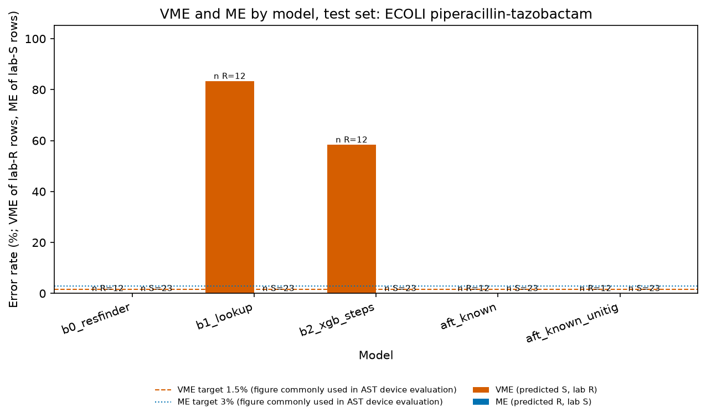

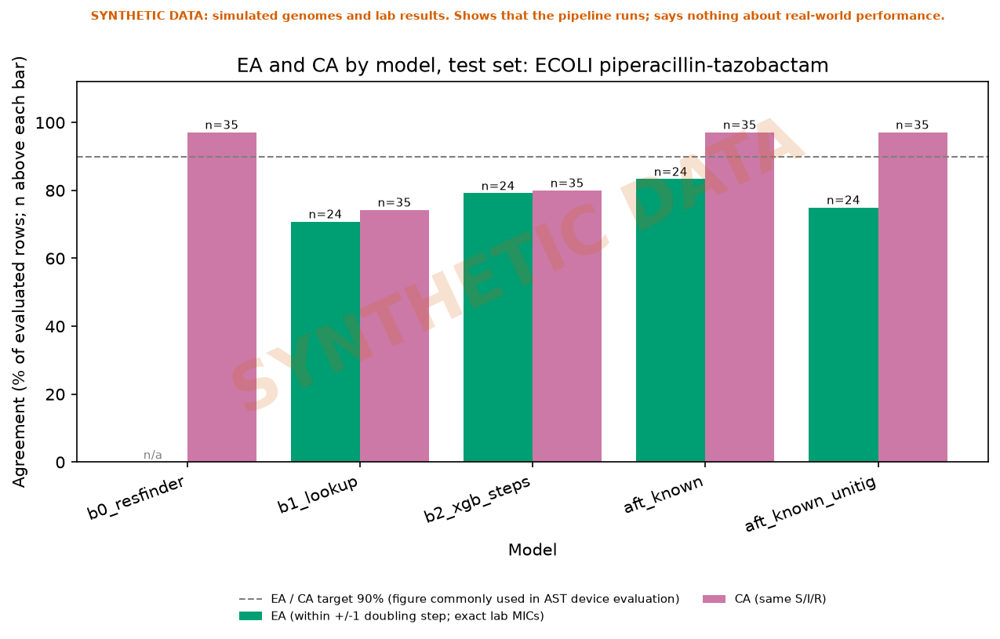

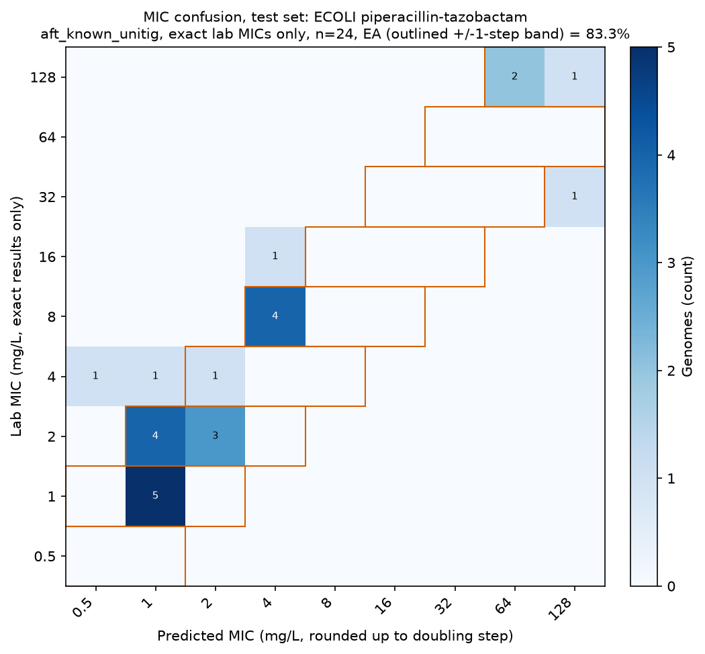

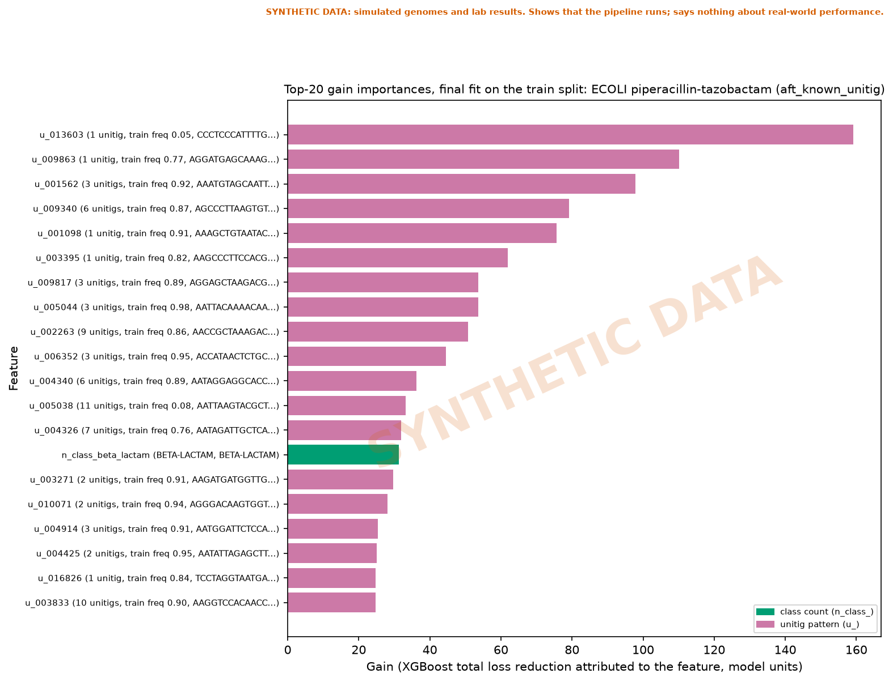

### KPNEU x ceftriaxone

Call breakpoint (CLSI 2024, bloodstream): S if MIC <= 1 mg/L, R if MIC > 2 mg/L.

#### Test set (lineage-held-out genomes, scored once)

| Model | n | VME % (predicted S, lab R; of lab R) | Call VME % (lab R called likely active; of lab R) | Active calls % (lab S called likely active; of lab S) | Uncertain % | ME % (predicted R, lab S; of lab S) | Minor error % (of categorised) | CA % (same S/I/R) | EA % (within +/-1 step; exact lab MICs) | Exact agreement % (exact lab MICs) | AUROC (R vs S) | Band coverage % (90% band; exact lab MICs) | Band width (doubling steps) |
| --- | --- | --- | --- | --- | --- | --- | --- | --- | --- | --- | --- | --- | --- |
| b0_resfinder | 81 | 0.0% (n=38) | — | — | — | 0.0% (n=43) | 0.0% (n=81) | 100.0% (n=81) | — | — | — | — | — |
| b1_lookup | 81 | 0.0% (n=38) | 0.0% (n=38) | 0.0% (n=43) | 51.9% (n=81) | 11.6% (n=43) | 0.0% (n=81) | 93.8% (n=81) | 87.1% (n=31) | 32.3% (n=31) | 0.971 | 100.0% (n=31) | 10.00 |
| b2_xgb_steps | 81 | 2.6% (n=38) | 0.0% (n=38) | 97.7% (n=43) | 0.0% (n=81) | 0.0% (n=43) | 0.0% (n=81) | 98.8% (n=81) | 96.8% (n=31) | 67.7% (n=31) | 0.987 | 96.8% (n=31) | 2.00 |
| aft_known | 81 | 0.0% (n=38) | 0.0% (n=38) | 97.7% (n=43) | 0.0% (n=81) | 0.0% (n=43) | 0.0% (n=81) | 100.0% (n=81) | 51.6% (n=31) | 29.0% (n=31) | 1.000 | 96.8% (n=31) | 4.00 |
| aft_known_unitig | 81 | 2.6% (n=38) | 0.0% (n=38) | 97.7% (n=43) | 0.0% (n=81) | 0.0% (n=43) | 0.0% (n=81) | 98.8% (n=81) | 61.3% (n=31) | 35.5% (n=31) | 1.000 | 96.8% (n=31) | 4.00 |

Categorical metrics with the lab S/I/R re-derived from the lab MIC under the call breakpoint:

| Model | VME % re-derived (of lab R) | Call VME % re-derived (of lab R) | Call ME % re-derived (of lab S) | Active calls % re-derived (of lab S) | Uncertain % re-derived | ME % re-derived (of lab S) | Minor error % re-derived | CA % re-derived |
| --- | --- | --- | --- | --- | --- | --- | --- | --- |
| b0_resfinder | 0.0% (n=38) | — | — | — | — | 0.0% (n=43) | 0.0% (n=81) | 100.0% (n=81) |
| b1_lookup | 0.0% (n=38) | 0.0% (n=38) | 2.3% (n=43) | 0.0% (n=43) | 51.9% (n=81) | 11.6% (n=43) | 0.0% (n=81) | 93.8% (n=81) |
| b2_xgb_steps | 2.6% (n=38) | 0.0% (n=38) | 2.3% (n=43) | 97.7% (n=43) | 0.0% (n=81) | 0.0% (n=43) | 0.0% (n=81) | 98.8% (n=81) |
| aft_known | 0.0% (n=38) | 0.0% (n=38) | 2.3% (n=43) | 97.7% (n=43) | 0.0% (n=81) | 0.0% (n=43) | 0.0% (n=81) | 100.0% (n=81) |
| aft_known_unitig | 2.6% (n=38) | 0.0% (n=38) | 2.3% (n=43) | 97.7% (n=43) | 0.0% (n=81) | 0.0% (n=43) | 0.0% (n=81) | 98.8% (n=81) |

#### Cross-validation (out-of-fold, train split)

| Model | n | VME % (predicted S, lab R; of lab R) | Call VME % (lab R called likely active; of lab R) | Active calls % (lab S called likely active; of lab S) | Uncertain % | ME % (predicted R, lab S; of lab S) | Minor error % (of categorised) | CA % (same S/I/R) | EA % (within +/-1 step; exact lab MICs) | Exact agreement % (exact lab MICs) | AUROC (R vs S) | Band coverage % (90% band; exact lab MICs; cross-conformal, see note) | Band width (doubling steps) |
| --- | --- | --- | --- | --- | --- | --- | --- | --- | --- | --- | --- | --- | --- |
| b0_resfinder | 429 | 0.0% (n=249) | — | — | — | 0.0% (n=180) | 0.0% (n=429) | 100.0% (n=429) | — | — | — | — | — |
| b1_lookup | 429 | 0.0% (n=249) | 0.0% (n=249) | 16.7% (n=180) | 33.1% (n=429) | 13.9% (n=180) | 0.0% (n=429) | 94.2% (n=429) | 69.4% (n=144) | 20.8% (n=144) | 0.940 | 95.1% (n=144) | 9.20 |
| b2_xgb_steps | 429 | 1.6% (n=249) | 0.0% (n=249) | 93.9% (n=180) | 0.0% (n=429) | 1.7% (n=180) | 0.0% (n=429) | 98.4% (n=429) | 91.7% (n=144) | 53.5% (n=144) | 0.986 | 92.4% (n=144) | 2.51 |
| aft_known | 429 | 0.8% (n=249) | 0.0% (n=249) | 95.6% (n=180) | 0.0% (n=429) | 0.0% (n=180) | 0.2% (n=429) | 99.3% (n=429) | 77.1% (n=144) | 26.4% (n=144) | 1.000 | 95.8% (n=144) | 4.00 |
| aft_known_unitig | 429 | 1.2% (n=249) | 0.0% (n=249) | 94.4% (n=180) | 0.5% (n=429) | 0.0% (n=180) | 1.4% (n=429) | 97.9% (n=429) | 63.2% (n=144) | 20.8% (n=144) | 0.999 | 93.8% (n=144) | 4.00 |

_Note: CV bands are cross-conformal: the band on each fold's rows is calibrated on the out-of-fold residuals of the other folds only, so CV coverage is an out-of-fold estimate, not the calibration set itself._

Categorical metrics with the lab S/I/R re-derived from the lab MIC under the call breakpoint:

| Model | VME % re-derived (of lab R) | Call VME % re-derived (of lab R) | Call ME % re-derived (of lab S) | Active calls % re-derived (of lab S) | Uncertain % re-derived | ME % re-derived (of lab S) | Minor error % re-derived | CA % re-derived |
| --- | --- | --- | --- | --- | --- | --- | --- | --- |
| b0_resfinder | 0.0% (n=249) | — | — | — | — | 0.0% (n=180) | 0.0% (n=429) | 100.0% (n=429) |
| b1_lookup | 0.0% (n=249) | 0.0% (n=249) | 4.4% (n=180) | 16.7% (n=180) | 33.1% (n=429) | 13.9% (n=180) | 0.0% (n=429) | 94.2% (n=429) |
| b2_xgb_steps | 1.6% (n=249) | 0.0% (n=249) | 6.1% (n=180) | 93.9% (n=180) | 0.0% (n=429) | 1.7% (n=180) | 0.0% (n=429) | 98.4% (n=429) |
| aft_known | 0.8% (n=249) | 0.0% (n=249) | 4.4% (n=180) | 95.6% (n=180) | 0.0% (n=429) | 0.0% (n=180) | 0.2% (n=429) | 99.3% (n=429) |
| aft_known_unitig | 1.2% (n=249) | 0.0% (n=249) | 4.4% (n=180) | 94.4% (n=180) | 0.5% (n=429) | 0.0% (n=180) | 1.4% (n=429) | 97.9% (n=429) |

#### External and leave-one-lineage-out sets

**leave-one-lineage-out (KPNEU_ML_001)** (`lolo_KPNEU_ML_001`)

| Model | n | VME % (predicted S, lab R; of lab R) | Call VME % (lab R called likely active; of lab R) | Active calls % (lab S called likely active; of lab S) | Uncertain % | ME % (predicted R, lab S; of lab S) | Minor error % (of categorised) | CA % (same S/I/R) | EA % (within +/-1 step; exact lab MICs) | Exact agreement % (exact lab MICs) | AUROC (R vs S) | Band coverage % (90% band; exact lab MICs) | Band width (doubling steps) |
| --- | --- | --- | --- | --- | --- | --- | --- | --- | --- | --- | --- | --- | --- |
| b1_lookup | 84 | 76.9% (n=78) | 0.0% (n=78) | 0.0% (n=6) | 6.0% (n=84) | 0.0% (n=6) | 0.0% (n=84) | 28.6% (n=84) | 21.4% (n=28) | 7.1% (n=28) | 0.744 | 100.0% (n=28) | 10.00 |
| b2_xgb_steps | 84 | 1.3% (n=78) | 0.0% (n=78) | 83.3% (n=6) | 0.0% (n=84) | 0.0% (n=6) | 0.0% (n=84) | 98.8% (n=84) | 92.9% (n=28) | 46.4% (n=28) | 0.993 | 92.9% (n=28) | 2.00 |
| aft_known | 84 | 1.3% (n=78) | 0.0% (n=78) | 83.3% (n=6) | 0.0% (n=84) | 0.0% (n=6) | 0.0% (n=84) | 98.8% (n=84) | 82.1% (n=28) | 32.1% (n=28) | 0.999 | 89.3% (n=28) | 4.00 |
| aft_known_unitig | 84 | 1.3% (n=78) | 0.0% (n=78) | 33.3% (n=6) | 3.6% (n=84) | 0.0% (n=6) | 0.0% (n=84) | 98.8% (n=84) | 75.0% (n=28) | 35.7% (n=28) | 1.000 | 96.4% (n=28) | 4.00 |

Categorical metrics with the lab S/I/R re-derived from the lab MIC under the call breakpoint:

| Model | VME % re-derived (of lab R) | Call VME % re-derived (of lab R) | Call ME % re-derived (of lab S) | Active calls % re-derived (of lab S) | Uncertain % re-derived | ME % re-derived (of lab S) | Minor error % re-derived | CA % re-derived |
| --- | --- | --- | --- | --- | --- | --- | --- | --- |
| b1_lookup | 76.9% (n=78) | 0.0% (n=78) | 16.7% (n=6) | 0.0% (n=6) | 6.0% (n=84) | 0.0% (n=6) | 0.0% (n=84) | 28.6% (n=84) |
| b2_xgb_steps | 1.3% (n=78) | 0.0% (n=78) | 16.7% (n=6) | 83.3% (n=6) | 0.0% (n=84) | 0.0% (n=6) | 0.0% (n=84) | 98.8% (n=84) |
| aft_known | 1.3% (n=78) | 0.0% (n=78) | 16.7% (n=6) | 83.3% (n=6) | 0.0% (n=84) | 0.0% (n=6) | 0.0% (n=84) | 98.8% (n=84) |
| aft_known_unitig | 1.3% (n=78) | 0.0% (n=78) | 16.7% (n=6) | 33.3% (n=6) | 3.6% (n=84) | 0.0% (n=6) | 0.0% (n=84) | 98.8% (n=84) |

**leave-one-lineage-out (KPNEU_ML_002)** (`lolo_KPNEU_ML_002`)

| Model | n | VME % (predicted S, lab R; of lab R) | Call VME % (lab R called likely active; of lab R) | Active calls % (lab S called likely active; of lab S) | Uncertain % | ME % (predicted R, lab S; of lab S) | Minor error % (of categorised) | CA % (same S/I/R) | EA % (within +/-1 step; exact lab MICs) | Exact agreement % (exact lab MICs) | AUROC (R vs S) | Band coverage % (90% band; exact lab MICs) | Band width (doubling steps) |
| --- | --- | --- | --- | --- | --- | --- | --- | --- | --- | --- | --- | --- | --- |
| b1_lookup | 76 | 0.0% (n=68) | 0.0% (n=68) | 0.0% (n=8) | 10.5% (n=76) | 62.5% (n=8) | 0.0% (n=76) | 93.4% (n=76) | 52.9% (n=17) | 29.4% (n=17) | 0.766 | 100.0% (n=17) | 10.00 |
| b2_xgb_steps | 76 | 0.0% (n=68) | 0.0% (n=68) | 100.0% (n=8) | 0.0% (n=76) | 0.0% (n=8) | 0.0% (n=76) | 100.0% (n=76) | 94.1% (n=17) | 58.8% (n=17) | 1.000 | 94.1% (n=17) | 2.00 |
| aft_known | 76 | 0.0% (n=68) | 0.0% (n=68) | 100.0% (n=8) | 0.0% (n=76) | 0.0% (n=8) | 0.0% (n=76) | 100.0% (n=76) | 94.1% (n=17) | 70.6% (n=17) | 1.000 | 100.0% (n=17) | 4.00 |
| aft_known_unitig | 76 | 0.0% (n=68) | 0.0% (n=68) | 100.0% (n=8) | 0.0% (n=76) | 0.0% (n=8) | 0.0% (n=76) | 100.0% (n=76) | 82.4% (n=17) | 41.2% (n=17) | 1.000 | 100.0% (n=17) | 4.00 |

Categorical metrics with the lab S/I/R re-derived from the lab MIC under the call breakpoint:

| Model | VME % re-derived (of lab R) | Call VME % re-derived (of lab R) | Call ME % re-derived (of lab S) | Active calls % re-derived (of lab S) | Uncertain % re-derived | ME % re-derived (of lab S) | Minor error % re-derived | CA % re-derived |
| --- | --- | --- | --- | --- | --- | --- | --- | --- |
| b1_lookup | 0.0% (n=68) | 0.0% (n=68) | 0.0% (n=8) | 0.0% (n=8) | 10.5% (n=76) | 62.5% (n=8) | 0.0% (n=76) | 93.4% (n=76) |
| b2_xgb_steps | 0.0% (n=68) | 0.0% (n=68) | 0.0% (n=8) | 100.0% (n=8) | 0.0% (n=76) | 0.0% (n=8) | 0.0% (n=76) | 100.0% (n=76) |
| aft_known | 0.0% (n=68) | 0.0% (n=68) | 0.0% (n=8) | 100.0% (n=8) | 0.0% (n=76) | 0.0% (n=8) | 0.0% (n=76) | 100.0% (n=76) |
| aft_known_unitig | 0.0% (n=68) | 0.0% (n=68) | 0.0% (n=8) | 100.0% (n=8) | 0.0% (n=76) | 0.0% (n=8) | 0.0% (n=76) | 100.0% (n=76) |

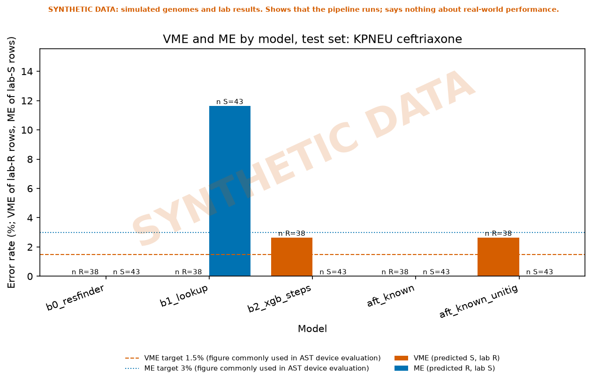

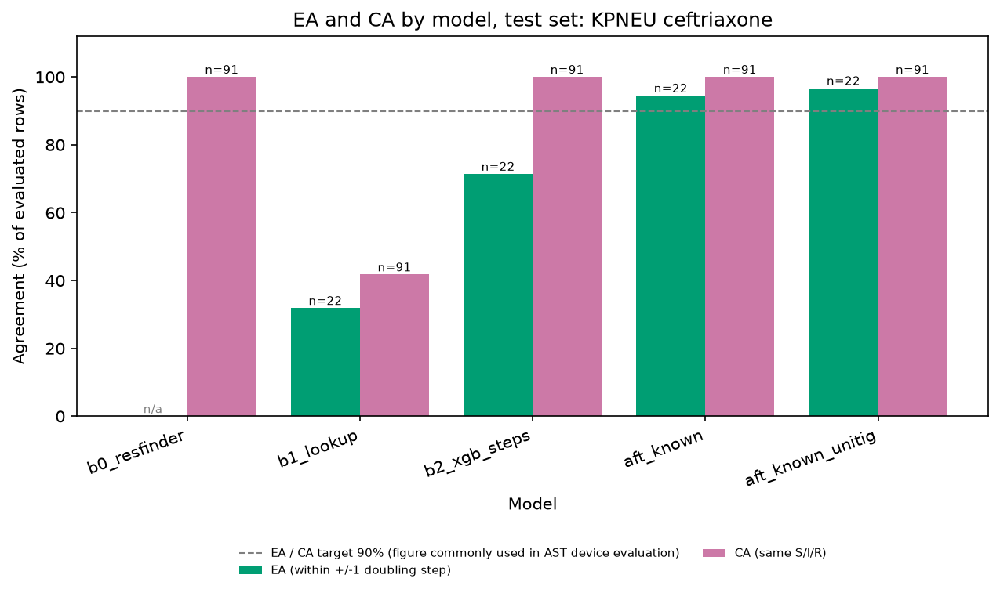

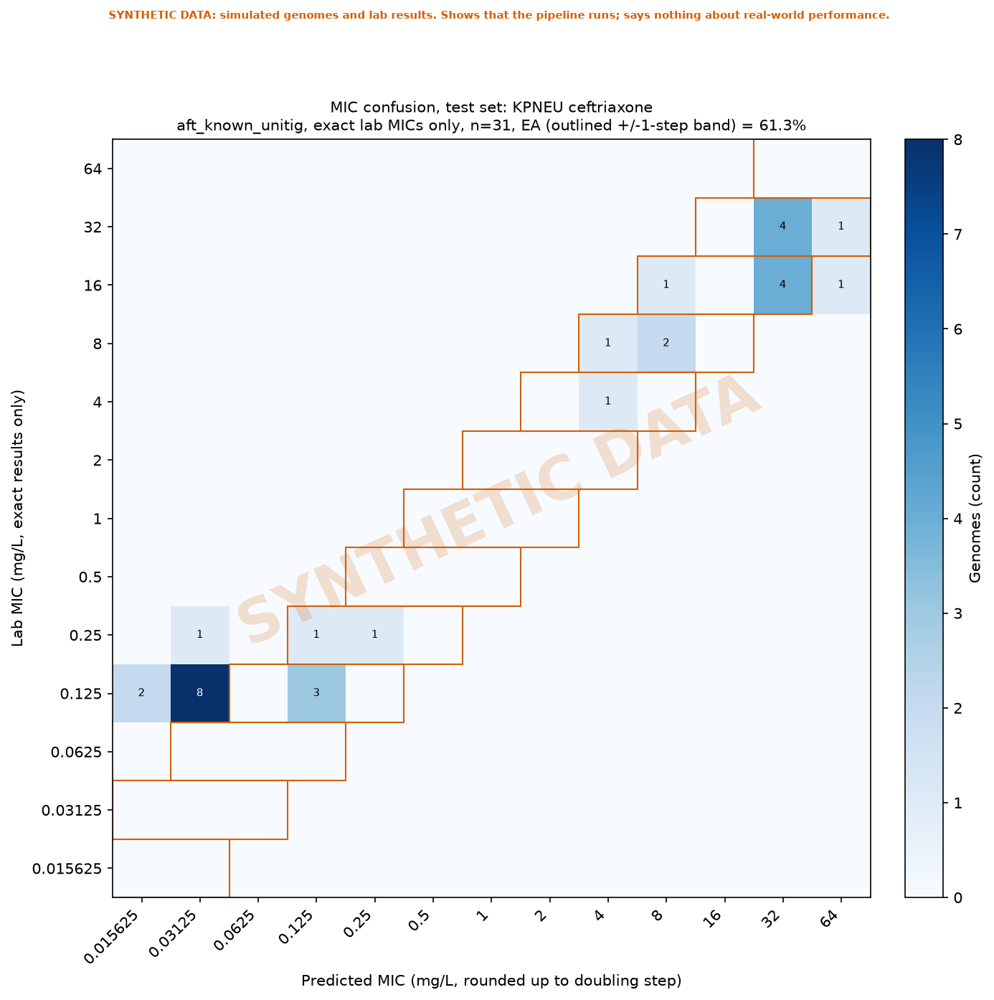

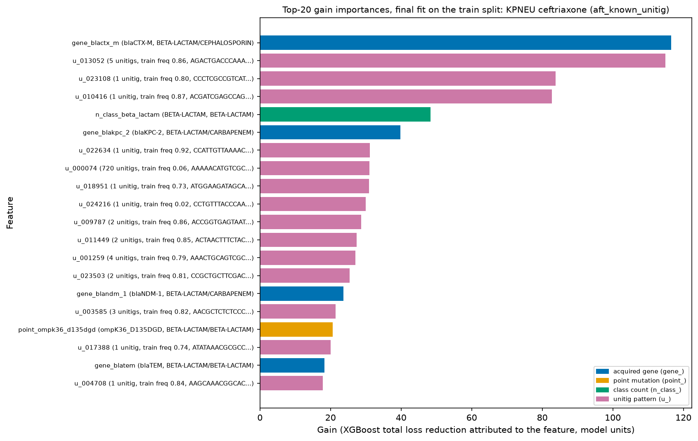

### KPNEU x ciprofloxacin

Call breakpoint (CLSI 2024, bloodstream): S if MIC <= 0.25 mg/L, R if MIC > 0.5 mg/L.

#### Test set (lineage-held-out genomes, scored once)

| Model | n | VME % (predicted S, lab R; of lab R) | Call VME % (lab R called likely active; of lab R) | Active calls % (lab S called likely active; of lab S) | Uncertain % | ME % (predicted R, lab S; of lab S) | Minor error % (of categorised) | CA % (same S/I/R) | EA % (within +/-1 step; exact lab MICs) | Exact agreement % (exact lab MICs) | AUROC (R vs S) | Band coverage % (90% band; exact lab MICs) | Band width (doubling steps) |
| --- | --- | --- | --- | --- | --- | --- | --- | --- | --- | --- | --- | --- | --- |
| b0_resfinder | 80 | 42.9% (n=14) | — | — | — | 29.5% (n=61) | 6.2% (n=80) | 63.7% (n=80) | — | — | — | — | — |
| b1_lookup | 80 | 50.0% (n=14) | 0.0% (n=14) | 1.6% (n=61) | 97.5% (n=80) | 1.6% (n=61) | 7.5% (n=80) | 82.5% (n=80) | 73.8% (n=65) | 29.2% (n=65) | 0.875 | 100.0% (n=65) | 8.00 |
| b2_xgb_steps | 80 | 7.1% (n=14) | 0.0% (n=14) | 49.2% (n=61) | 56.2% (n=80) | 4.9% (n=61) | 6.2% (n=80) | 88.8% (n=80) | 75.4% (n=65) | 36.9% (n=65) | 0.963 | 95.4% (n=65) | 6.00 |
| aft_known | 80 | 7.1% (n=14) | 7.1% (n=14) | 63.9% (n=61) | 36.2% (n=80) | 1.6% (n=61) | 10.0% (n=80) | 87.5% (n=80) | 73.8% (n=65) | 20.0% (n=65) | 0.954 | 93.8% (n=65) | 4.00 |
| aft_known_unitig | 80 | 0.0% (n=14) | 0.0% (n=14) | 85.2% (n=61) | 22.5% (n=80) | 1.6% (n=61) | 6.2% (n=80) | 92.5% (n=80) | 93.8% (n=65) | 41.5% (n=65) | 0.992 | 93.8% (n=65) | 2.00 |

Categorical metrics with the lab S/I/R re-derived from the lab MIC under the call breakpoint:

| Model | VME % re-derived (of lab R) | Call VME % re-derived (of lab R) | Call ME % re-derived (of lab S) | Active calls % re-derived (of lab S) | Uncertain % re-derived | ME % re-derived (of lab S) | Minor error % re-derived | CA % re-derived |
| --- | --- | --- | --- | --- | --- | --- | --- | --- |
| b0_resfinder | 42.9% (n=14) | — | — | — | — | 29.5% (n=61) | 6.2% (n=80) | 63.7% (n=80) |
| b1_lookup | 50.0% (n=14) | 0.0% (n=14) | 0.0% (n=61) | 1.6% (n=61) | 97.5% (n=80) | 1.6% (n=61) | 7.5% (n=80) | 82.5% (n=80) |
| b2_xgb_steps | 7.1% (n=14) | 0.0% (n=14) | 0.0% (n=61) | 49.2% (n=61) | 56.2% (n=80) | 4.9% (n=61) | 6.2% (n=80) | 88.8% (n=80) |
| aft_known | 7.1% (n=14) | 7.1% (n=14) | 0.0% (n=61) | 63.9% (n=61) | 36.2% (n=80) | 1.6% (n=61) | 10.0% (n=80) | 87.5% (n=80) |
| aft_known_unitig | 0.0% (n=14) | 0.0% (n=14) | 1.6% (n=61) | 85.2% (n=61) | 22.5% (n=80) | 1.6% (n=61) | 6.2% (n=80) | 92.5% (n=80) |

#### Cross-validation (out-of-fold, train split)

| Model | n | VME % (predicted S, lab R; of lab R) | Call VME % (lab R called likely active; of lab R) | Active calls % (lab S called likely active; of lab S) | Uncertain % | ME % (predicted R, lab S; of lab S) | Minor error % (of categorised) | CA % (same S/I/R) | EA % (within +/-1 step; exact lab MICs) | Exact agreement % (exact lab MICs) | AUROC (R vs S) | Band coverage % (90% band; exact lab MICs; cross-conformal, see note) | Band width (doubling steps) |
| --- | --- | --- | --- | --- | --- | --- | --- | --- | --- | --- | --- | --- | --- |
| b0_resfinder | 448 | 42.6% (n=195) | — | — | — | 23.4% (n=231) | 4.9% (n=448) | 64.5% (n=448) | — | — | — | — | — |
| b1_lookup | 448 | 54.4% (n=195) | 0.0% (n=195) | 0.0% (n=231) | 97.8% (n=448) | 0.9% (n=231) | 13.6% (n=448) | 62.3% (n=448) | 58.4% (n=320) | 28.4% (n=320) | 0.866 | 92.5% (n=320) | 9.32 |
| b2_xgb_steps | 448 | 3.6% (n=195) | 0.0% (n=195) | 56.7% (n=231) | 55.1% (n=448) | 2.2% (n=231) | 6.2% (n=448) | 91.1% (n=448) | 78.8% (n=320) | 42.2% (n=320) | 0.991 | 94.7% (n=320) | 5.50 |
| aft_known | 448 | 3.1% (n=195) | 0.0% (n=195) | 74.0% (n=231) | 28.6% (n=448) | 0.4% (n=231) | 7.6% (n=448) | 90.8% (n=448) | 80.6% (n=320) | 35.3% (n=320) | 0.994 | 93.8% (n=320) | 4.00 |
| aft_known_unitig | 448 | 1.0% (n=195) | 0.0% (n=195) | 84.8% (n=231) | 18.1% (n=448) | 0.4% (n=231) | 5.1% (n=448) | 94.2% (n=448) | 93.8% (n=320) | 48.1% (n=320) | 0.998 | 93.8% (n=320) | 2.00 |

_Note: CV bands are cross-conformal: the band on each fold's rows is calibrated on the out-of-fold residuals of the other folds only, so CV coverage is an out-of-fold estimate, not the calibration set itself._

Categorical metrics with the lab S/I/R re-derived from the lab MIC under the call breakpoint:

| Model | VME % re-derived (of lab R) | Call VME % re-derived (of lab R) | Call ME % re-derived (of lab S) | Active calls % re-derived (of lab S) | Uncertain % re-derived | ME % re-derived (of lab S) | Minor error % re-derived | CA % re-derived |
| --- | --- | --- | --- | --- | --- | --- | --- | --- |
| b0_resfinder | 42.6% (n=195) | — | — | — | — | 23.4% (n=231) | 4.9% (n=448) | 64.5% (n=448) |
| b1_lookup | 54.4% (n=195) | 0.0% (n=195) | 0.0% (n=231) | 0.0% (n=231) | 97.8% (n=448) | 0.9% (n=231) | 13.6% (n=448) | 62.3% (n=448) |
| b2_xgb_steps | 3.6% (n=195) | 0.0% (n=195) | 0.0% (n=231) | 56.7% (n=231) | 55.1% (n=448) | 2.2% (n=231) | 6.2% (n=448) | 91.1% (n=448) |
| aft_known | 3.1% (n=195) | 0.0% (n=195) | 0.4% (n=231) | 74.0% (n=231) | 28.6% (n=448) | 0.4% (n=231) | 7.6% (n=448) | 90.8% (n=448) |
| aft_known_unitig | 1.0% (n=195) | 0.0% (n=195) | 0.4% (n=231) | 84.8% (n=231) | 18.1% (n=448) | 0.4% (n=231) | 5.1% (n=448) | 94.2% (n=448) |

#### External and leave-one-lineage-out sets

**leave-one-lineage-out (KPNEU_ML_001)** (`lolo_KPNEU_ML_001`)

| Model | n | VME % (predicted S, lab R; of lab R) | Call VME % (lab R called likely active; of lab R) | Active calls % (lab S called likely active; of lab S) | Uncertain % | ME % (predicted R, lab S; of lab S) | Minor error % (of categorised) | CA % (same S/I/R) | EA % (within +/-1 step; exact lab MICs) | Exact agreement % (exact lab MICs) | AUROC (R vs S) | Band coverage % (90% band; exact lab MICs) | Band width (doubling steps) |
| --- | --- | --- | --- | --- | --- | --- | --- | --- | --- | --- | --- | --- | --- |
| b1_lookup | 92 | 74.7% (n=75) | 0.0% (n=75) | 0.0% (n=8) | 90.2% (n=92) | 0.0% (n=8) | 9.8% (n=92) | 29.3% (n=92) | 21.1% (n=57) | 8.8% (n=57) | 0.720 | 63.2% (n=57) | 8.00 |
| b2_xgb_steps | 92 | 2.7% (n=75) | 0.0% (n=75) | 50.0% (n=8) | 71.7% (n=92) | 0.0% (n=8) | 9.8% (n=92) | 88.0% (n=92) | 75.4% (n=57) | 35.1% (n=57) | 0.994 | 96.5% (n=57) | 6.00 |
| aft_known | 92 | 1.3% (n=75) | 0.0% (n=75) | 50.0% (n=8) | 22.8% (n=92) | 0.0% (n=8) | 12.0% (n=92) | 87.0% (n=92) | 73.7% (n=57) | 31.6% (n=57) | 0.993 | 91.2% (n=57) | 4.00 |
| aft_known_unitig | 92 | 1.3% (n=75) | 0.0% (n=75) | 37.5% (n=8) | 21.7% (n=92) | 0.0% (n=8) | 9.8% (n=92) | 89.1% (n=92) | 93.0% (n=57) | 50.9% (n=57) | 0.994 | 93.0% (n=57) | 2.00 |

Categorical metrics with the lab S/I/R re-derived from the lab MIC under the call breakpoint:

| Model | VME % re-derived (of lab R) | Call VME % re-derived (of lab R) | Call ME % re-derived (of lab S) | Active calls % re-derived (of lab S) | Uncertain % re-derived | ME % re-derived (of lab S) | Minor error % re-derived | CA % re-derived |
| --- | --- | --- | --- | --- | --- | --- | --- | --- |
| b1_lookup | 74.7% (n=75) | 0.0% (n=75) | 0.0% (n=8) | 0.0% (n=8) | 90.2% (n=92) | 0.0% (n=8) | 9.8% (n=92) | 29.3% (n=92) |
| b2_xgb_steps | 2.7% (n=75) | 0.0% (n=75) | 0.0% (n=8) | 50.0% (n=8) | 71.7% (n=92) | 0.0% (n=8) | 9.8% (n=92) | 88.0% (n=92) |
| aft_known | 1.3% (n=75) | 0.0% (n=75) | 0.0% (n=8) | 50.0% (n=8) | 22.8% (n=92) | 0.0% (n=8) | 12.0% (n=92) | 87.0% (n=92) |
| aft_known_unitig | 1.3% (n=75) | 0.0% (n=75) | 0.0% (n=8) | 37.5% (n=8) | 21.7% (n=92) | 0.0% (n=8) | 9.8% (n=92) | 89.1% (n=92) |

**leave-one-lineage-out (KPNEU_ML_002)** (`lolo_KPNEU_ML_002`)

| Model | n | VME % (predicted S, lab R; of lab R) | Call VME % (lab R called likely active; of lab R) | Active calls % (lab S called likely active; of lab S) | Uncertain % | ME % (predicted R, lab S; of lab S) | Minor error % (of categorised) | CA % (same S/I/R) | EA % (within +/-1 step; exact lab MICs) | Exact agreement % (exact lab MICs) | AUROC (R vs S) | Band coverage % (90% band; exact lab MICs) | Band width (doubling steps) |
| --- | --- | --- | --- | --- | --- | --- | --- | --- | --- | --- | --- | --- | --- |
| b1_lookup | 76 | 66.1% (n=59) | 0.0% (n=59) | 12.5% (n=16) | 92.1% (n=76) | 0.0% (n=16) | 1.3% (n=76) | 47.4% (n=76) | 43.2% (n=44) | 20.5% (n=44) | 0.731 | 86.4% (n=44) | 8.00 |
| b2_xgb_steps | 76 | 0.0% (n=59) | 0.0% (n=59) | 37.5% (n=16) | 69.7% (n=76) | 12.5% (n=16) | 6.6% (n=76) | 90.8% (n=76) | 79.5% (n=44) | 45.5% (n=44) | 0.971 | 97.7% (n=44) | 6.00 |
| aft_known | 76 | 0.0% (n=59) | 0.0% (n=59) | 43.8% (n=16) | 39.5% (n=76) | 6.2% (n=16) | 3.9% (n=76) | 94.7% (n=76) | 86.4% (n=44) | 40.9% (n=44) | 0.994 | 95.5% (n=44) | 4.00 |
| aft_known_unitig | 76 | 0.0% (n=59) | 0.0% (n=59) | 62.5% (n=16) | 23.7% (n=76) | 0.0% (n=16) | 2.6% (n=76) | 97.4% (n=76) | 100.0% (n=44) | 43.2% (n=44) | 1.000 | 100.0% (n=44) | 2.00 |

Categorical metrics with the lab S/I/R re-derived from the lab MIC under the call breakpoint:

| Model | VME % re-derived (of lab R) | Call VME % re-derived (of lab R) | Call ME % re-derived (of lab S) | Active calls % re-derived (of lab S) | Uncertain % re-derived | ME % re-derived (of lab S) | Minor error % re-derived | CA % re-derived |
| --- | --- | --- | --- | --- | --- | --- | --- | --- |
| b1_lookup | 66.1% (n=59) | 0.0% (n=59) | 0.0% (n=16) | 12.5% (n=16) | 92.1% (n=76) | 0.0% (n=16) | 1.3% (n=76) | 47.4% (n=76) |
| b2_xgb_steps | 0.0% (n=59) | 0.0% (n=59) | 0.0% (n=16) | 37.5% (n=16) | 69.7% (n=76) | 12.5% (n=16) | 6.6% (n=76) | 90.8% (n=76) |
| aft_known | 0.0% (n=59) | 0.0% (n=59) | 0.0% (n=16) | 43.8% (n=16) | 39.5% (n=76) | 6.2% (n=16) | 3.9% (n=76) | 94.7% (n=76) |
| aft_known_unitig | 0.0% (n=59) | 0.0% (n=59) | 0.0% (n=16) | 62.5% (n=16) | 23.7% (n=76) | 0.0% (n=16) | 2.6% (n=76) | 97.4% (n=76) |

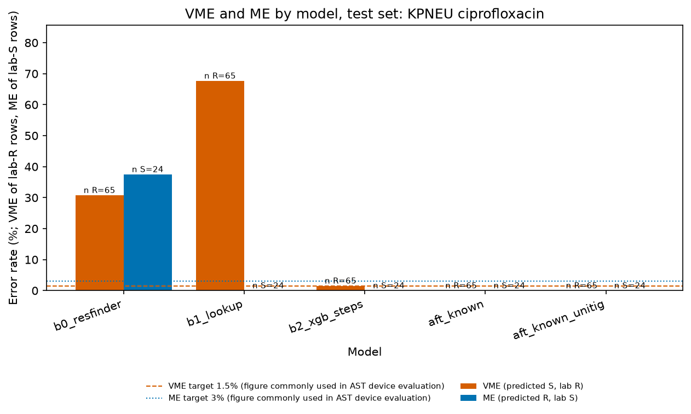

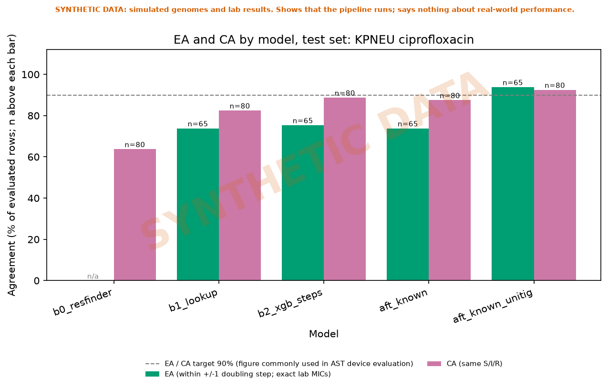

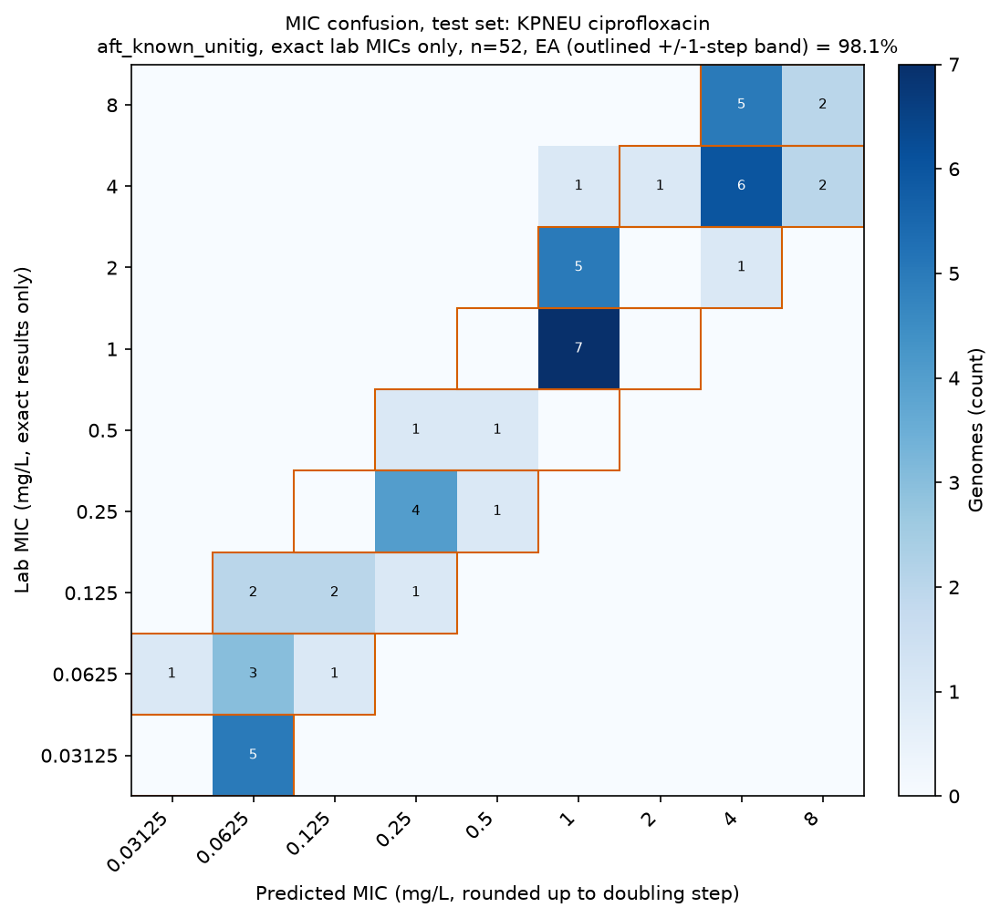

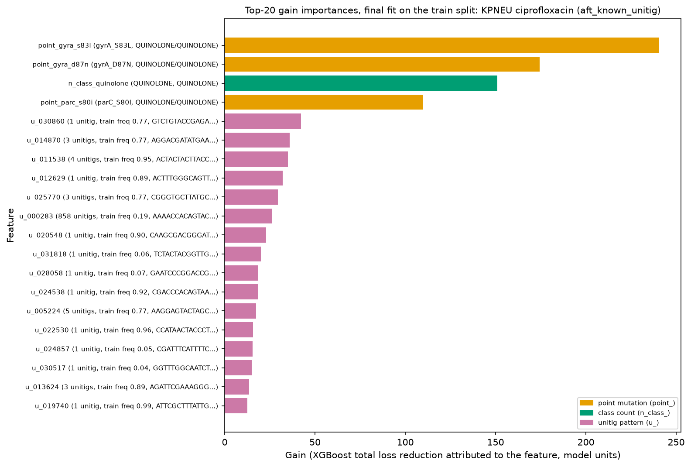

### KPNEU x gentamicin

Call breakpoint (CLSI 2024, bloodstream): S if MIC <= 2 mg/L, R if MIC > 4 mg/L.

#### Test set (lineage-held-out genomes, scored once)

| Model | n | VME % (predicted S, lab R; of lab R) | Call VME % (lab R called likely active; of lab R) | Active calls % (lab S called likely active; of lab S) | Uncertain % | ME % (predicted R, lab S; of lab S) | Minor error % (of categorised) | CA % (same S/I/R) | EA % (within +/-1 step; exact lab MICs) | Exact agreement % (exact lab MICs) | AUROC (R vs S) | Band coverage % (90% band; exact lab MICs) | Band width (doubling steps) |
| --- | --- | --- | --- | --- | --- | --- | --- | --- | --- | --- | --- | --- | --- |
| b0_resfinder | 53 | 100.0% (n=7) | — | — | — | 0.0% (n=45) | 1.9% (n=53) | 84.9% (n=53) | — | — | — | — | — |
| b1_lookup | 53 | 28.6% (n=7) | 0.0% (n=7) | 0.0% (n=45) | 100.0% (n=53) | 0.0% (n=45) | 1.9% (n=53) | 94.3% (n=53) | 90.0% (n=40) | 72.5% (n=40) | 0.857 | 97.5% (n=40) | 8.00 |
| b2_xgb_steps | 53 | 0.0% (n=7) | 0.0% (n=7) | 100.0% (n=45) | 15.1% (n=53) | 0.0% (n=45) | 0.0% (n=53) | 100.0% (n=53) | 97.5% (n=40) | 72.5% (n=40) | 1.000 | 97.5% (n=40) | 2.00 |
| aft_known | 53 | 0.0% (n=7) | 0.0% (n=7) | 100.0% (n=45) | 13.2% (n=53) | 0.0% (n=45) | 1.9% (n=53) | 98.1% (n=53) | 95.0% (n=40) | 70.0% (n=40) | 1.000 | 95.0% (n=40) | 2.00 |
| aft_known_unitig | 53 | 0.0% (n=7) | 0.0% (n=7) | 100.0% (n=45) | 11.3% (n=53) | 0.0% (n=45) | 3.8% (n=53) | 96.2% (n=53) | 97.5% (n=40) | 62.5% (n=40) | 1.000 | 97.5% (n=40) | 2.00 |

Categorical metrics with the lab S/I/R re-derived from the lab MIC under the call breakpoint:

| Model | VME % re-derived (of lab R) | Call VME % re-derived (of lab R) | Call ME % re-derived (of lab S) | Active calls % re-derived (of lab S) | Uncertain % re-derived | ME % re-derived (of lab S) | Minor error % re-derived | CA % re-derived |
| --- | --- | --- | --- | --- | --- | --- | --- | --- |
| b0_resfinder | 100.0% (n=7) | — | — | — | — | 0.0% (n=45) | 1.9% (n=53) | 84.9% (n=53) |
| b1_lookup | 28.6% (n=7) | 0.0% (n=7) | 0.0% (n=45) | 0.0% (n=45) | 100.0% (n=53) | 0.0% (n=45) | 1.9% (n=53) | 94.3% (n=53) |
| b2_xgb_steps | 0.0% (n=7) | 0.0% (n=7) | 0.0% (n=45) | 100.0% (n=45) | 15.1% (n=53) | 0.0% (n=45) | 0.0% (n=53) | 100.0% (n=53) |
| aft_known | 0.0% (n=7) | 0.0% (n=7) | 0.0% (n=45) | 100.0% (n=45) | 13.2% (n=53) | 0.0% (n=45) | 1.9% (n=53) | 98.1% (n=53) |
| aft_known_unitig | 0.0% (n=7) | 0.0% (n=7) | 0.0% (n=45) | 100.0% (n=45) | 11.3% (n=53) | 0.0% (n=45) | 3.8% (n=53) | 96.2% (n=53) |

#### Cross-validation (out-of-fold, train split)

| Model | n | VME % (predicted S, lab R; of lab R) | Call VME % (lab R called likely active; of lab R) | Active calls % (lab S called likely active; of lab S) | Uncertain % | ME % (predicted R, lab S; of lab S) | Minor error % (of categorised) | CA % (same S/I/R) | EA % (within +/-1 step; exact lab MICs) | Exact agreement % (exact lab MICs) | AUROC (R vs S) | Band coverage % (90% band; exact lab MICs; cross-conformal, see note) | Band width (doubling steps) |
| --- | --- | --- | --- | --- | --- | --- | --- | --- | --- | --- | --- | --- | --- |
| b0_resfinder | 265 | 100.0% (n=50) | — | — | — | 0.0% (n=194) | 7.9% (n=265) | 73.2% (n=265) | — | — | — | — | — |
| b1_lookup | 265 | 76.0% (n=50) | 0.0% (n=50) | 3.1% (n=194) | 97.7% (n=265) | 0.5% (n=194) | 7.9% (n=265) | 77.4% (n=265) | 70.9% (n=179) | 53.1% (n=179) | 0.637 | 92.2% (n=179) | 7.49 |
| b2_xgb_steps | 265 | 2.0% (n=50) | 2.0% (n=50) | 98.5% (n=194) | 26.4% (n=265) | 0.5% (n=194) | 15.5% (n=265) | 83.8% (n=265) | 96.1% (n=179) | 65.4% (n=179) | 0.983 | 96.1% (n=179) | 2.00 |
| aft_known | 265 | 2.0% (n=50) | 2.0% (n=50) | 98.5% (n=194) | 27.2% (n=265) | 0.5% (n=194) | 13.2% (n=265) | 86.0% (n=265) | 95.0% (n=179) | 59.2% (n=179) | 0.975 | 95.0% (n=179) | 2.00 |
| aft_known_unitig | 265 | 2.0% (n=50) | 2.0% (n=50) | 98.5% (n=194) | 27.5% (n=265) | 1.0% (n=194) | 15.8% (n=265) | 83.0% (n=265) | 93.9% (n=179) | 52.0% (n=179) | 0.983 | 93.9% (n=179) | 2.00 |

_Note: CV bands are cross-conformal: the band on each fold's rows is calibrated on the out-of-fold residuals of the other folds only, so CV coverage is an out-of-fold estimate, not the calibration set itself._

Categorical metrics with the lab S/I/R re-derived from the lab MIC under the call breakpoint:

| Model | VME % re-derived (of lab R) | Call VME % re-derived (of lab R) | Call ME % re-derived (of lab S) | Active calls % re-derived (of lab S) | Uncertain % re-derived | ME % re-derived (of lab S) | Minor error % re-derived | CA % re-derived |
| --- | --- | --- | --- | --- | --- | --- | --- | --- |
| b0_resfinder | 100.0% (n=40) | — | — | — | — | 0.0% (n=194) | 11.0% (n=263) | 73.8% (n=263) |
| b1_lookup | 72.5% (n=40) | 0.0% (n=40) | 0.0% (n=194) | 3.1% (n=194) | 97.7% (n=263) | 0.5% (n=194) | 10.3% (n=263) | 78.3% (n=263) |
| b2_xgb_steps | 2.5% (n=40) | 2.5% (n=40) | 0.0% (n=194) | 98.5% (n=194) | 25.9% (n=263) | 0.5% (n=194) | 14.4% (n=263) | 84.8% (n=263) |
| aft_known | 2.5% (n=40) | 2.5% (n=40) | 0.0% (n=194) | 98.5% (n=194) | 26.6% (n=263) | 0.5% (n=194) | 12.2% (n=263) | 87.1% (n=263) |
| aft_known_unitig | 2.5% (n=40) | 2.5% (n=40) | 0.0% (n=194) | 98.5% (n=194) | 27.0% (n=263) | 1.0% (n=194) | 13.3% (n=263) | 85.6% (n=263) |

#### External and leave-one-lineage-out sets

**leave-one-lineage-out (KPNEU_ML_001)** (`lolo_KPNEU_ML_001`)

| Model | n | VME % (predicted S, lab R; of lab R) | Call VME % (lab R called likely active; of lab R) | Active calls % (lab S called likely active; of lab S) | Uncertain % | ME % (predicted R, lab S; of lab S) | Minor error % (of categorised) | CA % (same S/I/R) | EA % (within +/-1 step; exact lab MICs) | Exact agreement % (exact lab MICs) | AUROC (R vs S) | Band coverage % (90% band; exact lab MICs) | Band width (doubling steps) |
| --- | --- | --- | --- | --- | --- | --- | --- | --- | --- | --- | --- | --- | --- |
| b1_lookup | 51 | 84.6% (n=13) | 0.0% (n=13) | 0.0% (n=34) | 100.0% (n=51) | 0.0% (n=34) | 13.7% (n=51) | 64.7% (n=51) | 50.0% (n=30) | 40.0% (n=30) | 0.575 | 100.0% (n=30) | 8.00 |
| b2_xgb_steps | 51 | 0.0% (n=13) | 0.0% (n=13) | 91.2% (n=34) | 37.3% (n=51) | 2.9% (n=34) | 21.6% (n=51) | 76.5% (n=51) | 93.3% (n=30) | 56.7% (n=30) | 0.962 | 93.3% (n=30) | 2.00 |
| aft_known | 51 | 0.0% (n=13) | 0.0% (n=13) | 91.2% (n=34) | 39.2% (n=51) | 0.0% (n=34) | 31.4% (n=51) | 68.6% (n=51) | 100.0% (n=30) | 73.3% (n=30) | 0.956 | 100.0% (n=30) | 2.00 |
| aft_known_unitig | 51 | 0.0% (n=13) | 0.0% (n=13) | 91.2% (n=34) | 39.2% (n=51) | 2.9% (n=34) | 27.5% (n=51) | 70.6% (n=51) | 96.7% (n=30) | 66.7% (n=30) | 0.948 | 96.7% (n=30) | 2.00 |

Categorical metrics with the lab S/I/R re-derived from the lab MIC under the call breakpoint:

| Model | VME % re-derived (of lab R) | Call VME % re-derived (of lab R) | Call ME % re-derived (of lab S) | Active calls % re-derived (of lab S) | Uncertain % re-derived | ME % re-derived (of lab S) | Minor error % re-derived | CA % re-derived |
| --- | --- | --- | --- | --- | --- | --- | --- | --- |
| b1_lookup | 80.0% (n=5) | 0.0% (n=5) | 0.0% (n=34) | 0.0% (n=34) | 100.0% (n=49) | 0.0% (n=34) | 22.4% (n=49) | 69.4% (n=49) |
| b2_xgb_steps | 0.0% (n=5) | 0.0% (n=5) | 0.0% (n=34) | 91.2% (n=34) | 34.7% (n=49) | 2.9% (n=34) | 22.4% (n=49) | 75.5% (n=49) |
| aft_known | 0.0% (n=5) | 0.0% (n=5) | 0.0% (n=34) | 91.2% (n=34) | 36.7% (n=49) | 0.0% (n=34) | 16.3% (n=49) | 83.7% (n=49) |
| aft_known_unitig | 0.0% (n=5) | 0.0% (n=5) | 0.0% (n=34) | 91.2% (n=34) | 36.7% (n=49) | 2.9% (n=34) | 18.4% (n=49) | 79.6% (n=49) |

**leave-one-lineage-out (KPNEU_ML_002)** (`lolo_KPNEU_ML_002`)

| Model | n | VME % (predicted S, lab R; of lab R) | Call VME % (lab R called likely active; of lab R) | Active calls % (lab S called likely active; of lab S) | Uncertain % | ME % (predicted R, lab S; of lab S) | Minor error % (of categorised) | CA % (same S/I/R) | EA % (within +/-1 step; exact lab MICs) | Exact agreement % (exact lab MICs) | AUROC (R vs S) | Band coverage % (90% band; exact lab MICs) | Band width (doubling steps) |
| --- | --- | --- | --- | --- | --- | --- | --- | --- | --- | --- | --- | --- | --- |
| b1_lookup | 52 | 92.9% (n=14) | 0.0% (n=14) | 0.0% (n=28) | 100.0% (n=52) | 0.0% (n=28) | 17.3% (n=52) | 57.7% (n=52) | 53.8% (n=39) | 43.6% (n=39) | 0.585 | 92.3% (n=39) | 8.00 |
| b2_xgb_steps | 52 | 0.0% (n=14) | 0.0% (n=14) | 100.0% (n=28) | 46.2% (n=52) | 0.0% (n=28) | 30.8% (n=52) | 69.2% (n=52) | 94.9% (n=39) | 56.4% (n=39) | 1.000 | 94.9% (n=39) | 2.00 |
| aft_known | 52 | 0.0% (n=14) | 0.0% (n=14) | 100.0% (n=28) | 46.2% (n=52) | 0.0% (n=28) | 30.8% (n=52) | 69.2% (n=52) | 89.7% (n=39) | 43.6% (n=39) | 1.000 | 89.7% (n=39) | 2.00 |
| aft_known_unitig | 52 | 0.0% (n=14) | 0.0% (n=14) | 100.0% (n=28) | 46.2% (n=52) | 0.0% (n=28) | 28.8% (n=52) | 71.2% (n=52) | 92.3% (n=39) | 64.1% (n=39) | 1.000 | 92.3% (n=39) | 2.00 |

Categorical metrics with the lab S/I/R re-derived from the lab MIC under the call breakpoint:

| Model | VME % re-derived (of lab R) | Call VME % re-derived (of lab R) | Call ME % re-derived (of lab S) | Active calls % re-derived (of lab S) | Uncertain % re-derived | ME % re-derived (of lab S) | Minor error % re-derived | CA % re-derived |
| --- | --- | --- | --- | --- | --- | --- | --- | --- |
| b1_lookup | 92.9% (n=14) | 0.0% (n=14) | 0.0% (n=28) | 0.0% (n=28) | 100.0% (n=52) | 0.0% (n=28) | 17.3% (n=52) | 57.7% (n=52) |
| b2_xgb_steps | 0.0% (n=14) | 0.0% (n=14) | 0.0% (n=28) | 100.0% (n=28) | 46.2% (n=52) | 0.0% (n=28) | 30.8% (n=52) | 69.2% (n=52) |
| aft_known | 0.0% (n=14) | 0.0% (n=14) | 0.0% (n=28) | 100.0% (n=28) | 46.2% (n=52) | 0.0% (n=28) | 30.8% (n=52) | 69.2% (n=52) |
| aft_known_unitig | 0.0% (n=14) | 0.0% (n=14) | 0.0% (n=28) | 100.0% (n=28) | 46.2% (n=52) | 0.0% (n=28) | 28.8% (n=52) | 71.2% (n=52) |

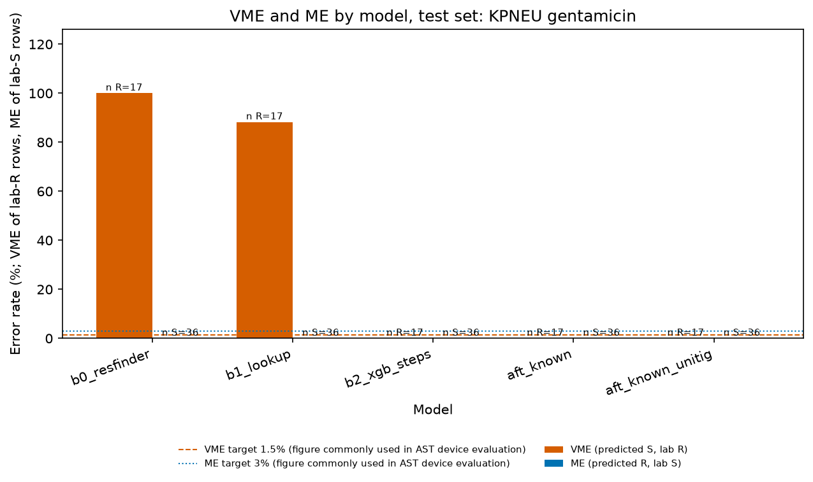

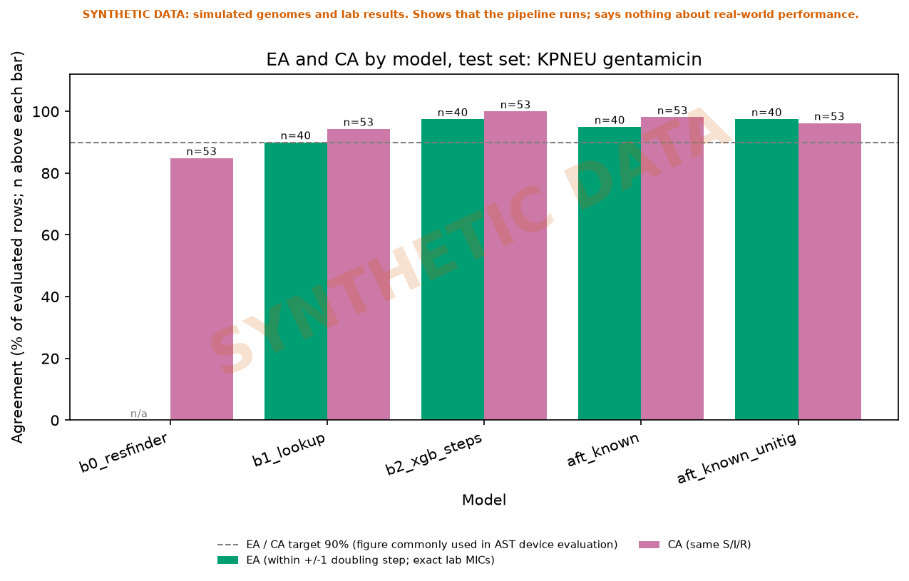

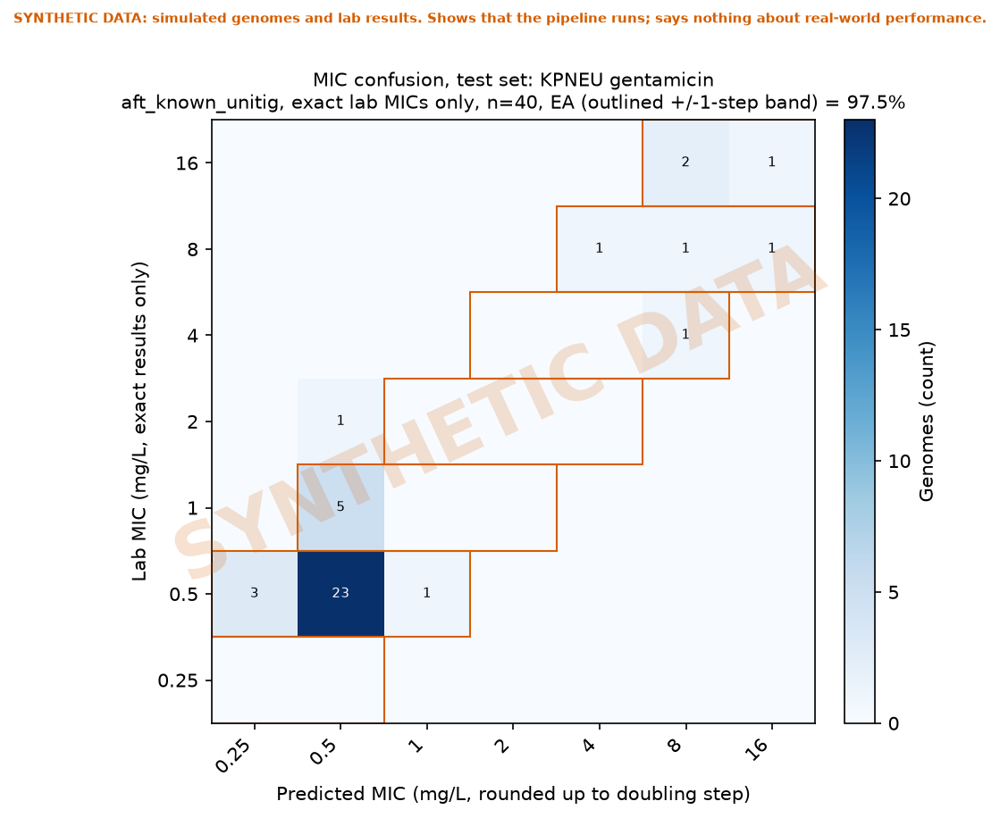

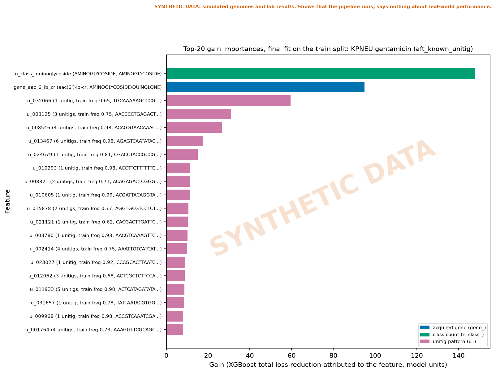

### KPNEU x meropenem

Call breakpoint (CLSI 2024, bloodstream): S if MIC <= 1 mg/L, R if MIC > 2 mg/L.

#### Test set (lineage-held-out genomes, scored once)

| Model | n | VME % (predicted S, lab R; of lab R) | Call VME % (lab R called likely active; of lab R) | Active calls % (lab S called likely active; of lab S) | Uncertain % | ME % (predicted R, lab S; of lab S) | Minor error % (of categorised) | CA % (same S/I/R) | EA % (within +/-1 step; exact lab MICs) | Exact agreement % (exact lab MICs) | AUROC (R vs S) | Band coverage % (90% band; exact lab MICs) | Band width (doubling steps) |
| --- | --- | --- | --- | --- | --- | --- | --- | --- | --- | --- | --- | --- | --- |
| b0_resfinder | 84 | 0.0% (n=17) | — | — | — | 1.6% (n=61) | 7.1% (n=84) | 91.7% (n=84) | — | — | — | — | — |
| b1_lookup | 84 | 76.5% (n=17) | 0.0% (n=17) | 0.0% (n=61) | 71.4% (n=84) | 0.0% (n=61) | 7.1% (n=84) | 77.4% (n=84) | 75.0% (n=36) | 36.1% (n=36) | 0.818 | 100.0% (n=36) | 16.00 |
| b2_xgb_steps | 84 | 17.6% (n=17) | 0.0% (n=17) | 98.4% (n=61) | 0.0% (n=84) | 1.6% (n=61) | 7.1% (n=84) | 88.1% (n=84) | 88.9% (n=36) | 61.1% (n=36) | 0.968 | 94.4% (n=36) | 6.00 |
| aft_known | 84 | 0.0% (n=17) | 0.0% (n=17) | 96.7% (n=61) | 1.2% (n=84) | 0.0% (n=61) | 9.5% (n=84) | 90.5% (n=84) | 77.8% (n=36) | 22.2% (n=36) | 1.000 | 94.4% (n=36) | 4.00 |
| aft_known_unitig | 84 | 0.0% (n=17) | 0.0% (n=17) | 98.4% (n=61) | 0.0% (n=84) | 0.0% (n=61) | 8.3% (n=84) | 91.7% (n=84) | 75.0% (n=36) | 13.9% (n=36) | 1.000 | 100.0% (n=36) | 4.00 |

Categorical metrics with the lab S/I/R re-derived from the lab MIC under the call breakpoint:

| Model | VME % re-derived (of lab R) | Call VME % re-derived (of lab R) | Call ME % re-derived (of lab S) | Active calls % re-derived (of lab S) | Uncertain % re-derived | ME % re-derived (of lab S) | Minor error % re-derived | CA % re-derived |
| --- | --- | --- | --- | --- | --- | --- | --- | --- |
| b0_resfinder | 0.0% (n=23) | — | — | — | — | 1.7% (n=58) | 0.0% (n=81) | 98.8% (n=81) |
| b1_lookup | 65.2% (n=23) | 0.0% (n=23) | 1.7% (n=58) | 0.0% (n=58) | 70.4% (n=81) | 0.0% (n=58) | 0.0% (n=81) | 81.5% (n=81) |
| b2_xgb_steps | 13.0% (n=23) | 0.0% (n=23) | 1.7% (n=58) | 98.3% (n=58) | 0.0% (n=81) | 1.7% (n=58) | 0.0% (n=81) | 95.1% (n=81) |
| aft_known | 0.0% (n=23) | 0.0% (n=23) | 1.7% (n=58) | 98.3% (n=58) | 0.0% (n=81) | 0.0% (n=58) | 2.5% (n=81) | 97.5% (n=81) |
| aft_known_unitig | 0.0% (n=23) | 0.0% (n=23) | 1.7% (n=58) | 98.3% (n=58) | 0.0% (n=81) | 0.0% (n=58) | 1.2% (n=81) | 98.8% (n=81) |

#### Cross-validation (out-of-fold, train split)

| Model | n | VME % (predicted S, lab R; of lab R) | Call VME % (lab R called likely active; of lab R) | Active calls % (lab S called likely active; of lab S) | Uncertain % | ME % (predicted R, lab S; of lab S) | Minor error % (of categorised) | CA % (same S/I/R) | EA % (within +/-1 step; exact lab MICs) | Exact agreement % (exact lab MICs) | AUROC (R vs S) | Band coverage % (90% band; exact lab MICs; cross-conformal, see note) | Band width (doubling steps) |
| --- | --- | --- | --- | --- | --- | --- | --- | --- | --- | --- | --- | --- | --- |
| b0_resfinder | 453 | 0.0% (n=157) | — | — | — | 2.2% (n=275) | 4.6% (n=453) | 94.0% (n=453) | — | — | — | — | — |
| b1_lookup | 453 | 68.8% (n=157) | 0.0% (n=157) | 0.0% (n=275) | 59.4% (n=453) | 0.7% (n=275) | 4.6% (n=453) | 71.1% (n=453) | 60.3% (n=199) | 20.6% (n=199) | 0.814 | 90.5% (n=199) | 15.35 |
| b2_xgb_steps | 453 | 17.8% (n=157) | 0.0% (n=157) | 73.1% (n=275) | 14.8% (n=453) | 2.9% (n=275) | 4.9% (n=453) | 87.2% (n=453) | 79.9% (n=199) | 50.3% (n=199) | 0.966 | 91.0% (n=199) | 6.99 |
| aft_known | 453 | 0.6% (n=157) | 0.0% (n=157) | 97.1% (n=275) | 0.4% (n=453) | 0.4% (n=275) | 6.0% (n=453) | 93.6% (n=453) | 70.9% (n=199) | 22.6% (n=199) | 0.999 | 96.5% (n=199) | 4.00 |
| aft_known_unitig | 453 | 0.6% (n=157) | 0.0% (n=157) | 96.7% (n=275) | 0.7% (n=453) | 0.4% (n=275) | 7.1% (n=453) | 92.5% (n=453) | 74.9% (n=199) | 28.6% (n=199) | 0.999 | 97.5% (n=199) | 4.00 |

_Note: CV bands are cross-conformal: the band on each fold's rows is calibrated on the out-of-fold residuals of the other folds only, so CV coverage is an out-of-fold estimate, not the calibration set itself._

Categorical metrics with the lab S/I/R re-derived from the lab MIC under the call breakpoint:

| Model | VME % re-derived (of lab R) | Call VME % re-derived (of lab R) | Call ME % re-derived (of lab S) | Active calls % re-derived (of lab S) | Uncertain % re-derived | ME % re-derived (of lab S) | Minor error % re-derived | CA % re-derived |
| --- | --- | --- | --- | --- | --- | --- | --- | --- |
| b0_resfinder | 0.0% (n=175) | — | — | — | — | 1.5% (n=263) | 0.9% (n=442) | 98.2% (n=442) |
| b1_lookup | 65.1% (n=175) | 0.0% (n=175) | 1.5% (n=263) | 0.0% (n=263) | 58.6% (n=442) | 0.4% (n=263) | 1.4% (n=442) | 72.6% (n=442) |
| b2_xgb_steps | 17.1% (n=175) | 0.0% (n=175) | 1.5% (n=263) | 73.8% (n=263) | 14.7% (n=442) | 1.9% (n=263) | 1.1% (n=442) | 91.0% (n=442) |
| aft_known | 0.6% (n=175) | 0.0% (n=175) | 1.5% (n=263) | 97.7% (n=263) | 0.5% (n=442) | 0.4% (n=263) | 2.7% (n=442) | 96.8% (n=442) |
| aft_known_unitig | 0.6% (n=175) | 0.0% (n=175) | 1.5% (n=263) | 97.3% (n=263) | 0.7% (n=442) | 0.0% (n=263) | 4.3% (n=442) | 95.5% (n=442) |

#### External and leave-one-lineage-out sets

**leave-one-lineage-out (KPNEU_ML_001)** (`lolo_KPNEU_ML_001`)

| Model | n | VME % (predicted S, lab R; of lab R) | Call VME % (lab R called likely active; of lab R) | Active calls % (lab S called likely active; of lab S) | Uncertain % | ME % (predicted R, lab S; of lab S) | Minor error % (of categorised) | CA % (same S/I/R) | EA % (within +/-1 step; exact lab MICs) | Exact agreement % (exact lab MICs) | AUROC (R vs S) | Band coverage % (90% band; exact lab MICs) | Band width (doubling steps) |
| --- | --- | --- | --- | --- | --- | --- | --- | --- | --- | --- | --- | --- | --- |
| b1_lookup | 88 | 76.6% (n=64) | 0.0% (n=64) | 0.0% (n=18) | 19.3% (n=88) | 0.0% (n=18) | 6.8% (n=88) | 37.5% (n=88) | 28.9% (n=38) | 13.2% (n=38) | 0.660 | 86.8% (n=38) | 16.00 |
| b2_xgb_steps | 88 | 1.6% (n=64) | 0.0% (n=64) | 94.4% (n=18) | 0.0% (n=88) | 0.0% (n=18) | 6.8% (n=88) | 92.0% (n=88) | 68.4% (n=38) | 28.9% (n=38) | 0.998 | 100.0% (n=38) | 6.00 |
| aft_known | 88 | 0.0% (n=64) | 0.0% (n=64) | 94.4% (n=18) | 0.0% (n=88) | 0.0% (n=18) | 6.8% (n=88) | 93.2% (n=88) | 73.7% (n=38) | 28.9% (n=38) | 1.000 | 92.1% (n=38) | 4.00 |
| aft_known_unitig | 88 | 0.0% (n=64) | 0.0% (n=64) | 94.4% (n=18) | 0.0% (n=88) | 0.0% (n=18) | 8.0% (n=88) | 92.0% (n=88) | 57.9% (n=38) | 18.4% (n=38) | 1.000 | 97.4% (n=38) | 4.00 |

Categorical metrics with the lab S/I/R re-derived from the lab MIC under the call breakpoint:

| Model | VME % re-derived (of lab R) | Call VME % re-derived (of lab R) | Call ME % re-derived (of lab S) | Active calls % re-derived (of lab S) | Uncertain % re-derived | ME % re-derived (of lab S) | Minor error % re-derived | CA % re-derived |
| --- | --- | --- | --- | --- | --- | --- | --- | --- |
| b1_lookup | 74.3% (n=70) | 0.0% (n=70) | 0.0% (n=17) | 0.0% (n=17) | 19.5% (n=87) | 0.0% (n=17) | 0.0% (n=87) | 40.2% (n=87) |
| b2_xgb_steps | 1.4% (n=70) | 0.0% (n=70) | 0.0% (n=17) | 100.0% (n=17) | 0.0% (n=87) | 0.0% (n=17) | 0.0% (n=87) | 98.9% (n=87) |
| aft_known | 0.0% (n=70) | 0.0% (n=70) | 0.0% (n=17) | 100.0% (n=17) | 0.0% (n=87) | 0.0% (n=17) | 0.0% (n=87) | 100.0% (n=87) |
| aft_known_unitig | 0.0% (n=70) | 0.0% (n=70) | 0.0% (n=17) | 100.0% (n=17) | 0.0% (n=87) | 0.0% (n=17) | 0.0% (n=87) | 100.0% (n=87) |

**leave-one-lineage-out (KPNEU_ML_002)** (`lolo_KPNEU_ML_002`)

| Model | n | VME % (predicted S, lab R; of lab R) | Call VME % (lab R called likely active; of lab R) | Active calls % (lab S called likely active; of lab S) | Uncertain % | ME % (predicted R, lab S; of lab S) | Minor error % (of categorised) | CA % (same S/I/R) | EA % (within +/-1 step; exact lab MICs) | Exact agreement % (exact lab MICs) | AUROC (R vs S) | Band coverage % (90% band; exact lab MICs) | Band width (doubling steps) |
| --- | --- | --- | --- | --- | --- | --- | --- | --- | --- | --- | --- | --- | --- |
| b1_lookup | 77 | 63.6% (n=55) | 0.0% (n=55) | 0.0% (n=18) | 22.1% (n=77) | 0.0% (n=18) | 5.2% (n=77) | 49.4% (n=77) | 45.0% (n=40) | 25.0% (n=40) | 0.682 | 92.5% (n=40) | 16.00 |
| b2_xgb_steps | 77 | 25.5% (n=55) | 0.0% (n=55) | 66.7% (n=18) | 6.5% (n=77) | 16.7% (n=18) | 5.2% (n=77) | 72.7% (n=77) | 65.0% (n=40) | 35.0% (n=40) | 0.899 | 82.5% (n=40) | 6.00 |
| aft_known | 77 | 0.0% (n=55) | 0.0% (n=55) | 83.3% (n=18) | 2.6% (n=77) | 0.0% (n=18) | 6.5% (n=77) | 93.5% (n=77) | 85.0% (n=40) | 30.0% (n=40) | 1.000 | 100.0% (n=40) | 4.00 |
| aft_known_unitig | 77 | 0.0% (n=55) | 0.0% (n=55) | 88.9% (n=18) | 1.3% (n=77) | 0.0% (n=18) | 7.8% (n=77) | 92.2% (n=77) | 80.0% (n=40) | 50.0% (n=40) | 1.000 | 97.5% (n=40) | 4.00 |

Categorical metrics with the lab S/I/R re-derived from the lab MIC under the call breakpoint:

| Model | VME % re-derived (of lab R) | Call VME % re-derived (of lab R) | Call ME % re-derived (of lab S) | Active calls % re-derived (of lab S) | Uncertain % re-derived | ME % re-derived (of lab S) | Minor error % re-derived | CA % re-derived |
| --- | --- | --- | --- | --- | --- | --- | --- | --- |
| b1_lookup | 61.0% (n=59) | 0.0% (n=59) | 6.2% (n=16) | 0.0% (n=16) | 20.0% (n=75) | 0.0% (n=16) | 0.0% (n=75) | 52.0% (n=75) |
| b2_xgb_steps | 23.7% (n=59) | 0.0% (n=59) | 6.2% (n=16) | 68.8% (n=16) | 5.3% (n=75) | 12.5% (n=16) | 0.0% (n=75) | 78.7% (n=75) |
| aft_known | 0.0% (n=59) | 0.0% (n=59) | 6.2% (n=16) | 81.2% (n=16) | 2.7% (n=75) | 0.0% (n=16) | 1.3% (n=75) | 98.7% (n=75) |
| aft_known_unitig | 0.0% (n=59) | 0.0% (n=59) | 6.2% (n=16) | 87.5% (n=16) | 1.3% (n=75) | 0.0% (n=16) | 2.7% (n=75) | 97.3% (n=75) |

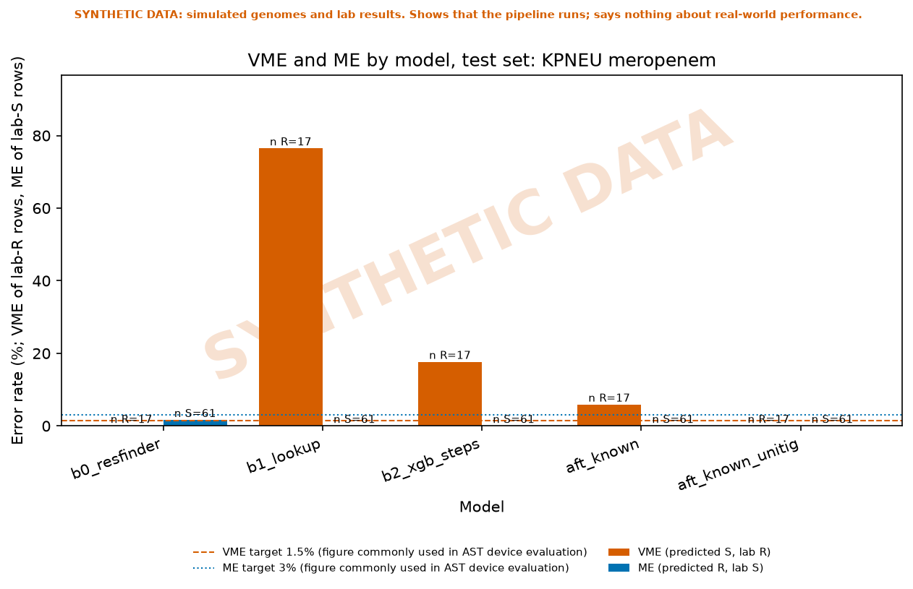

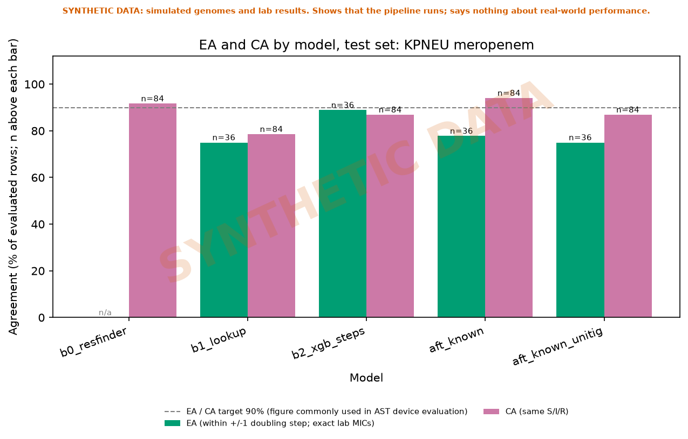

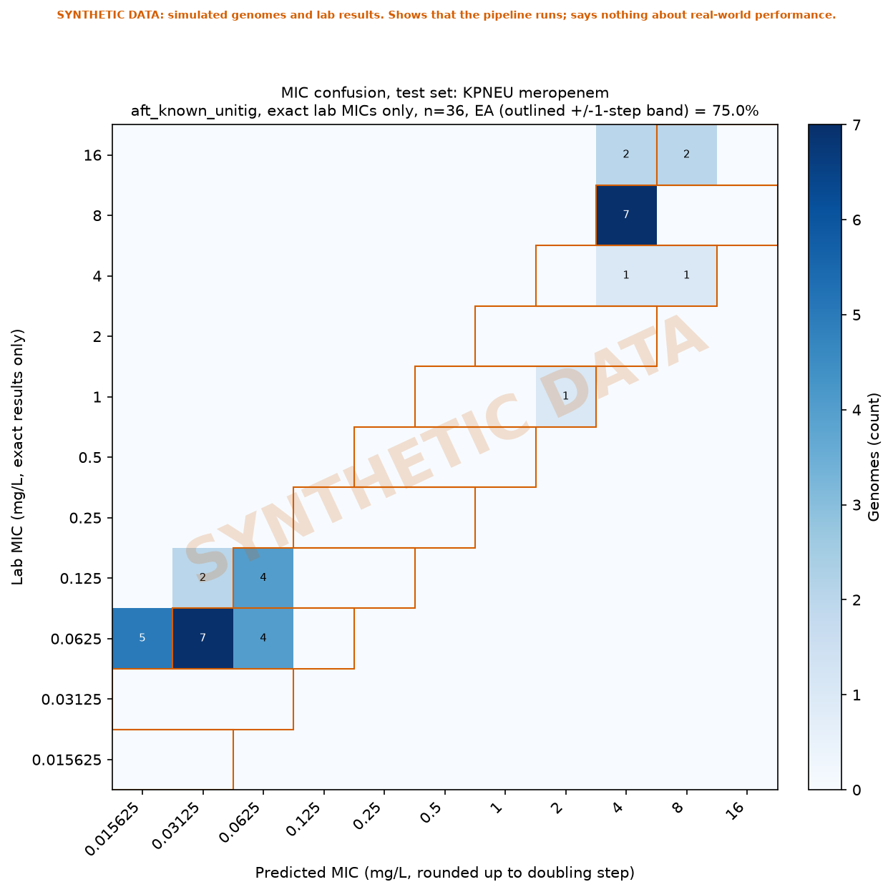

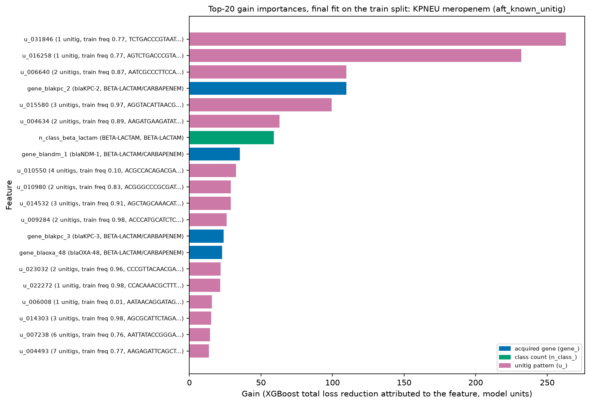

### KPNEU x piperacillin-tazobactam

Call breakpoint (CLSI 2024, bloodstream): S if MIC <= 8 mg/L, R if MIC > 16 mg/L.

#### Test set (lineage-held-out genomes, scored once)

| Model | n | VME % (predicted S, lab R; of lab R) | Call VME % (lab R called likely active; of lab R) | Active calls % (lab S called likely active; of lab S) | Uncertain % | ME % (predicted R, lab S; of lab S) | Minor error % (of categorised) | CA % (same S/I/R) | EA % (within +/-1 step; exact lab MICs) | Exact agreement % (exact lab MICs) | AUROC (R vs S) | Band coverage % (90% band; exact lab MICs) | Band width (doubling steps) |
| --- | --- | --- | --- | --- | --- | --- | --- | --- | --- | --- | --- | --- | --- |
| b0_resfinder | 43 | 6.7% (n=15) | — | — | — | 0.0% (n=28) | 0.0% (n=43) | 97.7% (n=43) | — | — | — | — | — |
| b1_lookup | 43 | 86.7% (n=15) | 0.0% (n=15) | 35.7% (n=28) | 74.4% (n=43) | 0.0% (n=28) | 4.7% (n=43) | 65.1% (n=43) | 72.4% (n=29) | 31.0% (n=29) | 0.836 | 96.6% (n=29) | 6.00 |
| b2_xgb_steps | 43 | 33.3% (n=15) | 6.7% (n=15) | 71.4% (n=28) | 39.5% (n=43) | 0.0% (n=28) | 18.6% (n=43) | 69.8% (n=43) | 86.2% (n=29) | 37.9% (n=29) | 0.902 | 100.0% (n=29) | 4.00 |
| aft_known | 43 | 6.7% (n=15) | 0.0% (n=15) | 82.1% (n=28) | 11.6% (n=43) | 3.6% (n=28) | 0.0% (n=43) | 95.3% (n=43) | 89.7% (n=29) | 37.9% (n=29) | 0.992 | 89.7% (n=29) | 2.00 |
| aft_known_unitig | 43 | 6.7% (n=15) | 0.0% (n=15) | 53.6% (n=28) | 39.5% (n=43) | 0.0% (n=28) | 2.3% (n=43) | 95.3% (n=43) | 96.6% (n=29) | 62.1% (n=29) | 0.994 | 100.0% (n=29) | 4.00 |

Categorical metrics with the lab S/I/R re-derived from the lab MIC under the call breakpoint:

| Model | VME % re-derived (of lab R) | Call VME % re-derived (of lab R) | Call ME % re-derived (of lab S) | Active calls % re-derived (of lab S) | Uncertain % re-derived | ME % re-derived (of lab S) | Minor error % re-derived | CA % re-derived |
| --- | --- | --- | --- | --- | --- | --- | --- | --- |
| b0_resfinder | 0.0% (n=14) | — | — | — | — | 0.0% (n=28) | 2.3% (n=43) | 97.7% (n=43) |
| b1_lookup | 85.7% (n=14) | 0.0% (n=14) | 0.0% (n=28) | 35.7% (n=28) | 74.4% (n=43) | 0.0% (n=28) | 7.0% (n=43) | 65.1% (n=43) |
| b2_xgb_steps | 28.6% (n=14) | 7.1% (n=14) | 0.0% (n=28) | 71.4% (n=28) | 39.5% (n=43) | 0.0% (n=28) | 20.9% (n=43) | 69.8% (n=43) |
| aft_known | 0.0% (n=14) | 0.0% (n=14) | 3.6% (n=28) | 82.1% (n=28) | 11.6% (n=43) | 3.6% (n=28) | 2.3% (n=43) | 95.3% (n=43) |
| aft_known_unitig | 0.0% (n=14) | 0.0% (n=14) | 0.0% (n=28) | 53.6% (n=28) | 39.5% (n=43) | 0.0% (n=28) | 4.7% (n=43) | 95.3% (n=43) |

#### Cross-validation (out-of-fold, train split)

| Model | n | VME % (predicted S, lab R; of lab R) | Call VME % (lab R called likely active; of lab R) | Active calls % (lab S called likely active; of lab S) | Uncertain % | ME % (predicted R, lab S; of lab S) | Minor error % (of categorised) | CA % (same S/I/R) | EA % (within +/-1 step; exact lab MICs) | Exact agreement % (exact lab MICs) | AUROC (R vs S) | Band coverage % (90% band; exact lab MICs; cross-conformal, see note) | Band width (doubling steps) |
| --- | --- | --- | --- | --- | --- | --- | --- | --- | --- | --- | --- | --- | --- |
| b0_resfinder | 293 | 6.6% (n=121) | — | — | — | 0.0% (n=164) | 2.7% (n=293) | 94.5% (n=293) | — | — | — | — | — |
| b1_lookup | 293 | 78.5% (n=121) | 0.0% (n=121) | 41.5% (n=164) | 72.7% (n=293) | 0.0% (n=164) | 5.1% (n=293) | 62.5% (n=293) | 74.9% (n=175) | 33.7% (n=175) | 0.757 | 93.1% (n=175) | 5.52 |
| b2_xgb_steps | 293 | 31.4% (n=121) | 7.4% (n=121) | 62.2% (n=164) | 44.0% (n=293) | 0.6% (n=164) | 17.1% (n=293) | 69.6% (n=293) | 83.4% (n=175) | 45.7% (n=175) | 0.914 | 93.7% (n=175) | 4.00 |
| aft_known | 293 | 4.1% (n=121) | 0.0% (n=121) | 86.0% (n=164) | 14.3% (n=293) | 0.6% (n=164) | 4.1% (n=293) | 93.9% (n=293) | 91.4% (n=175) | 42.3% (n=175) | 0.997 | 92.6% (n=175) | 2.42 |
| aft_known_unitig | 293 | 2.5% (n=121) | 0.0% (n=121) | 64.6% (n=164) | 33.8% (n=293) | 0.0% (n=164) | 6.8% (n=293) | 92.2% (n=293) | 77.7% (n=175) | 38.3% (n=175) | 0.996 | 97.1% (n=175) | 4.00 |

_Note: CV bands are cross-conformal: the band on each fold's rows is calibrated on the out-of-fold residuals of the other folds only, so CV coverage is an out-of-fold estimate, not the calibration set itself._

Categorical metrics with the lab S/I/R re-derived from the lab MIC under the call breakpoint:

| Model | VME % re-derived (of lab R) | Call VME % re-derived (of lab R) | Call ME % re-derived (of lab S) | Active calls % re-derived (of lab S) | Uncertain % re-derived | ME % re-derived (of lab S) | Minor error % re-derived | CA % re-derived |
| --- | --- | --- | --- | --- | --- | --- | --- | --- |
| b0_resfinder | 1.8% (n=113) | — | — | — | — | 0.0% (n=164) | 4.8% (n=291) | 94.5% (n=291) |
| b1_lookup | 78.8% (n=113) | 0.0% (n=113) | 0.0% (n=164) | 41.5% (n=164) | 72.9% (n=291) | 0.0% (n=164) | 6.5% (n=291) | 62.9% (n=291) |
| b2_xgb_steps | 30.1% (n=113) | 7.1% (n=113) | 0.6% (n=164) | 62.2% (n=164) | 44.3% (n=291) | 0.6% (n=164) | 17.2% (n=291) | 70.8% (n=291) |
| aft_known | 0.0% (n=113) | 0.0% (n=113) | 0.0% (n=164) | 86.0% (n=164) | 14.1% (n=291) | 0.6% (n=164) | 6.2% (n=291) | 93.5% (n=291) |
| aft_known_unitig | 0.9% (n=113) | 0.0% (n=113) | 0.0% (n=164) | 64.6% (n=164) | 33.7% (n=291) | 0.0% (n=164) | 6.5% (n=291) | 93.1% (n=291) |

#### External and leave-one-lineage-out sets

**leave-one-lineage-out (KPNEU_ML_001)** (`lolo_KPNEU_ML_001`)

| Model | n | VME % (predicted S, lab R; of lab R) | Call VME % (lab R called likely active; of lab R) | Active calls % (lab S called likely active; of lab S) | Uncertain % | ME % (predicted R, lab S; of lab S) | Minor error % (of categorised) | CA % (same S/I/R) | EA % (within +/-1 step; exact lab MICs) | Exact agreement % (exact lab MICs) | AUROC (R vs S) | Band coverage % (90% band; exact lab MICs) | Band width (doubling steps) |
| --- | --- | --- | --- | --- | --- | --- | --- | --- | --- | --- | --- | --- | --- |
| b1_lookup | 55 | 83.3% (n=42) | 0.0% (n=42) | 9.1% (n=11) | 89.1% (n=55) | 0.0% (n=11) | 3.6% (n=55) | 32.7% (n=55) | 64.7% (n=17) | 29.4% (n=17) | 0.583 | 88.2% (n=17) | 6.00 |
| b2_xgb_steps | 55 | 14.3% (n=42) | 2.4% (n=42) | 63.6% (n=11) | 61.8% (n=55) | 0.0% (n=11) | 40.0% (n=55) | 49.1% (n=55) | 76.5% (n=17) | 41.2% (n=17) | 0.939 | 100.0% (n=17) | 4.00 |
| aft_known | 55 | 0.0% (n=42) | 0.0% (n=42) | 81.8% (n=11) | 9.1% (n=55) | 0.0% (n=11) | 5.5% (n=55) | 94.5% (n=55) | 94.1% (n=17) | 23.5% (n=17) | 1.000 | 94.1% (n=17) | 2.00 |
| aft_known_unitig | 55 | 0.0% (n=42) | 0.0% (n=42) | 100.0% (n=11) | 25.5% (n=55) | 0.0% (n=11) | 1.8% (n=55) | 98.2% (n=55) | 41.2% (n=17) | 11.8% (n=17) | 1.000 | 100.0% (n=17) | 4.00 |

Categorical metrics with the lab S/I/R re-derived from the lab MIC under the call breakpoint:

| Model | VME % re-derived (of lab R) | Call VME % re-derived (of lab R) | Call ME % re-derived (of lab S) | Active calls % re-derived (of lab S) | Uncertain % re-derived | ME % re-derived (of lab S) | Minor error % re-derived | CA % re-derived |
| --- | --- | --- | --- | --- | --- | --- | --- | --- |
| b1_lookup | 85.4% (n=41) | 0.0% (n=41) | 0.0% (n=11) | 9.1% (n=11) | 90.7% (n=54) | 0.0% (n=11) | 3.7% (n=54) | 31.5% (n=54) |
| b2_xgb_steps | 14.6% (n=41) | 2.4% (n=41) | 0.0% (n=11) | 63.6% (n=11) | 61.1% (n=54) | 0.0% (n=11) | 38.9% (n=54) | 50.0% (n=54) |
| aft_known | 0.0% (n=41) | 0.0% (n=41) | 0.0% (n=11) | 81.8% (n=11) | 9.3% (n=54) | 0.0% (n=11) | 5.6% (n=54) | 94.4% (n=54) |
| aft_known_unitig | 0.0% (n=41) | 0.0% (n=41) | 0.0% (n=11) | 100.0% (n=11) | 25.9% (n=54) | 0.0% (n=11) | 1.9% (n=54) | 98.1% (n=54) |

**leave-one-lineage-out (KPNEU_ML_002)** (`lolo_KPNEU_ML_002`)

| Model | n | VME % (predicted S, lab R; of lab R) | Call VME % (lab R called likely active; of lab R) | Active calls % (lab S called likely active; of lab S) | Uncertain % | ME % (predicted R, lab S; of lab S) | Minor error % (of categorised) | CA % (same S/I/R) | EA % (within +/-1 step; exact lab MICs) | Exact agreement % (exact lab MICs) | AUROC (R vs S) | Band coverage % (90% band; exact lab MICs) | Band width (doubling steps) |
| --- | --- | --- | --- | --- | --- | --- | --- | --- | --- | --- | --- | --- | --- |
| b1_lookup | 50 | 84.1% (n=44) | 0.0% (n=44) | 0.0% (n=6) | 92.0% (n=50) | 0.0% (n=6) | 6.0% (n=50) | 20.0% (n=50) | 27.3% (n=11) | 0.0% (n=11) | 0.576 | 63.6% (n=11) | 6.00 |
| b2_xgb_steps | 50 | 25.0% (n=44) | 2.3% (n=44) | 16.7% (n=6) | 76.0% (n=50) | 16.7% (n=6) | 56.0% (n=50) | 20.0% (n=50) | 81.8% (n=11) | 45.5% (n=11) | 0.498 | 90.9% (n=11) | 4.00 |
| aft_known | 50 | 2.3% (n=44) | 0.0% (n=44) | 16.7% (n=6) | 14.0% (n=50) | 0.0% (n=6) | 4.0% (n=50) | 94.0% (n=50) | 81.8% (n=11) | 18.2% (n=11) | 0.987 | 81.8% (n=11) | 2.00 |
| aft_known_unitig | 50 | 0.0% (n=44) | 0.0% (n=44) | 0.0% (n=6) | 22.0% (n=50) | 0.0% (n=6) | 12.0% (n=50) | 88.0% (n=50) | 90.9% (n=11) | 45.5% (n=11) | 0.991 | 100.0% (n=11) | 4.00 |

Categorical metrics with the lab S/I/R re-derived from the lab MIC under the call breakpoint:

| Model | VME % re-derived (of lab R) | Call VME % re-derived (of lab R) | Call ME % re-derived (of lab S) | Active calls % re-derived (of lab S) | Uncertain % re-derived | ME % re-derived (of lab S) | Minor error % re-derived | CA % re-derived |
| --- | --- | --- | --- | --- | --- | --- | --- | --- |
| b1_lookup | 83.3% (n=42) | 0.0% (n=42) | 0.0% (n=6) | 0.0% (n=6) | 92.0% (n=50) | 0.0% (n=6) | 10.0% (n=50) | 20.0% (n=50) |
| b2_xgb_steps | 23.8% (n=42) | 2.4% (n=42) | 16.7% (n=6) | 16.7% (n=6) | 76.0% (n=50) | 16.7% (n=6) | 56.0% (n=50) | 22.0% (n=50) |
| aft_known | 0.0% (n=42) | 0.0% (n=42) | 0.0% (n=6) | 16.7% (n=6) | 14.0% (n=50) | 0.0% (n=6) | 8.0% (n=50) | 92.0% (n=50) |
| aft_known_unitig | 0.0% (n=42) | 0.0% (n=42) | 0.0% (n=6) | 0.0% (n=6) | 22.0% (n=50) | 0.0% (n=6) | 12.0% (n=50) | 88.0% (n=50) |

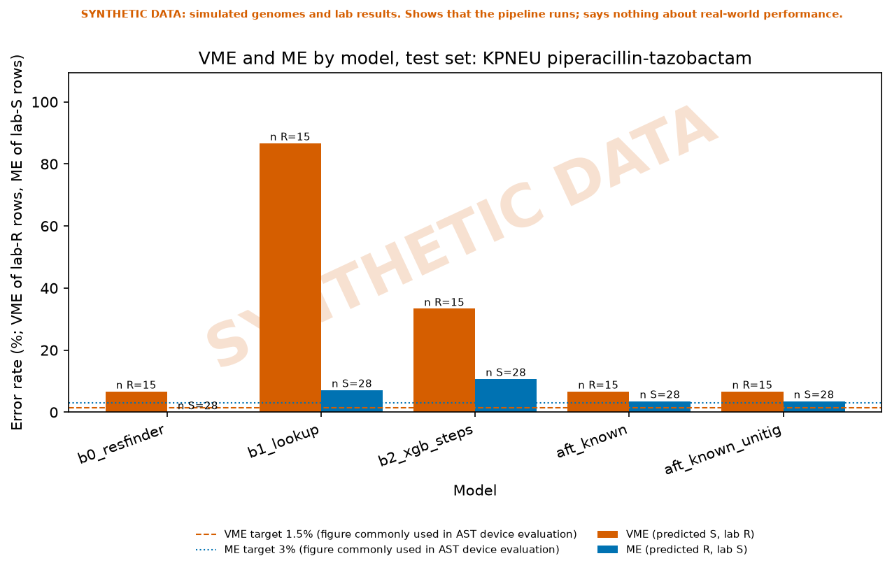

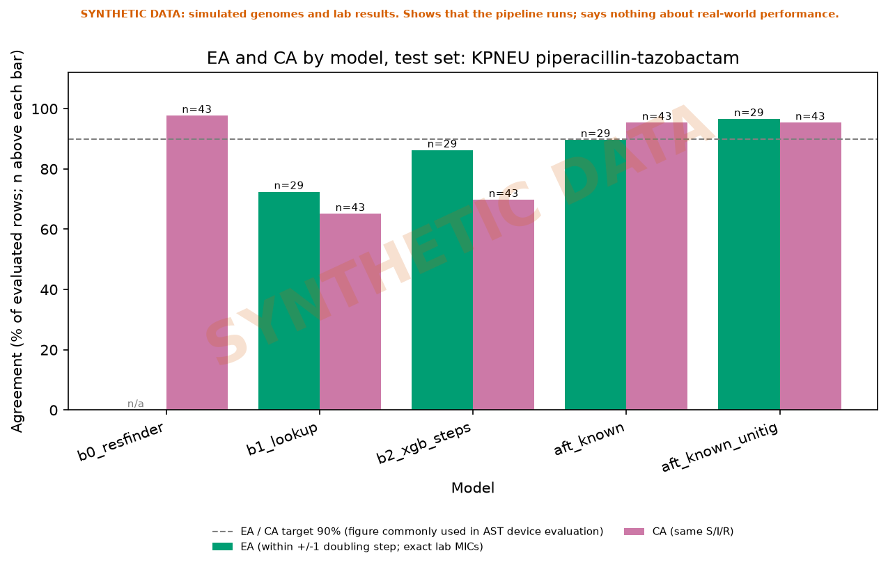

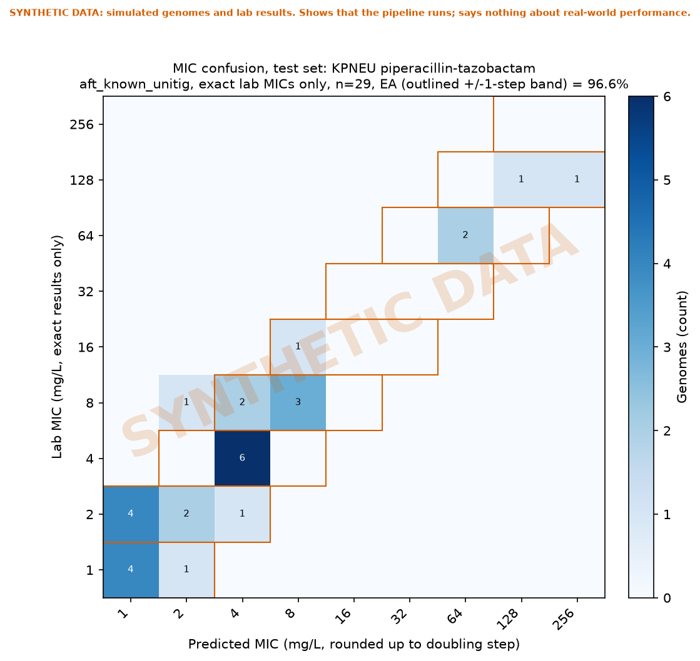

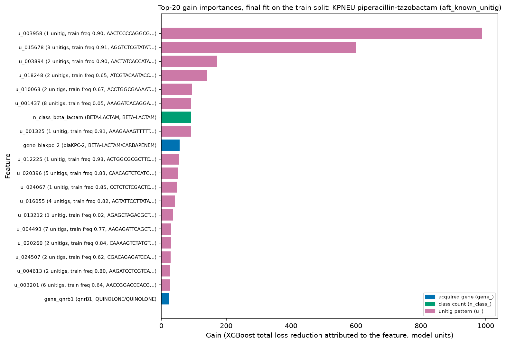

## Species-level figures

### ECOLI

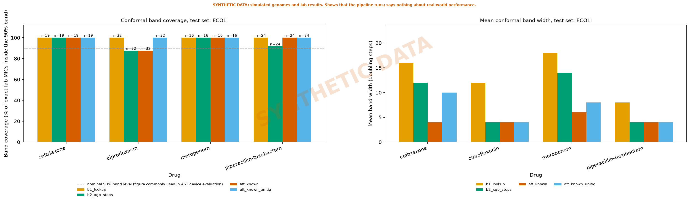

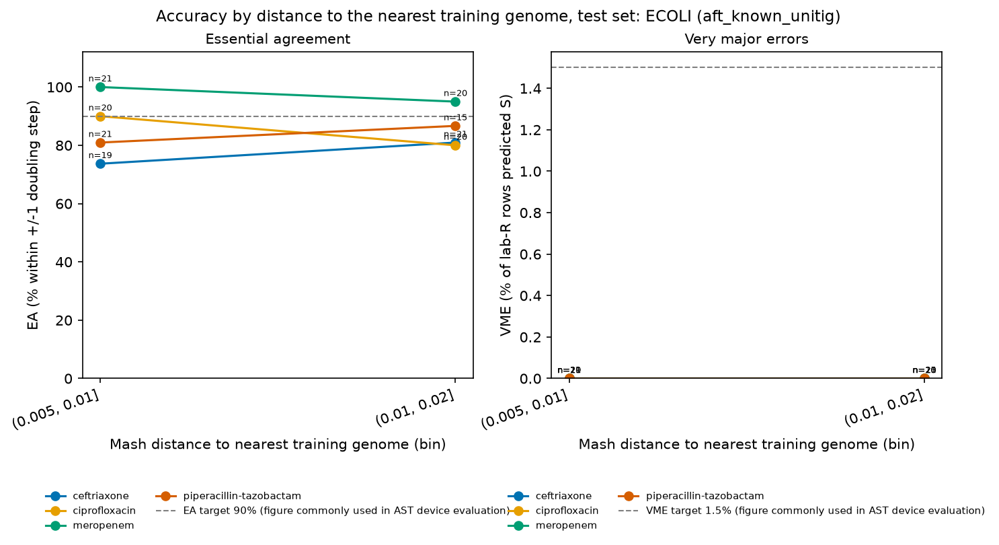

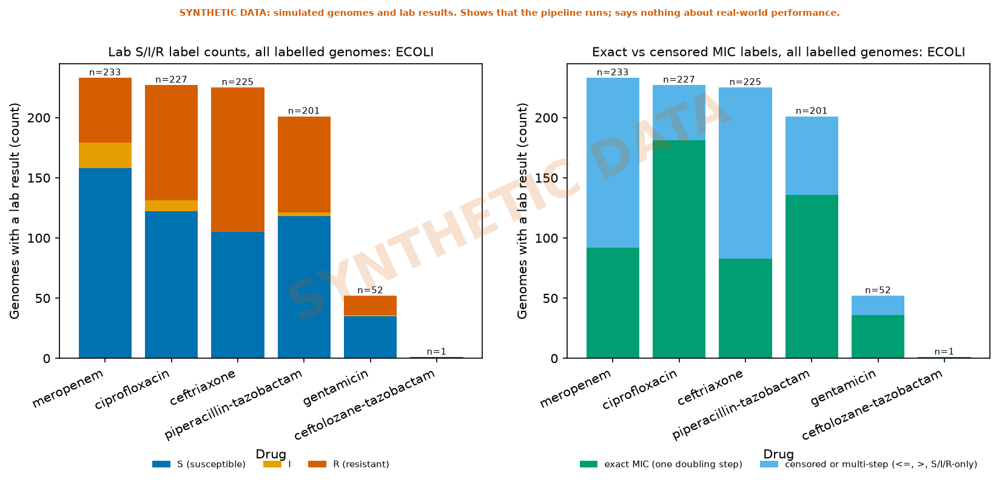

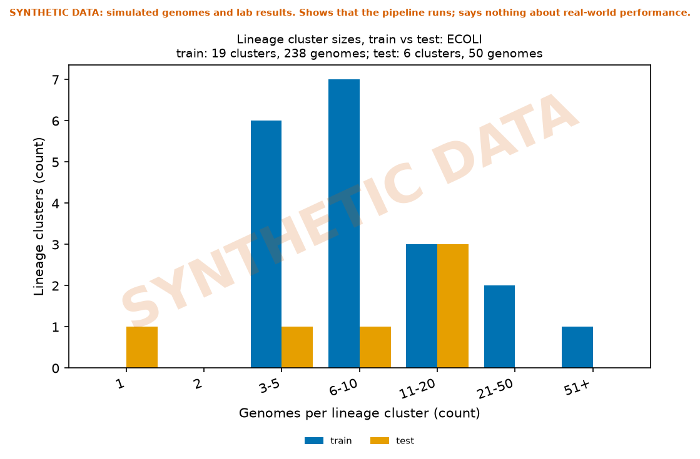

### KPNEU

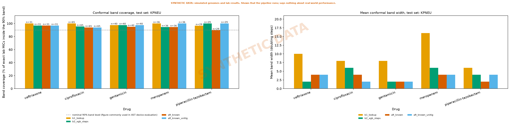

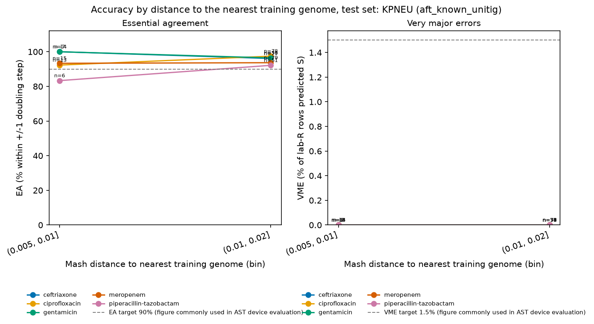

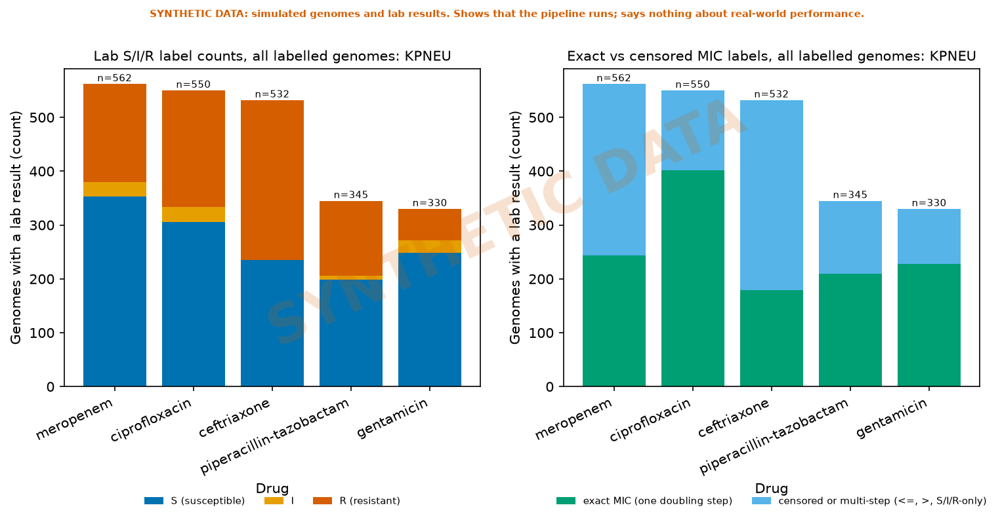

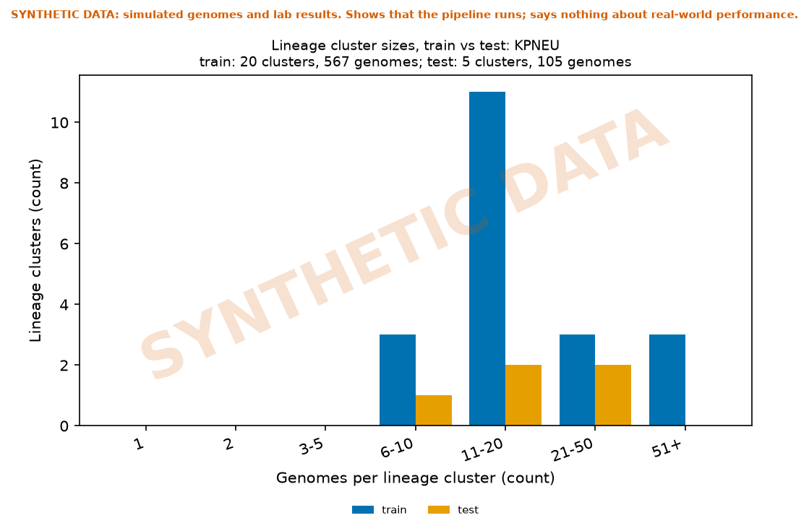

## Leakage checklist (automated)

Checks from `DATA_CONTRACT.md` section 4 that can be verified from the files on disk. `NOT RUN` means the input needed for that check is missing. Fold-internal feature selection and calibration-on-validation-only are enforced in the training code and are not re-verifiable from outputs.

- Rule 8 (test set touched once) is checked against `results/test_ledger.csv`, which `train` appends to every time it scores the test rows of a pair: each species x drug must carry one run_id (training parameters + splits) and one inputs_sha1 (labels, features, unitig set, drug/breakpoint configs, model code). This shows the test rows were only ever scored by one configuration on one set of inputs; it cannot show that nobody looked at test metrics before settling on that configuration.
- Unitig patterns are built from every train genome, including the genomes held out within CV folds and LOLO runs; only test genomes are queried against the frozen set. No labels enter the build and per-fold selection recomputes frequency filters and ranking on the fit rows only, so this is not label leakage, but CV and LOLO rows use the build-time encoding rather than the query path a new genome takes and may read slightly optimistic.

6 passed, 0 failed, 0 not run.

| Check | Result | Detail |
| --- | --- | --- |
| no forbidden columns among features | PASS | 23667 feature names across 20 source(s); none forbidden, all prefixed |
| no lineage cluster in two splits or two folds | PASS | 50 clusters over 960 genomes; every cluster is in one split and one fold |
| unitig patterns built on train genomes only | PASS | unitigs_ECOLI_rows.parquet: 238 built, 50 queried; unitigs_KPNEU_rows.parquet: 567 built, 105 queried |
| labels de-duplicated by biosample | PASS | 879 biosamples over 879 genomes (0 rows without biosample) |
| prediction rows match their split | PASS | 19247 rows across 9 preds file(s); cv rows are train genomes, test rows are test genomes, 3872 lolo row(s) are train genomes of their held-out lineage |
| test set touched once (one run_id and inputs_sha1 per species x drug in results/test_ledger.csv) | PASS | test_ledger.csv: 9 scoring(s) of 9 pair(s), one run_id and inputs_sha1 each (ECOLI x ceftriaxone: 9cae235e86b3/2b948f04b3f2, ECOLI x ciprofloxacin: 9cae235e86b3/2b948f04b3f2, ECOLI x meropenem: 9cae235e86b3/2b948f04b3f2, ECOLI x piperacillin-tazobactam: 9cae235e86b3/2b948f04b3f2, KPNEU x ceftriaxone: 9cae235e86b3/85e36e8635c1, ... (+4 more)); 9 preds file(s) match it |

## Inputs and notes

| Input | Status |
| --- | --- |
| drop_log_evaluate.csv | found |
| drop_log_ingest.csv | found |
| drop_log_known_amr.csv | found |
| drop_log_lineages.csv | found |
| drop_log_qc.csv | found |
| drop_log_splits.csv | found |
| drop_log_synth.csv | found |
| drop_log_train.csv | found |
| drop_log_unitigs.csv | found |
| known_amr_columns.csv | found |
| label_counts.csv | found |
| lineages.parquet | found |
| metrics.parquet | found |
| metrics_by_distance.parquet | found |
| models/ECOLI/ceftriaxone/importance.json | found |
| models/ECOLI/ciprofloxacin/importance.json | found |
| models/ECOLI/meropenem/importance.json | found |
| models/ECOLI/piperacillin-tazobactam/importance.json | found |
| models/KPNEU/ceftriaxone/importance.json | found |
| models/KPNEU/ciprofloxacin/importance.json | found |
| models/KPNEU/gentamicin/importance.json | found |
| models/KPNEU/meropenem/importance.json | found |
| models/KPNEU/piperacillin-tazobactam/importance.json | found |
| pairs_kept.csv | found |
| preds_*.parquet | found |
| preds_ECOLI_ceftriaxone.parquet | found |
| preds_ECOLI_ciprofloxacin.parquet | found |
| preds_ECOLI_meropenem.parquet | found |
| preds_ECOLI_piperacillin-tazobactam.parquet | found |
| preds_KPNEU_ceftriaxone.parquet | found |
| preds_KPNEU_ciprofloxacin.parquet | found |
| preds_KPNEU_gentamicin.parquet | found |
| preds_KPNEU_meropenem.parquet | found |
| preds_KPNEU_piperacillin-tazobactam.parquet | found |
| splits.parquet | found |
| unitigs_ECOLI_index.parquet | found |
| unitigs_KPNEU_index.parquet | found |

### Rows excluded while drawing figures

| stage | reason | n_dropped | detail |
| --- | --- | --- | --- |
| report | mic_confusion: lab result not an exact MIC (interval wider than one doubling step, or lab_exact false), or null prediction | 19 | ECOLI ceftriaxone aft_known_unitig test |
| report | mic_confusion: lab result not an exact MIC (interval wider than one doubling step, or lab_exact false), or null prediction | 6 | ECOLI ciprofloxacin aft_known_unitig test |
| report | mic_confusion: lab result not an exact MIC (interval wider than one doubling step, or lab_exact false), or null prediction | 24 | ECOLI meropenem aft_known_unitig test |
| report | mic_confusion: lab result not an exact MIC (interval wider than one doubling step, or lab_exact false), or null prediction | 11 | ECOLI piperacillin-tazobactam aft_known_unitig test |
| report | mic_confusion: lab result not an exact MIC (interval wider than one doubling step, or lab_exact false), or null prediction | 50 | KPNEU ceftriaxone aft_known_unitig test |
| report | mic_confusion: lab result not an exact MIC (interval wider than one doubling step, or lab_exact false), or null prediction | 15 | KPNEU ciprofloxacin aft_known_unitig test |
| report | mic_confusion: lab result not an exact MIC (interval wider than one doubling step, or lab_exact false), or null prediction | 13 | KPNEU gentamicin aft_known_unitig test |
| report | mic_confusion: lab result not an exact MIC (interval wider than one doubling step, or lab_exact false), or null prediction | 48 | KPNEU meropenem aft_known_unitig test |
| report | mic_confusion: lab result not an exact MIC (interval wider than one doubling step, or lab_exact false), or null prediction | 14 | KPNEU piperacillin-tazobactam aft_known_unitig test |

> These are predictions of in-vitro susceptibility, not prescribing advice. Dose, route, and final drug choice depend on PK/PD, infection site, renal function, allergies, and other patient factors, and remain with the clinician. Confirm with standard AST.
